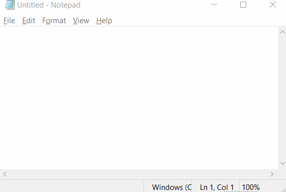

# 讯飞输入法悬浮窗插件

## 用法

| 作用于 |     按键      | 功能说明              |
| ------ | :-----------: | --------------------- |
| 全局   | Win + Alt + H | 启动/切换讯飞语音输入 |

## 注

1. 若没有安装讯飞语音则会自动询问是否引导下载安装

## 效果如下图

