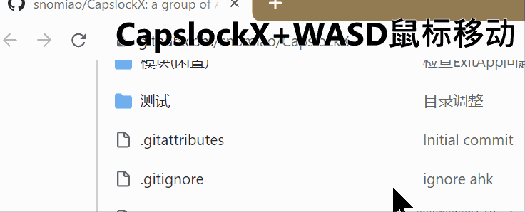
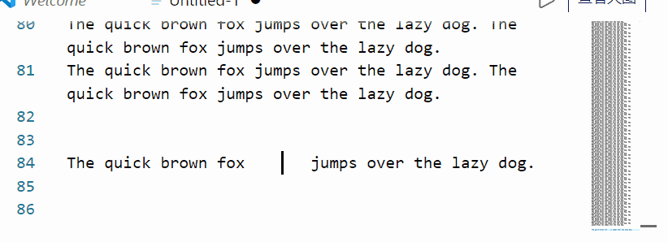
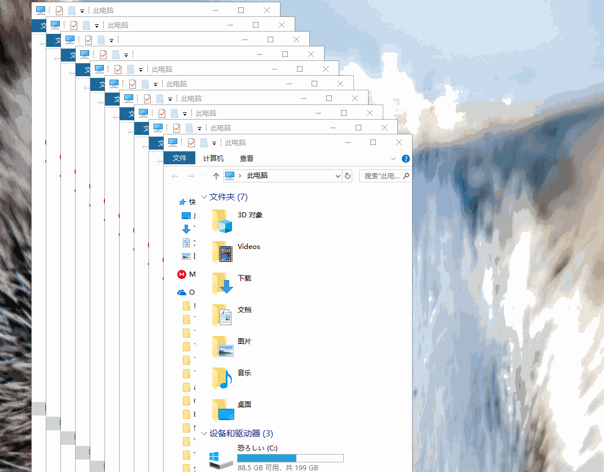

# Drafting

# CapsLockX - 💻 Get Hacker's Keyboard

CapsLockX is a modular hotkey script engine based on AutoHotkey. Allows you to easily operate the computer efficiently like a hacker in a movie without leaving the keyboard with both hands . There are a lot of functions that you can understand at a touch and are super easy to use: editing enhancement, virtual desktop and window management, mouse simulation, in-app hotkey enhancement, JS mathematical expression calculation, and other super multi-functions are waiting for you to personally define.

**[See English Docs (Google Translated)](https://capslockx.snomiao.com/)**

---

## Badges

<!-- culture badges  -->

[](https://github.com/Program-in-Chinese/overview),
[](https://996.icu)
[](https://github.com/snolab/CapsLockX/blob/master/LICENSE.md)


[](https://github.com/snolab/CapsLockX/stargazers)

<!-- build and publish status -->


[](https://github.com/snolab/CapsLockX/actions/workflows/gh-pages-release.yml)

[](https://www.jsdelivr.com/package/gh/snolab/capslockx)

[](https://www.npmjs.com/capslockx)
[](https://github.com/snolab/CapsLockX/actions/workflows/npm-publish.yml)


[](https://community.chocolatey.org/packages/CapsLockX/)
[](https://github.com/snolab/CapsLockX/actions/workflows/choco-push.yml)
[](https://community.chocolatey.org/packages/CapsLockX/)

<!-- [](https://github.com/snolab/CapsLockX/actions/workflows/package-test.yml) -->

---

## Tutorial 📖

### 简易入门教程（读完这一小节，便算是入门了 CapsLockX 的使用 ）

CapsLockX 有四大核心功能： **窗口管理**，**鼠标模拟**、**方向键模拟**、应用内热键，本入门教程将带你学会前 3 大核心功能。

首先获取 CapsLockX ：下载这个压缩包： [下载 JSDelivrCDN-发布程序包.zip](https://cdn.jsdelivr.net/gh/snolab/CapsLockX@gh-pages/CapsLockX-latest.zip)

解压之后，打开 CapsLockX 文件夹内的 `CapsLockX.exe`，过掉简单的新手教程，然后按照以下左右手功能区的依次试用来了解 CapsLockX 的功能。

CapsLockX 启动之后，并**不会影响**你键盘其它按键的功能，以下的功能只有在你按出 `CapsLockX + 组合键` 时才会触发。

左手功能区：

- 窗口管理：`CapsLockX + 1234567890` 切换到第 `n` 个虚拟桌面，`CapsLockX + ZXCV` 窗口操作（窗口切换、窗口关闭，窗口排列，透明置顶）。
- 鼠标模拟功能：按 `CapsLockX + WASD` 鼠标移动（像玩游戏的时候操作人物移动一样简单），按 `CapsLockX + QE` 鼠标左右键点击，`CapsLockX + RF` 滚轮上下滑动。

右手功能区：

- 方向键模拟：打开任意一个编辑 `HJKL` 光标移动，`YOUI` 页面移动

上手之后，如果想了解更多功能，则可参考下方速查手册。

---

## 进阶参考手册

### 安装与使用 🛠

#### 绿色便携程序包（新手适用，稳定版） 📦

源码打包就是软件本体，无需编译，纯绿色便携软件解压即用。源码 + 程序包，推荐第一个（最快）。

1. [下载 JSDelivrCDN-发布程序包.zip](https://cdn.jsdelivr.net/gh/snolab/CapsLockX@gh-pages/CapsLockX-latest.zip)
1. [备选下载 CloudFlareCDN-发布程序包.zip](https://capslockx.snomiao.com/CapsLockX-latest.zip)
1. [备选下载 GitHub-发布程序包.zip](https://github.com/snolab/CapsLockX/raw/gh-pages/CapsLockX-latest.zip)
1. [备选下载 GitHub-仓库程序包.zip](https://github.com/snolab/CapsLockX/archive/master.zip)
1. [备选下载 BitBucket-仓库程序包.zip](https://bitbucket.org/snomiao/capslockx/get/master.zip)
1. [备选下载 中国大陆用户-Gitee-仓库程序包.zip （需登录）](https://gitee.com/snomiao/CapslockX/repository/archive/master.zip)

解压后使用即可，启动与自启动的方法： 双击 `CapsLockX.exe` 即可启动脚本，如需添加启动项，请在开始菜单 - 运行输入 shell:startup 然后给本程序创建快捷方式，扔进去就可以了。

#### 命令行方式安装（进阶用户推荐，可自动更新）🖥️

以下几种任选其一，其它地区用户推荐第 2 个

1. `npx capslockx`, -- NPX 直接运行，可以一直运行最新版，推荐（需要安装 NodeJS ）
2. `choco update capslockx && capslockx` -- [Chocolatey](https://community.chocolatey.org/packages/CapsLockX/) 安装可使用 cup 自动更新，推荐
3. `npm i -g capslockx && npx capslockx` -- npm 全局安装
4. `git clone https://gitee.com/snomiao/CapslockX && .\CapsLockX\CapsLockX.exe` -- 大陆源码包（绿色软件包）解压使用，中国大陆地区用户推荐
5. `git clone https://github.com/snolab/CapsLockX && .\CapsLockX\CapsLockX.exe` -- github 源码包（绿色软件包）解压使用
6. `winget capslockx` -- TODO
7. `scoop capslockx` -- TODO

## 使用手册 📖

<!-- * 按 `CapsLock` 切换 CapsLockX 模式 -->

- 按住 `CapsLockX` 进入 CapsLockX 模式，此时你的键盘会成为像 Vim 默认模式那样的功能键盘，（键位见下
- 长按 `CapsLockX` 键将锁定 `CLX` 模式，此时弹起 `CapsLockX` 键将保持 `CLX` 到下一次按下 `CaspLockX` 键为止。[功能由来](https://github.com/snolab/CapsLockX/issues/21)

CapsLockX 默认加载了一些常用的模块，功能与使用方法已在下方列出。
对于不需要的模块，你也可以直接删除 `./Modules` 目录下对应的 `.ahk` 文件，然后按 `Ctrl + Alt + \` 重新加载即可。

你也可以编写自己的 `my-ahk.user.ahk` 然后放到 `./User/` 目录下，CapsLockX 会自动识别并加载它们。

### 多任务工作的噩梦

#### 单线程大脑、多线程大脑，为什么进行多任务工作？

#### 多窗口的出现，虚拟桌面的出现，整理窗口, 桌面定义，虚拟桌面，Chrome 标签组、……

#### 焦点数量：活动窗口、默认活动窗口、……

#### 情景模式、工作桌面、娱乐桌面、项目分类 虚拟桌面概述

#### 多屏幕的利用

#### 4K 时代的窗口排列

Windows 默认窗口排列限制

##### Linux 与 Mac 窗口的管理

##### Android 与 iOS 的窗口管理

### 编辑操作的困扰

#### 键入区与编辑区的疏远

TODO 漫谈 ThinkPad 与 mac 方向键位、来自 VIM 的灵感

#### 并击的概念

TODO 各种类型的并击

TODO 并击的信息量提升计算

### 图形界面的困扰

TODO：文档：鼠标模拟功能介绍、RPG 游戏的移动

### 人类的速度认知

TODO：指数增长的世界感知，焦点，听力、视觉、触觉，VS 常规线性操作

### 软件的热键缺陷

TODO：应用增强模块介绍

### 便携键盘的可用性

TODO：FN 键、方向键、编辑操作、61 配列 vs 87 键配列、

<!-- 下面这堆东西是自动从各个模块里抽取的，如需改动请到对应模块.md 里操作, 在这里修改会被覆盖 -->
<!-- 开始：抽取模块帮助 -->
<!-- 模块文件名：00-Help.ahk-->

### 帮助模块

如果你想学习如何开发 CapsLockX 的插件，请：

1. 打开 `Modules/01-Help.ahk` ， 你可以了解到 CapsLockX 插件的基本格式
2. 将它复制一份，命名为你自己的插件名称
3. 将它本来的功能改成你自己需要的功能，插件的开发就完成啦！

## 本模块功能见下

| 作用于 | 按键                  | 功能                             |
| ------ | --------------------- | -------------------------------- |
| 全局   | CapsLockX + /         | 临时显示热键提示                 |
| 全局   | CapsLockX + Alt + /   | 🔗 打开 CapsLockX 的完整文档页面 |
| 全局   | CapsLockX + Shift + / | 🕷 提交 bug、建议等               |

<!-- 模块文件名：01.1-插件-鼠标模拟.ahk-->

### 模拟鼠标插件（ WASD QERF ）

> 一直以来，我总是以键盘控自居，应该是在从前做模型的时候伤到了手指关节开始，成为键盘重度用户的。各种键盘加速工具，主动去记住各种快捷键，力求少用鼠标，甚至去学习了 vim 和 emacs。但是，很多时候，鼠标是无可替代的，尤其是在图形界面大行其道时候。

—— 以上是来自 [SimClick 模拟点击](https://github.com/rywiki/simclick) 作者的一段话，这是一款以网格细分方式模拟鼠标的作品，可以与本项目互补

—— 由 [秦金伟](http://rsytes.coding-pages.com/) 推荐

## 功能

- 本模块使用按键区：CapsLockX + QWER ASDF
- 非常舒适地使用 WASD QE RF 来模拟【完整的】鼠标功能，相信我，试过这种手感之后，你会喜欢上它的。
- 指针移动时会自动黏附各种按钮、超链接。滚轮的指数级增长的加速度滚动机制使你再也不惧怕超级长的文章和网页。
- 效果如图：
  

## 使用方法如下

| 作用于 | 按键                                  | 说明                                     |
| ------ | ------------------------------------- | ---------------------------------------- |
| 全局   | `CapsLockX + w a s d`                 | 鼠标移动（上下左右）                     |
| 全局   | `CapsLockX + ad`                      | 将 HJKL 键切换到滚轮模式（上下左右滚动） |
| 全局   | `CapsLockX + r f`                     | 垂直滚轮（上下）                         |
| 全局   | `CapsLockX + Shift + r f`             | 水平滚轮（左右）                         |
| 全局   | `CapsLockX + Ctrl + Alt + r f`        | 垂直滚轮自动滚动（上 下）                |
| 全局   | `CapsLockX + Ctrl + Alt + Shift+ r f` | 水平滚轮自动滚动（左 右）                |
| 全局   | `CapsLockX + rf`                      | rf 同时按相当于鼠标中键                  |
| 全局   | `CapsLockX + e`                       | 鼠标左键                                 |
| 全局   | `CapsLockX + q`                       | 鼠标右键                                 |

## 操作细节

快速连按 AD 步进

<!-- 模块文件名：01.2-插件-编辑增强.ahk-->

### 编辑增强插件（ TG YUIO HJKL ）

这个世界上还有比 Vim 模式的 HJKL 移动光标更棒的东西吗？
这个必须有！
那就是带加速度的 HJKL 流畅编辑体验！想不想试试让你的光标来一次排水沟过弯的高端操作？装它！



| 作用域     | Edit 模块             | 说明                             |
| ---------- | --------------------- | -------------------------------- |
| 全局(基本) | `CapsLockX + h j k l` | 上下左右 方向键                  |
| 全局(基本) | `CapsLockX + y o`     | Home End                         |
| 全局(基本) | `CapsLockX + u i`     | PageUp PageDown                  |
| 全局(基本) | `CapsLockX + g`       | 回车                             |
| 全局(进阶) | `CapsLockX + t`       | Delete                           |
| 全局(进阶) | `CapsLockX + hl`      | hl 一起按选择当前词              |
| 全局(进阶) | `CapsLockX + kj`      | kj 一起按选择当前行              |
| 全局(进阶) | `CapsLockX + h + t`   | 移位后删：大部分情况可代替退格键 |

<!-- 模块文件名：03.1-WindowManager.ahk-->

### 窗口增强插件 (CLX + 1234567890 ZXCV)

## 功能简述

用好 Win 10 自带的 10 个虚拟桌面豪华配置、多显示器自动排列窗口、半透明置顶、（注：任务栏和 AltTab 相关功能暂不兼容 Win11，窗口排列功能正常。）

1. 窗口切换：`CapsLockX + [Shift] + Z`
2. 窗口关闭：`CapsLockX + [Shift] + X`
3. 窗口排列：`CapsLockX + [Shift] + C`
4. 窗口置顶：`CapsLockX + [Shift] + V`
5. 左手窗口管理：在 `Alt + Tab` 的界面，用 `WASD` 切换窗口，`X` 关掉窗口。
6. 高效使用虚拟桌面：`CapsLockX + 0123456789` 切换、增减虚拟桌面，加上 `Shift` 键可以转移当前窗口
7. 虚拟机与远程桌面快速脱离：双击左边 `Shift + Ctrl + Alt`。

## 效果图

- Alt + Tab 管理窗口增强
  
- CapsLockX + C 一键排列窗口（这 GIF 是旧版本录的看起来比较卡，新版本优化过 API 就不卡了）
  

## 使用方法如下 ( Alt+Tab 与 CapsLockX )

| 作用域       | 窗口增强模块                          | 说明                                       |
| ------------ | ------------------------------------- | ------------------------------------------ |
| Alt+Tab 界面 | `Q E`                                 | 左右切换多桌面                             |
| Alt+Tab 界面 | `W A S D`                             | 上下左右切换窗口选择                       |
| Alt+Tab 界面 | `X C`                                 | 关闭选择的窗口（目前 X 和 C 没有区别）     |
| Win+Tab 视图 | `Alt + W A S D`                       | 切换窗口选择                               |
| 全局         | `Win + [Shift] + b`                   | 定位到托盘或任务栏任务                     |
| 全局         | `Win + Shift + hjkl`                  | 在窗口之间按方向切换焦点                   |
| 任务栏       | `Ctrl + W 或 Delete`                  | 在托盘图标或任务栏任务上，选择退出按钮     |
| 全局         | `CapsLockX + 1 2 ... 9 0`             | 切换到第 1 .. 12 个桌面                    |
| 全局         | `CapsLockX + Shift + 1 2 ... 9 0 - =` | 把当前窗口移到第 n 个桌面(如果有的话)      |
| 全局         | `CapsLockX + Alt + Backspace`         | 删除当前桌面（会把所有窗口移到上一个桌面） |
| 全局         | `CapsLockX + C`                       | 快速排列当前桌面的窗口                     |
| 全局         | `CapsLockX + Ctrl + C`                | 快速排列当前桌面的窗口（包括最小化的窗口） |
| 全局         | `CapsLockX + Shift + C`               | 快速堆叠当前桌面的窗口                     |
| 全局         | `CapsLockX + Shift + Ctrl + C`        | 快速堆叠当前桌面的窗口（包括最小化的窗口） |
| 全局         | `CapsLockX + Shift + [ ]`             | 把当前窗口移到上一个/下一个桌面            |
| 全局         | `CapsLockX + Z`                       | 循环切到最近使用的窗口                     |
| 全局         | `CapsLockX + Shift + Z`               | 循环切到最不近使用的窗口                   |
| 全局         | `CapsLockX + X`                       | 关掉当前标签页 Ctrl+W                      |
| 全局         | `CapsLockX + Shift + X`               | 关掉当前窗口 Alt+F4                        |
| 全局         | `CapsLockX + V`                       | 让窗口透明                                 |
| 全局         | `CapsLockX + Shift + V`               | 让窗口保持透明（并置顶）                   |
| 任意窗口     | `双击左边 Shift+Ctrl+Alt`             | 后置当前窗口， \* 见下方注                 |

\*注： 双击左边 Shift+Ctrl+Alt 设计用于远程桌面与虚拟机，使其可与本机桌面窗口同时显示。
例如 mstsc.exe、TeamViewer、VirtualBox、HyperV、VMWare 等远程桌面或虚拟机程序，配合 CapsLockX + Shift + V 透明置顶功能，让你在 Windows 的界面上同时使用 Linux 界面或 MacOS 界面再也不是难题。

此处借用 [@yangbin9317 的评论](https://v2ex.com/t/772052#r_10458792)

> 以 CapsLock 为抓手,打通底层逻辑,拉齐 Windows 和 Linux WM,解决了 Windows 难用的痛点

(20220313) 对于两端都是 Windows 的情况，也可以考虑使用 [RemoteApp Tool - Kim Knight](http://www.kimknight.net/remoteapptool) 来代替远程桌面。

<!-- 模块文件名：Eval-Javascript.ahk-->

### JavaScript 计算 (建议安装 NodeJS )

| 作用于 | 按键            | 效果                                   |
| ------ | --------------- | -------------------------------------- |
| 全局   | `CapsLockX + -` | 计算当前选区 JavaScript 表达式，并替换 |
| 全局   | `CapsLockX + =` | 计算当前选区 JavaScript 表达式，并替换 |

<!-- 模块文件名：LaptopKeyboardFix.ahk-->

### Surface 笔记本扩充功能键

专治各种笔记本残破键盘

1. 没有右 Ctrl 键？合并 Menu 与 右 Ctrl 键，Menu 当 Ctrl 用 或者 Ctrl 当 Menu 用都可以
2. 没有 Pause 键？Win + Alt + P 也能打开系统设定信息。
3. 待补充

| 模式             | 按键                                  | 功能                               |
| ---------------- | :------------------------------------ | ---------------------------------- |
| 全局             | Win + Alt + P                         | 相当于 Win + Pause，专为笔记本定制 |
| 全局             | 右 Ctrl 按一下                        | 会按一下 Menu 弹出菜单             |
| 全局             | 按住右 Menu                           | 会按住 Ctrl，此时可以与其它键组合  |
| Win 键模拟启用后 | ] 按住同时，[ 按下                    | 相当于按 Win 键                    |
| Win 键模拟启用后 | RAlt+\| 相当于按 Alt+Tab 只不过在右手 |

<!-- 模块文件名：功能-快捷输入.ahk-->

### 快捷输入

| 模式 | 快捷输入 | 说明                                            |
| ---- | -------- | ----------------------------------------------- |
| 全局 | `#D#`    | 日期输入：`(20220217)`                          |
| 全局 | `#T#`    | 时间输入：`(20220217.220717)`                   |
| 全局 | `#DT#`   | 日期时间输入：`2022-02-17 22:07:33`             |
| 全局 | `#NPW#`  | 随机输入数字密码如： `7500331260229289`         |
| 全局 | `#PW#`   | 随机输入数字字母密码如： `yyCTCNYodECTLr2h`     |
| 全局 | `#WPW#`  | 随机输入数字字母密码如： `FtD5BB1m5H98eY7Y`     |
| 全局 | `#SPW#`  | 随机输入数字字母符号密码如： `/})y+xK]z~>XKQ+p` |

<!-- 模块文件名：应用-Anki增强.ahk-->

### Anki 增强模块

| 模式                 |  Anki 增强模块  | 说明                                                        |
| -------------------- | :-------------: | ----------------------------------------------------------- |
| 在 Anki-学习界面     |  `w 或 k 或 ↑`  | 按下=撤销，松开显示答案                                     |
| 在 Anki-学习界面     |  `a 或 h 或 ←`  | 按下=顺利，松开显示答案                                     |
| 在 Anki-学习界面     |  `s 或 j 或 ↓`  | 按下=困难，松开显示答案                                     |
| 在 Anki-学习界面     |  `d 或 l 或 →`  | 按下=生疏，松开显示答案                                     |
| 在 Anki-学习界面     |       `q`       | 返回上个界面                                                |
| 在 Anki-学习界面     |       `c`       | 添加新卡片                                                  |
| 在 Anki-学习界面     | `1 或 NumPad1 ` | 困难（原键位不动）                                          |
| 在 Anki-学习界面     | `2 或 NumPad2 ` | 生疏（原键位不动）                                          |
| 在 Anki-学习界面     | `3 或 NumPad3 ` | 一般（原键位不动）                                          |
| 在 Anki-学习界面     | `4 或 NumPad4 ` | 顺利（原键位不动）                                          |
| 在 Anki-学习界面     | `5 或 NumPad5 ` | 撤销                                                        |
| 在 Anki-学习界面     | `6 或 NumPad6 ` | 暂停卡片                                                    |
| 在 Anki-学习界面     |    `Alt + i`    | 快速导入剪贴版的内容（按 Tab 分割） / 比如可以从 Excel 复制 |
| 在 Anki-添加卡片界面 |    `Alt + s`    | 按下 添加 按钮                                              |

> 此插件可配合手柄使用，使用 XPadder 配置手柄摇杆映射到方向键即可。
>
> 效果请见 bilibili [中二雪星怎背词 - 手柄怎么可以不用来背单词！](https://www.bilibili.com/video/av8456838/)

<!-- 模块文件名：应用-OneNote2016增强.ahk-->

### OneNote 2016

我很确定我们用的不是同一个 OneNote，因为，你没有装 CapsLockX ！

## 按键分布设计（开发中）

| 按键描述                | 作用                    | 备注       |
| ----------------------- | ----------------------- | ---------- |
| `所有 OneNote 自带热键` | 原功能                  |            |
| `按一下 Alt 再按别的`   | 触发 OneNote 原菜单功能 |            |
| `Alt + 1234567`         | 大纲折叠展开到 1-7 层级 |            |
| `Alt + qwe asd r`       | 工具、换笔、视图        |            |
| `Alt + f`               | 查找标签                |            |
| `Alt + -=`              | 公式相关                |            |
| `Alt + m`               | 移动笔记、分区          |            |
| `Alt + hjkl`            | 各种链接功能            |            |
| `Alt + zxcv`            | 高级复制粘贴            | 细节开发中 |
| `Alt + /`               | 热键帮助、提示          | 开发中     |
| `F2 F3`                 | 重命名、查找笔记        |            |

## 详细按键表 / CheatSheet

| 作用于                   | 格式热键                       | 功能                                                                      |
| ------------------------ | ------------------------------ | ------------------------------------------------------------------------- |
| 全局                     | `Win + Alt + N`                | 打开快速笔记第一页（弥补 OneNote 原本没有像 Notion 一样的首页概念的不足） |
| 全局                     | `Win + Shift + N`              | 打开 OneNote 并精确搜索                                                   |
| OneNote2016              | `Alt + 1234567`                | 大纲：大纲折叠展开到那层（强烈推荐，超好用）                              |
| OneNote2016              | `Ctrl + Shift + c`             | 转换：复制（纯文本）                                                      |
| OneNote2016              | `Ctrl + Shift + v`             | 转换：粘贴（纯文本）                                                      |
| OneNote2016              | `F2`                           | 整理：重命名笔记                                                          |
| OneNote2016              | `Shift + F2`                   | 整理：重命名分区                                                          |
| OneNote2016              | `Alt + m`                      | 整理：移动笔记                                                            |
| OneNote2016              | `Alt + Shift + m`              | 整理：移动分区                                                            |
| OneNote2016              | `Ctrl + n`                     | 整理：新建笔记                                                            |
| OneNote2016              | `Ctrl + Alt + n`               | 整理：在当前笔记下方新建笔记                                              |
| OneNote2016              | `Alt + Delete`                 | 整理：快速删除当前页面                                                    |
| OneNote2016              | `Ctrl + s`                     | 整理：立即同步此笔记本                                                    |
| OneNote2016              | `Ctrl + w`                     | 整理：关闭窗口                                                            |
| OneNote2016              | `Shift + Delete`               | 编辑：快速删除当前行                                                      |
| OneNote2016              | `Alt + -`                      | 编辑：自动 2 维化公式                                                     |
| OneNote2016              | `Alt + k`                      | 编辑：展开当前关键词的相关页面链接（快速关键词一对多链接）                |
| OneNote2016              | `Alt + n`                      | 样式：切换页面为无色背景                                                  |
| OneNote2016              | `Alt + v`                      | 样式：改变文字背景色                                                      |
| OneNote2016              | `Alt + q`                      | 工具：拖动                                                                |
| OneNote2016              | `Alt + w`                      | 工具：套锁                                                                |
| OneNote2016              | `Alt + e`                      | 工具：橡皮                                                                |
| OneNote2016              | `Alt + s`                      | 工具：输入                                                                |
| OneNote2016              | `Alt + a`                      | 工具：换到第 2 支笔                                                       |
| OneNote2016              | `Alt + d`                      | 工具：打开换笔盘（然后可可方向键选笔 （目前全屏无效）                     |
| OneNote2016              | `Alt + d 然后 1234567`         | 工具：打开换笔盘（然后选第 1 行第 x 支笔） （目前全屏无效）               |
| OneNote2016              | `Alt + d 然后 Shift + 1234567` | 工具：打开换笔盘（然后选第 2 行第 x 支笔） （目前全屏无效）               |
| OneNote2016              | `Alt + r`                      | 视图：缩放到原始大小                                                      |
| OneNote2016              | `Alt + y`                      | 视图：缩放到页面宽度                                                      |
| OneNote2016              | `^!+- 或 ^!+=`                 | 视图：缩小页面 或 放大页面                                                |
| OneNote2016              | `Alt + f`                      | 视图：搜索标记                                                            |
| OneNote2016 创建链接窗口 | `Alt + s`                      | 转换：复制当前所有搜索结果页面的链接                                      |
| OneNote2016 创建链接窗口 | `Alt + Shift + s`              | 转换：复制当前所有搜索结果页面的链接并粘贴                                |
| `剪贴板` 笔记打开时      | `Ctrl + C`                     | 转换：追加复制的内容到该笔记                                              |
| `Clipboard` 笔记打开时   | `Ctrl + C`                     | 转换：追加复制的内容到该笔记                                              |

<!-- 模块文件名：应用-讯飞输入法语音悬浮窗.ahk-->

### 讯飞输入法悬浮窗插件

## 用法

| 作用于 |      按键       | 功能说明              |
| ------ | :-------------: | --------------------- |
| 全局   | `Win + Alt + H` | 启动/切换讯飞语音输入 |

## 注

1. 原 `Win + H` 的功能是 Windows 自带听写，安装本插件后，可通过 `Win + Shift + H` 使用原 Windows 的听写
2. 若没有安装讯飞语音则会自动询问是否引导下载安装

## 效果如下图


<!-- 模块文件名：插件-媒体键.ahk-->

### 媒体键模块

| 作用于 | 媒体键模块        | 说明                                        |
| ------ | ----------------- | ------------------------------------------- |
| 全局   | `CapsLockX + F1`  | 打开：我的电脑                              |
| 全局   | `CapsLockX + F2`  | 打开：计算器                                |
| 全局   | `CapsLockX + F3`  | 打开：浏览器主页                            |
| 全局   | `CapsLockX + F4`  | 打开：媒体库（默认是 Windows Media Player） |
| 全局   | `CapsLockX + F5`  | 播放：暂停/播放                             |
| 全局   | `CapsLockX + F6`  | 播放：上一首                                |
| 全局   | `CapsLockX + F7`  | 播放：下一首                                |
| 全局   | `CapsLockX + F8`  | 播放：停止                                  |
| 全局   | `CapsLockX + F9`  | 音量加                                      |
| 全局   | `CapsLockX + F10` | 音量减                                      |
| 全局   | `CapsLockX + F11` | 静音                                        |

<!-- 模块文件名：插件-番茄时钟.ahk-->

### 番茄时钟

25 分钟固定循环休息提醒。

使用 CapsLockX + M 打开配置，然后修改 EnableScheduleTasks=1 即可启用本插件。

- 使用番茄报时（00 分和 30 分播放工作铃声，每小时的 25 分和 55 分播放休息铃声）（需要先开启定时任务）

  ```ini
  UseTomatoLife=1
  ```

- 使用番茄报时时，自动切换桌面（使用番茄报时时，自动切换桌面（休息桌面为 1，工作桌面为 2）

  ```ini
  UseTomatoLifeSwitchVirtualDesktop=1
  ```

注：如果只需要声音而不需要自动切换桌面的话，也可试试这款 Chrome 插件 [Tomato Life - Chrome 网上应用店](https://chrome.google.com/webstore/detail/25min-tomato-life/kkacpbmkhbljebmpcopjlgfgbgeokbhn)

注注: 本插件已经分离出一个独立项目，如果你喜欢番茄工作法的话可以参见雪星的 tomato-life 项目： [snomiao/tomato-life](https://github.com/snomiao/tomato-life)

<!-- 结束：抽取模块帮助 -->

## 过去与未来 🛰

### 制作背景 ( 2017 年秋) 🍁

> 本人比较经常写代码…
> 起初我习惯右手用鼠标……后来觉得鼠标放右边有点远……改成了左手用鼠标
> 左手用鼠标之后发现手还是要离开键盘……于是做了个 WASD 模拟鼠标的脚本。（然后就能一直用右手托着下巴玩电脑了）
> 后来写的脚本越来越多，就把其中一些常用的放到一起加载……

### 发展路线 🛰️

本项目的核心理念是：简化系统操作逻辑，提升操作效率，且不与原有习惯键位冲突。

1. [x] 按 CapsLockX + / 键显示对应帮助（目前的显示样式相当草率）
2. [ ] 自动更新（虽然 git pull 一下也不是不行）
3. [ ] 初次使用上手教程（这个现在有点简陋……）
4. [ ] 插件管理器（虽然文件系统也可以搞定）
5. [ ] 自动配置同步功能（虽然一般来说扔 onedrive 就够）
6. [ ] 易用的选项配置的 UI 界面（虽然改 ini 也不是什么难事）
7. [ ] 执行外部代码（Python、Nodejs、外部 AHK、Bash、……）（虽然写个脚本 run 一下也并不算麻烦）

如果你有任何想法或建议，请在这里提出：
[Issues · snomiao/CapslockX](https://github.com/snolab/CapsLockX/issues)

### 组合键含义设计

Win + 系列 通常为操作系统功能、桌面窗口应用进程管理等、输入法、输出设备（显示器、多屏）管理

Alt + 系列 通常表述为调用应用内功能，其含义应相当于按下功能相同的按钮，或跳转到特定功能界面。

Ctrl + 系列 同上，但使用上更为频繁、且很可能不存在功能相同的按钮。

Ctrl + Alt + 同上，但一般为全局热键

而 Shift 键 用来在以上功能的基础上稍微改变按键的含义（例如反向操作如 Shift+Alt+Tab，或功能范围扩大如 Shift+方向键调整选区等）

### 本项目与类似项目的功能对比 / 更新于(20200627) 其中的信息可能慢慢过时

| 功能\项目        | [CapsLockX](https://github.com/snolab/CapsLockX) | [Vonng/CapsLock](https://github.com/Vonng/CapsLock) | [coralsw/CapsEz](https://github.com/coralsw/CapsEz) | [CapsLock+](https://capslox.com/capslock-plus/) |
| :--------------- | :----------------------------------------------- | :-------------------------------------------------- | :-------------------------------------------------- | :---------------------------------------------- |
| 鼠标模拟         | ✅ 流畅完整                                      | ✅ 无滚轮                                           | 🈚 无                                               | 🈚 无                                           |
| 表达式计算       | ✅ Nodejs 或 JScript                             | 🈚 无                                               | 🈚 无                                               | ✅ TabScript (Snippet + Javascript)             |
| 窗口管理         | ✅ 强                                            | ✅ 有                                               | ✅ 有                                               | ✅ 强                                           |
| 虚拟桌面管理     | ✅ 有                                            | 🈚 无                                               | 🈚 无                                               | 🈚 无                                           |
| 编辑增强         | ✅ 有（抛物模型）                                | ✅ 有                                               | ✅ 有                                               | ✅ 有（很全）                                   |
| 绿色免安装       | ✅ 是                                            | ✅ 是                                               | ✅ 是                                               | ✅ 是                                           |
| 增强媒体键       | 不全                                             | ✅ 全                                               | 🈚 无                                               | 🈚 无                                           |
| 强化的剪贴板     | 弱                                               | 🈚 无                                               | 🈚 无                                               | ✅ 有                                           |
| 快速启动应用     | ✅ 插件                                          | ✅ 有                                               | ✅ 有                                               | ✅ 有                                           |
| 应用功能增强     | ✅ 丰富                                          | 🈚 无                                               | ✅ 有                                               | 🈚 无                                           |
| Bash 控制        | 🈚 无                                            | ✅ 有                                               | 🈚 无                                               | 🈚 无                                           |
| 快速启动语音输入 | ✅ 讯飞                                          | 🈚 无                                               | 🈚 无                                               | 🈚 无                                           |
| 快速输入时间日期 | ✅ 有                                            |                                                     | ✅ 有                                               |                                                 |
| 窗口绑定到热键   | 🈚 无                                            | 🈚 无                                               | 🈚 无                                               | ✅ 有                                           |
| 快速旋转屏幕     | ✅ 有                                            | 🈚 无                                               | 🈚 无                                               | 🈚 无                                           |
| 二次开发         | ✅ 文档友好                                      | ✅ 可                                               | ✅ 可                                               | ✅ 可                                           |
| 内存占用         | ✅ 约 2~3M                                       |                                                     |                                                     |                                                 |
| 模块化           | ✅                                               | 🈚 无                                               | 🈚 无                                               | 🈚 无                                           |
| 系统             | Win                                              | Mac（主），Win（次）                                | Win                                                 | Win, [Mac](https://capslox.com/)                |
| 支持语言         | 中文                                             | 中文 / English                                      | 中文                                                | 中文 / English                                  |

#### 本项目地址 🔗

以下几个仓库同步更新：

- GitHub: [https://github.com/snolab/CapsLockX](https://github.com/snolab/CapsLockX)
- Gitee: [https://gitee.com/snomiao/CapslockX](https://gitee.com/snomiao/CapslockX)
- Bitbucket: [https://bitbucket.org/snomiao/capslockx](https://bitbucket.org/snomiao/capslockx)
- Gitlab: [https://gitlab.com/snomiao/CapsLockX/](https://gitlab.com/snomiao/CapsLockX/)

文档地址 📄

- 自动翻译文档 Netlify CDN：[https://capslockx.netlify.com](https://capslockx.netlify.com)
- 自动翻译文档 CloudFlare CDN：[https://capslockx.snomiao.com](https://capslockx.snomiao.com)

星图 ⭐️

- [](https://starchart.cc/snolab/CapsLockX)

#### 相似项目地址 🔗

- [Star Historys](https://star-history.t9t.io/#snolab/CapsLockX&wo52616111/capslock-plus&coralsw/CapsEz&Vonng/CapsLock)
- 源码：[Vonng/CapsLock: Make CapsLock Great Again!](https://github.com/Vonng/CapsLock)
  设计：[Capslock/design.md at master · Vonng/Capslock](https://github.com/Vonng/Capslock/blob/master/design.md)
- [coralsw/CapsEz: KeyMouse Tools](https://github.com/coralsw/CapsEz)
- [CapsLock+](https://capslox.com/CapsLock-plus/)
- [Capslox](https://capslox.com/cn/)
- CapsLock++ [matrix1001/CapsLock-plus-plus: ⌨Amazing, extendable, readable autohotkey scripts framework utilized by CapsLock.](https://github.com/matrix1001/CapsLock-plus-plus)

## 答疑相关 ❓

相关社群：

- [本项目的 issues （可作论坛使用）](https://github.com/snolab/CapsLockX/issues) ✉️
- CapsLockX 用户电报群：[t.me/CapsLockX_users](https://t.me/CapsLockX_users)📱
- CapsLockX 用户 QQ 群 🐧：[100949388](https://jq.qq.com/?_wv=1027&k=56lsK8ko)
- QZ/VimD/TC/AHK QQ 群 🐧： 271105729
- AHK 高级 QQ 群 🐧： 717947647

本项目相关答疑直接进群 [@雪星](tencent://message?uin=997596439) 或私聊提问也可。

### 安全性

考虑到任何能够获取到管理员权限的软件对于用户的操作系统都是相当危险的，故本项目必须采用开源的方式以使社区可以自由且随意地检查本项目中可能涉及到的任何部分的代码，以保证所有用户的操作系统安全性不因本软件而受损害。

## 支持 ⭐️

如何帮助本项目生存下去？如果本项目有帮助到你：

1. ⭐️ 请在本项目 Github 上点星 <a class="github-button" href="https://github.com/snolab/CapsLockX" data-color-scheme="no-preference: light; light: light; dark: dark;" data-icon="octicon-star" data-size="large" data-show-count="true" aria-label="Star snolab/CapsLockX on GitHub">Star</a>
2. 🔗 请把我转发分享给你身边的朋友们。
3. 欢迎帮我翻译本文档到各国语言。 🌐
4. 欢迎提交 bug、提出完善建议 [issues](https://github.com/snolab/CapsLockX/issues) 🐞
5. 欢迎提交代码 PR，哪怕是修改错别字也是可以的～
6. 欢迎创作关于本软件的作品，比如录制使用教学视频投稿到 Youtube 或 Bilibili ，雪星会去给你点赞的哦。
7. 欢迎在此捐助本项目的开发，每一笔捐赠都会记录到下方的列表中：💰
   - 爱发电 ⚡️：[https://afdian.net/@snomiao](https://afdian.net/@snomiao)
   - PAYPAL: [https://paypal.me/snomiao](https://paypal.me/snomiao)
   - 支付宝捐助账号： [snomiao@gmail.com （点击查看二维码）](./支付宝捐助.png)
   - ETH： [0xdc2eece11a9e09c8db921989e54b30375446e49e](https://etherscan.io/address/0xdc2eece11a9e09c8db921989e54b30375446e49e)

[发展路线](#发展路线)

### 捐赠记录(截至 20210821) 📄

| 捐赠时间 | 名称   | 渠道   | 金额       | 备注                     |
| -------- | ------ | ------ | ---------- | ------------------------ |
| 20210619 | \*\*煜 | 支付宝 | +50.00 CNY | 小小資助，支持獨立開發者 |

### 鸣谢 🙏🏻

- 感谢来自以上捐赠者的经济支持。
- 感谢 [秦金伟](http://rsytes.coding-pages.com/) 的引用推荐文章、和发展建议：[2020-02-23 当键盘模拟鼠标 - 简书](https://www.jianshu.com/p/f757f56a7de6)
- 感谢 @河许人 帮助转载推广： [CapsLockX – 像黑客一样操作电脑！【雪星】 – AutoAHK](https://www.autoahk.com/archives/34996)
- 感谢在 issues 里和群里提问并帮助完善本项目的各位。

### 相关话题

- [CapsLockX - 像黑客一样操作电脑 - V2EX](https://v2ex.com/t/772052#reply1)
- [CapsLockX - 像黑客一样操作电脑！ - AutoHotkey Community](https://www.autohotkey.com/boards/viewtopic.php?f=28&t=88593)
- [(10) What are some good career alternatives for a computer programmer with RSI? - Quora](https://www.quora.com/Repetitive-Strain-Injury-RSI/What-are-some-good-career-alternatives-for-a-computer-programmer-with-RSI)
- [如何将电脑桌面划分为独立的两半？ - 知乎](https://www.zhihu.com/questionz/23443944/answer/1670521971)
- [有哪位残友用的是单手键盘？ - 知乎](https://www.zhihu.com/question/50621709/answer/1681247637)
- [(5 封私信 / 50 条消息) 怎么样才能只用键盘不用鼠标，包括任何指针触控设备，并优雅地使用电脑？ - 知乎](https://www.zhihu.com/question/21281518/answer/1770669886)
- [(5 封私信 / 50 条消息) 如何将电脑桌面划分为独立的两半？ - 知乎](https://www.zhihu.com/question/23443944/answer/1670521971)
- [我是职场达人，AutoHotKey 让我成为职场超人 - 知乎](https://zhuanlan.zhihu.com/p/60372361)
- [AutoHotKey 中文网专栏 - 知乎](https://www.zhihu.com/column/autoahk)
- [电脑一族如何防治“鼠标手” - 陕西日报](http://www.sxjkjy.com/uploadfiles/files/2017062110481454.pdf)

---

<!-- Place this tag in your head or just before your close body tag. -->
<script async defer src="https://buttons.github.io/buttons.js"></script>
