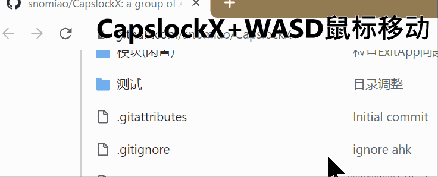

# CapsLockX - 💻 Get Hacker's Keyboard. Operate your computer like a **hacker**

CapsLockX is a modular hotkey script engine based on AutoHotkey. It allows you to operate your computer efficiently like a hacker in a movie without ever taking your hands off the keyboard. It comes packed with functions that are intuitive and easy to use: enhanced editing, virtual desktop and window management, mouse simulation, in-app hotkey enhancement, JS mathematical expression calculation, and many more multifunctional features are there for you to personally customize.

Here is a tiny online demo to show you the feeling how WASD Mouse + HJKL Keyboard works - [Try CapsLockX](https://snomiao.github.io/capslockx.js/)

Docs in Languages:
**[English Docs (ChatGPT Translated)](https://capslockx.snomiao.com/)**
**[简体中文 説明](./docs/README.zh.md)**
**[See Any Language Docs (Google Translated)](https://capslockx.snomiao.com/)**

---

## Badges Wall 📛 Badges

<!-- culture badges  -->

[](https://github.com/Program-in-Chinese/overview),
[](https://996.icu)
[](https://github.com/snolab/CapsLockX/blob/master/LICENSE.md)


[](https://github.com/snolab/CapsLockX/stargazers)

<!-- build and publish status -->


[](https://github.com/snolab/CapsLockX/actions/workflows/gh-pages-release.yml)

[](https://www.jsdelivr.com/package/gh/snolab/capslockx)

[](https://www.npmjs.com/capslockx)
[](https://github.com/snolab/CapsLockX/actions/workflows/npm-publish.yml)


[](https://community.chocolatey.org/packages/CapsLockX/)
[](https://github.com/snolab/CapsLockX/actions/workflows/choco-push.yml)
[](https://community.chocolatey.org/packages/CapsLockX/)

<!-- [](https://github.com/snolab/CapsLockX/actions/workflows/package-test.yml) -->

---

## Why?

CapsLockX was created to address several common frustrations that many computer users face on a daily basis. Here are some of the main reasons why CapsLockX exists:

1. **Efficient Window Management**: Modern computer usage often involves juggling multiple windows and virtual desktops, especially for professionals working on complex projects. CapsLockX provides intuitive hotkeys for managing virtual desktops and windows, making it easy to switch between tasks seamlessly without losing focus.

2. **Enhanced Text Editing**: Moving between the typing area and the editing control area can be cumbersome, especially for heavy typists or programmers. CapsLockX introduces Vim-like keybinds and other enhancements that allow for efficient text navigation and editing directly from the keyboard.

3. **Mouse Simulation**: Constantly switching between the keyboard and the mouse can disrupt workflow and lead to repetitive strain injuries (RSI). CapsLockX solves this by enabling comprehensive mouse emulation using the keyboard, allowing users to perform mouse actions with simple key combinations.

4. **Streamlined Shortcut Management**: Different applications often have their own sets of shortcuts, which can be hard to remember or inefficiently placed. CapsLockX provides a unified way to enhance and customize hotkeys within various applications, allowing for a more cohesive and efficient working environment.

5. **Mathematical Expression Calculation**: For users who frequently need to perform calculations, CapsLockX offers a way to quickly evaluate JavaScript mathematical expressions directly from the keyboard, streamlining workflows that involve frequent calculations.

6. **Multifunctional Customization**: CapsLockX is modular and highly customizable, allowing users to tailor the hotkey scripts to their specific needs. Whether you need specific functions for coding, writing, designing, or managing tasks, CapsLockX can be adapted to meet those requirements.

7. **Portable and Open Source**: CapsLockX is designed to be a portable tool that can be easily transferred and used across different systems. As an open-source project, it also provides transparency and community-driven improvements, ensuring that the software remains secure and continuously enhanced.

In summary, CapsLockX aims to make computer interaction more efficient, ergonomic, and customized to individual workflows, helping users operate like a **hacker** in movies, quickly achieving their tasks without breaking concentration.

## Beginner's Quick Start Tutorial 📖 Tutorial

### Simple Quick Start Tutorial (Completion of this section is considered the beginning of mastering CapsLockX)

CapsLockX has four core functions: **window management**, **mouse emulation**, **arrow key emulation**, and application-specific hotkeys. This beginner tutorial will teach you the first three core functions.

First, get CapsLockX: download this zip file: [Download JSDelivrCDN - Release Package.zip](https://cdn.jsdelivr.net/gh/snolab/CapsLockX@gh-pages/CapsLockX-latest.zip)

After unzipping, open `CapsLockX.exe` within the CapsLockX folder, get past the simple beginner tutorial, and then try out the following functions in the left and right-hand feature areas to understand the capabilities of CapsLockX.

Once CapsLockX is started, it will **not affect** the functionality of other keys on your keyboard. The following features are triggered only when you press `CapsLockX + combination keys`.

Left-hand feature area:

- Window management: `CapsLockX + 1234567890` switches to the `n`th virtual desktop, `CapsLockX + ZXCV` for window operations (window switching, window closing, window arranging, transparency top-most).
- Mouse emulation function: Press `CapsLockX + WASD` to move the mouse (as simple as moving a character while playing a game), press `CapsLockX + QE` for left and right mouse clicks, `CapsLockX + RF` for scrolling up and down.

Right-hand feature area:

- Arrow key emulation: Open any text editor (such as Notepad), press `HJKL` to move the cursor, `YOUI` to move the page

After familiarizing yourself with the basic features, consult the quick reference guide below for more advanced functionalities.

---

## Advanced Reference Manual 🦽 Manual

### Installation and Use 🛠 Installation

#### Portable Program Package (for beginners, stable version) 📦 Packaged Bins

The source code package is the software itself, no need to compile, just unzip and use the green portable software. Source code + program package, the first one is recommended (the fastest).

1. [Download JSDelivrCDN - Release Package.zip](https://cdn.jsdelivr.net/gh/snolab/CapsLockX@gh-pages/CapsLockX-latest.zip)
2. [Alternative Download CloudFlareCDN - Release Package.zip](https://capslockx.snomiao.com/CapsLockX-latest.zip)
3. [Alternative Download GitHub - Release Package.zip](https://github.com/snolab/CapsLockX/raw/gh-pages/CapsLockX-latest.zip)
4. [Alternative Download GitHub - Repository Program Package.zip](https://github.com/snolab/CapsLockX/archive/master.zip)
5. [Alternative Download BitBucket - Repository Program Package.zip](https://bitbucket.org/snomiao/capslockx/get/master.zip)
6. [Alternative Download for Mainland China Users - Gitee - Repository Program Package.zip (login required)](https://gitee.com/snomiao/CapslockX/repository/archive/master.zip)

You can use it after unzipping. Methods to start and set to auto-start: Double-click `CapsLockX.exe` to start the script. To add a startup item, enter shell:startup in the start menu - run, then create a shortcut for this program, and throw it in.

#### Command Line Installation (recommended for advanced users, can be updated automatically) 🖥️ Install by command

Choose any of the following, the 4th one is recommended for users in mainland China

1. `npx capslockx@latest`, -- Directly run with NPX, always run the latest version, recommended (requires installation of NodeJS)
2. `choco update capslockx && capslockx` -- Use [Chocolatey](https://community.chocolatey.org/packages/CapsLockX/) to install and use cup for automatic updates, recommended
3. `npm i -g capslockx && npx capslockx` -- npm global installation
4. `git clone https://gitee.com/snomiao/CapslockX && .\CapsLockX\CapsLockX.exe` -- Mainland China source code package (green software package) unzip and use, recommended for mainland China users
5. `git clone https://github.com/snolab/CapsLockX && .\CapsLockX\CapsLockX.exe` -- GitHub source code package (green software package) unzip and use
6. `winget capslockx` -- TODO #40
7. `scoop capslockx` -- TODO #41

## User Manual 📖 - Usage Manual

### Basic Operations

- Hold down `CapsLockX` to enter CapsLockX mode, at which point your keyboard will become a functional keyboard like the default mode of Vim (see key positions below).
- Press `CapsLockX+Space` at the same time to lock `CLX` mode, where `CLX` will be maintained until `CapsLockX` is pressed again next time. [Origin of Function](https://github.com/snolab/CapsLockX/issues/21)

### Module Description

CapsLockX by default loads some commonly used modules. The features and how to use them are listed below.
If you don't need certain modules, you can also directly delete the `.ahk` files in the `./Modules` directory, and then press `Ctrl + Alt + \` to reload.

You can also write your own `my-ahk.user.ahk` and put it in the `./User/` directory, and CapsLockX will automatically recognize and load them.

### Nightmares of Multitasking

#### Virtual Desktop Overview: Scenario Modes, Work Desks, Entertainment Desks, Project Categories...

Typically, a set of tasks a user is currently performing will include multiple windows. These windows combined can constitute a usage scenario, while multiple scenarios are likely to run at the same time, and some of them will run for a long time, without interference. This will involve a lot of window arrangement and virtual desktop switching operations, in these aspects, using CLX to manage your windows will bring a terrifying efficiency improvement.

Below are some examples of scenario combinations: Suppose you can study, work on several different jobs, chat with friends, play games, listen to BGM in the background, and have a paused movie ready to watch with family in the evening.

- Virtual desktop 1: Planning scenario: Schedule window + Multi-platform sync notes, e.g.: Google Calendar + Notion + Gmail.
- Virtual desktop 2: Learning scenario: Book reading window, note-taking window, e.g.: OneNote + Calibre, etc.
- Virtual desktop 3: Work scenario 1 (Front-end Development): Code editing + Documentation querying + Browser, e.g.: Chrome(dev) + VSCode + [stackoverflow](https://stackoverflow.com), etc.
- Virtual desktop 4: Work scenario 2 (Back-end Development): Code editing + Documentation querying + Backend terminal + Database browser, e.g.: DBeaver + VSCode(+bash) + [stackoverflow](https://stackoverflow.com), etc.
- Virtual desktop 5: Work scenario 3 (Script Development): Code editing + Documentation querying + Script target, e.g.: VSCode(+bash) + [stackoverflow](https://stackoverflow.com) etc.
- Virtual desktop 6: Work scenario 4 (3D Modeling and Rendering): 3D modeling software + Material searching, e.g.: Blender + Chrome.
- Virtual desktop 7: Work scenario 5 (3D Printing Slicing): Slicing software + Model searching window, e.g.: Cura + [thingiverse](https://thingiverse.com)
- Virtual desktop 7: Work scenario 6 (Video Processing): Editing + Material management, e.g.: PR + Everything.
- Virtual desktop 7: Work scenario 7 (Video Processing): Post-production + Documentation tutorial, e.g.: AE + Chrome.
- Virtual desktop 8: Writing scenario: Writing window, material referencing window, e.g.: Obsidian + Chrome (Google Scholar Index), etc.
- Virtual desktop 9: Communication scenario 1: Casual chats, e.g.: Telegram + Reddit + .
- Virtual desktop 9: Communication scenario 2: Work communication, e.g.: Slack + Skype + Gmail.
- Virtual desktop 9: Communication scenario 3: Presentation, e.g.: Google Meeting + (Vscode | Page application | Requirements document | Feedback document).
- Virtual desktop 0: Entertainment scenario 1: Playing games, e.g.: Age of Empires, Minecraft, Skyrim, Overcooked 2, etc.
- Virtual desktop 0: Entertainment scenario 3: Watching movies, listening to songs, e.g.: PotPlayer, Youtube Music, etc...
- ... More examples are welcome. Provide Issues or PRs for supplementation.

Snowstar does not recommend you handle too many tasks at the same time, but CapsLockX can save your thinking environment, greatly reducing the mental cost you incur during task switching, that is, saving you a lot of time rearranging windows and the resulting loss of attention.

(Note: If you like to handle many tasks at the same time, you might need not only a computer with not a small amount of memory but also a brain of significant capacity :D )

#### Enhancing the User Experience of Windows Window Switching - Win+Tab

When switching windows with Alt+Tab, if there are too many windows, a two-dimensional window pre-arrangement display will show up.
Generally speaking, Alt+Tab and Alt+Shift+Tab are purely left-handed keystrokes. If the user wants to select the window in the next line, they will instinctively press Alt+Tab many times.
However, the directional keys used for two-dimensional operations are often ignored because the right hand is usually on the mouse or on the J key.

Also, users will continue to hold down the Alt key after releasing the Tab key to browse the windows and select the target window to switch to.
In CLX, Alt+WASD will be used instead of the arrow keys to perform multiline window switching directly with the left hand, so there is no need to press Shift to go back to the left.
Moreover, if a user needs to clean up or close multiple windows, they simply press Alt+X to batch clean multiple target windows while remaining within the window browsing interface.

In CLX, these features greatly improve the usability of Alt+Tab.

## TODO-Docs

<details>
<summary>Click to expand TODO-docs</summary>

#### Focus count: Active window, default active window, …

Each desktop has only one active focus window, and the virtual desktop can achieve automatic switching to the focus window of that virtual desktop when switching to it, achieving multiple task focuses (i.e., active windows).

#### Utilizing Multiple Screens - Multi-screening

#### Window Arrangement in the Era of 4K - Window arrange with 4k screen

Default window arrangement limitations in Windows 10:

1. Not applicable to multiple desktops.
2. Unnecessary window gaps are too large.

##### Window Management on Linux and Mac - Window Manager in Linux and mac

TODO: i3 Window Management

##### Window Management on Android and iOS - Window Manage in android

Two system-level solutions: Left-right top-bottom split screen, floating windows; Application level: floating components,

### Troubles with Editing Operations

#### The Distance Between the Typing Area and Editing Control Area

TODO Discussion on ThinkPad and Mac arrow keys, inspiration from VIM,

### Human Perception of Speed

TODO: World perception of exponential growth, focus, auditory, visual, tactile, VS conventional linear operations

### Troubles with the Graphical User Interface

TODO: Document: Introduction to mouse simulation function, movement in RPG games

### Shortcut Deficiencies in Software

TODO: Application enhancement module introduction

### The Usability of Portable Keyboards

TODO: FN key, arrow keys, editing operations, 61-key layout vs 87-key layout,

#### The Concept of Chording

TODO Various types of chording
TODO Calculation of information quantity increase with chording

</details>

## Module Helps

<!-- The stuff below is automatically extracted from various modules. To make changes, please operate within the corresponding module.md files, as any changes made here will be overwritten. -->
<!-- MODULE_HELP_BEGIN -->
<!-- MODULE_FILE: @Help.ahk-->

### Help Module

If you want to learn how to develop plugins for CapsLockX, please:

1. Open `Modules/@Help.ahk`, where you can learn the basic format of CapsLockX plugins.
2. Copy it and give it your own plugin name.
3. Change its original function to the function you need, and the plugin development is complete!

#### See below for the functions of this module

| Scope  | Key                   | Function                         |
| ------ | --------------------- | -------------------------------- |
| Global | CapsLockX + /         | Temporarily display hotkey tips  |
| Global | CapsLockX + Alt + /   | 🔗 Open the full documentation page for CapsLockX |
| Global | CapsLockX + Shift + / | 🕷 Submit bugs, suggestions, etc. |

<!-- MODULE_FILE: App-AnkiEnhanced.ahk-->

### Anki Enhancement Module

Anki Operation Enhancement

#### Common Features/Characteristics

1. Use WASD or HJKL for quick continuous (and undoable) flashcard switching.
2. Create a word list in Excel, with two columns, select all and copy, then press Alt + i in Anki to quickly import the word list.
3. Simplify four options to three directional keys: left-easy, down-medium, right-hard, up-undo.
4. Can be used with a gamepad by using XPadder to map the gamepad joystick to directional keys. For the effect, see bilibili [中二雪星怎背词 - 手柄怎么可以不用来背单词！](https://www.bilibili.com/video/av8456838/)

#### Instructions

| Mode                 | Anki Enhancement Module | Description                                                  |
| -------------------- | :---------------------: | ------------------------------------------------------------ |
| In Anki-Learning Interface | `w or k or ↑`       | Press to undo, release to display answer                     |
| In Anki-Learning Interface | `a or h or ←`       | Press for smooth, release to display answer                  |
| In Anki-Learning Interface | `s or j or ↓`       | Press for medium, release to display answer                  |
| In Anki-Learning Interface | `d or l or →`       | Press for unfamiliar, release to display answer              |
| In Anki-Learning Interface |      `q`            | Return to the previous screen                                |
| In Anki-Learning Interface |      `c`            | Add a new card                                               |
| In Anki-Learning Interface | `1 or NumPad1`       | Hard (original key)                                          |
| In Anki-Learning Interface | `2 or NumPad2`       | Unfamiliar (original key)                                    |
| In Anki-Learning Interface | `3 or NumPad3`       | Medium (original key)                                        |
| In Anki-Learning Interface | `4 or NumPad4`       | Smooth (original key)                                        |
| In Anki-Learning Interface | `5 or NumPad5`       | Undo                                                         |
| In Anki-Learning Interface | `6 or NumPad6`       | Suspend card                                                 |
| In Anki-Learning Interface |   `Alt + i`          | Quickly import clipboard content (split by Tab) / for example, copy from Excel |
| In Anki-Add Card Interface |   `Alt + s`          | Press the Add Button                                         |

<!-- MODULE_FILE: App-OneNote.ahk-->

### OneNote 2016 - 2019 Enhancement

Enhance OneNote 2016 - 2019 keyboard operations simply, use the keyboard conveniently for: switching pens, making links, organizing pages, adjusting views...

#### Common Features by Snowstar Meow

1. When doing logs, first add a date tag to the note title on the note page with `Alt + T` (for future searches), then globally use `Win + Shift + N` to search for all notes with today's tag in OneNote, making it easy to retrieve your love diary, training log, daily reading list, project daily report for today... In short, using OneNote for journaling is very convenient, just press once, no need to search XD.
2. Select a word and press `Alt + K`, it will list all related page links below this word for making an index directory, weaving your OneNote into a web.
3. Create a new note named `My Clipboard`, then when copying text or images, CLX will automatically append to this note, making it convenient to collect materials or excerpt articles.
4. Alt + 1234567 level folding, easily switch between different levels of abstraction in thinking.

#### Key Distribution Design (Under Development)

| Key Description                | Function                | Note       |
| ------------------------------ | ----------------------- | ---------- |
| `All OneNote native hotkeys`   | Original functionality  |            |
| `Press Alt then something else`| Trigger OneNote original menu functions |      |
| `Alt + 1234567`                | Outline folding expands to 1-7 levels |      |
| `Alt + qwe asd r`              | Tools, switching pens, views |        |
| `Alt + f`                      | Search tags             |            |
| `Alt + -=`                     | Formula related         |            |
| `Alt + m`                      | Move note, section      |            |
| `Alt + hjkl`                   | Various linking functions |          |
| `Alt + zxcv`                   | Advanced copy paste     | Details in development |
| `Alt + /`                      | Hotkey help, hints      | In development |
| `F2 F3`                        | Rename, find note       |            |

#### Detailed Key Table / CheatSheet

| Applies to                  | Format Hotkey             | Function                                                                      |
| --------------------------- | ------------------------- | ---------------------------------------------------------------------------- |
| Global                      | `Win + Alt + N`           | Open the first page of quick notes (compensating for OneNote's lack of a home page concept like Notion) |
| Global                      | `Win + Shift + N`         | Open OneNote and search precisely for today's tags                          |
| OneNote2019                 | `Alt + 1234567`           | Outline: outline folding expands to that level (highly recommended, super useful) |
| OneNote2019                 | `F2`                      | Organize: rename note                                                        |
| OneNote2019                 | `Shift + F2`              | Organize: rename section                                                     |
| OneNote2019                 | `Alt + m`                 | Organize: move note                                                          |
| OneNote2019                 | `Alt + Shift + m`         | Organize: move section                                                       |
| OneNote2019                 | `Ctrl + n`                | Organize: create new note                                                    |
| OneNote2019                 | `Ctrl + Alt + n`          | Organize: create new note below current note                                 |
| OneNote2019                 | `Alt + Delete`            | Organize: quickly delete current page                                        |
| OneNote2019                 | `Ctrl + s`                | Organize: sync this notebook immediately                                     |
| OneNote2019                 | `Ctrl + w`                | Organize: close window                                                       |
| OneNote2019                 | `Shift + Delete`          | Edit: quickly delete current line                                            |
| OneNote2019                 | `Alt + -`                 | Edit: automatically 2D-ify formula                                           |
| OneNote2019                 | `Alt + k`                 | Edit: ⭐🔗 Expand related page links for current keyword (quick keyword one-to-many links) |
| OneNote2019                 | `Alt + n`                 | Style: switch page to colorless background                                   |
| OneNote2019                 | `Alt + v`                 | Style: change text background color                                          |
| OneNote2019                 | `Alt + q`                 | Tools: drag                                                                  |
| OneNote2019                 | `Alt + w`                 | Tools: lasso                                                                 |
| OneNote2019                 | `Alt + e`                 | Tools: eraser                                                                |
| OneNote2019                 | `Alt + s`                 | Tools: input                                                                 |
| OneNote2019                 | `Alt + a`                 | Tools: switch to the second pen                                              |
| OneNote2019                 | `Alt + d`                 |

<!-- MODULE_FILE: App-XunFeiSwitching.ahk-->

### Xunfei Input Method Floating Window Plugin

#### Usage

| Applies to |     Key      | Description           |
| ---------- | :----------: | --------------------- |
| Global     | Win + Alt + H | Start/Switch Xunfei Voice Input |

#### Note

1. If Xunfei Voice is not installed, it will automatically prompt a guide for download and installation.

#### Effect as shown in the image below


<!-- MODULE_FILE: CLX-Brainstorm.ahk-->

### CLX - Brainstorm

At any time, in any input box, press `CLX+b` to start using AI-assisted input.

#### Key Distribution (In Development)

| Key Description  | Function                                               | Note |
| ---------------- | ------------------------------------------------------ | ---- |
| CLX + b          | Automatically copy the current selection, input instructions, and let AI assist your input |      |
| CLX + Alt + b    | Configure activation code (currently free plan, more features may be added) |      |
| CLX + Shift + b  | Check usage quota                                      |      |

#### Protips:

##### Organize Meeting Notes Anytime

1. In any input box, use Win+H for voice input, then say what you want, without worrying about accuracy—just convey the general idea,
2. Then select all and press `CLX+b`, input `list points and to-do items` to see AI automatically organize your points and to-do list.

##### Translate Any Language Anytime

1. In any input box, select the text you want to translate
2. Then select all and press `CLX+b`, `to Chinese:` AI will automatically input it in Chinese.

<!-- MODULE_FILE: CLX-Brainstorm.ahk-->

### CLX - Brainstorm

At any time, in any input box, press `CLX+b` to start using AI-assisted input.

#### Key Distribution (In Development)

| Key Description  | Function                                               | Note |
| ---------------- | ------------------------------------------------------ | ---- |
| CLX + b          | Automatically copy the current selection, input instructions, and let AI assist your input |      |
| CLX + Alt + b    | Configure activation code (currently free plan, more features may be added) |      |
| CLX + Shift + b  | Check usage quota                                      |      |

#### Protips:

##### Organize Meeting Notes Anytime

1. In any input box, use Win+H for voice input, then say what you want, without worrying about accuracy—just convey the general idea,
2. Then select all and press `CLX+b`, input `list points and to-do items` to see AI automatically organize your points and to-do list.

##### Translate Any Language Anytime

1. In any input box, select the text you want to translate
2. Then select all and press `CLX+b`, `to Chinese:` AI will automatically input it in Chinese.

<!-- MODULE_FILE: CLX-Edit.ahk-->

### Edit Enhanced Plugin (TG YUIO HJKL) 🌟

Is there anything better in this world than moving the cursor with Vim mode's HJKL?  
There has to be!  
That's the accelerated HJKL smooth editing experience! Want to try the high-end operation of letting your cursor take a gutter turn? Install it!


| Scope       | Edit Module          | Description                     |
|-------------|----------------------|---------------------------------|
| Global (Basic) | `CapsLockX + h j k l` | Up, Down, Left, Right Arrow Keys |
| Global (Basic) | `CapsLockX + y o`     | Home End                        |
| Global (Basic) | `CapsLockX + u i`     | PageUp PageDown                 |
| Global (Basic) | `CapsLockX + [ ]`     | Shift+Tab and Tab               |
| Global (Basic) | `CapsLockX + g`       | Enter                           |
| Global (Advanced) | `CapsLockX + t`       | Delete                          |
| Global (Advanced) | `CapsLockX + hl`      | Press hl together to select the current word |
| Global (Advanced) | `CapsLockX + kj`      | Press kj together to select the current line |
| Global (Advanced) | `CapsLockX + h + t`   | Shift and then delete: can replace backspace in most cases |

<!-- MODULE_FILE: CLX-LaptopKeyboardFix.ahk-->

### Surface Laptop Function Key Enhancement

Specially designed for various damaged laptop keyboards

1. No right Ctrl key? Merge the Menu and right Ctrl keys. Menu can be used as Ctrl or Ctrl as Menu.
2. No Pause key? Win + Alt + P can also open system settings information.
3. To be added

| Mode             | Key                                      | Function                           |
| ---------------- | :--------------------------------------- | ---------------------------------- |
| Global           | Win + Alt + P                            | Equivalent to Win + Pause, customized for laptops |
| Global           | Right Ctrl pressed once                  | Triggers Menu to pop up the menu    |
| Global           | Hold the right Menu                      | Acts as holding Ctrl, allowing combination with other keys |
| When Win key simulation is enabled | ] held while [ pressed       | Equivalent to pressing the Win key |
| When Win key simulation is enabled | RAlt+\| Equivalent to Alt+Tab but on the right hand |

<!-- MODULE_FILE: CLX-MediaKeys.ahk-->

| Applies to | Media Key Module   | Description                                 |
| ---------- | ------------------ | ------------------------------------------- |
| Global     | `CapsLockX + F1`   | Open: My Computer                           |
| Global     | `CapsLockX + F2`   | Open: Calculator                            |
| Global     | `CapsLockX + F3`   | Open: Browser Homepage                      |
| Global     | `CapsLockX + F4`   | Open: Media Library (default is Windows Media Player) |
| Global     | `CapsLockX + F5`   | Play: Pause/Play                            |
| Global     | `CapsLockX + F6`   | Play: Previous                              |
| Global     | `CapsLockX + F7`   | Play: Next                                  |
| Global     | `CapsLockX + F8`   | Play: Stop                                  |
| Global     | `CapsLockX + F9`   | Volume Up                                   |
| Global     | `CapsLockX + F10`  | Volume Down                                 |
| Global     | `CapsLockX + F11`  | Mute                                        |

<!-- MODULE_FILE: CLX-Mouse.ahk-->

### Simulated Mouse Plugin (WASD QERF)

> All along, I've always considered myself a keyboard enthusiast, which probably started when I injured my finger joints while modeling, making me a heavy keyboard user. I actively memorized various keyboard shortcuts to minimize mouse use, learning vim and emacs in the process. However, the mouse is irreplaceable at times, especially with the prominence of graphical interfaces.

— The above is a quote from the author of [SimClick Simulated Click](https://github.com/rywiki/simclick), a grid-based simulated mouse project that complements this project.

— Recommended by [Qin Jinwei](http://rsytes.coding-pages.com/)

#### Features

- This module uses the key group: CapsLockX + QWER ASDF
- Simulate complete mouse functionality comfortably with WASD QE RF. Trust me, once you try this feel, you'll love it.
- The pointer automatically snaps to various buttons and hyperlinks when moving. The wheel's exponential acceleration mechanism helps you handle super long articles and web pages fearlessly.
- Effect as shown:
  

#### How to Use

| Applies to | Keys                                  | Description                                      |
| ---------- | ------------------------------------- | ------------------------------------------------ |
| Global     | `CapsLockX + w a s d`                 | Mouse movement (up, down, left, right)           |
| Global     | `CapsLockX + ad`                      | Switch HJKL keys to wheel mode (scroll up, down) |
| Global     | `CapsLockX + r f`                     | Vertical scroll wheel (up, down)                 |
| Global     | `CapsLockX + Shift + r f`             | Horizontal scroll wheel (left, right)            |
| Global     | `CapsLockX + Ctrl + Alt + r f`        | Automatic vertical scrolling (up, down)          |
| Global     | `CapsLockX + Ctrl + Alt + Shift+ r f` | Automatic horizontal scrolling (left, right)     |
| Global     | `CapsLockX + rf`                      | Pressing rf simultaneously acts as the middle mouse button |
| Global     | `CapsLockX + e`                       | Left mouse button                                |
| Global     | `CapsLockX + q`                       | Right mouse button                               |

#### Operational Details

Quick press AD for stepping.

<!-- MODULE_FILE: CLX-NodeEval.ahk-->

| Applies to | Key Combination  | Effect                                            |
| ---------- | ---------------- | ------------------------------------------------- |
| Global     | `CapsLockX + -`  | Computes the selected JavaScript expression and replaces it |
| Global     | `CapsLockX + =`  | Computes the selected JavaScript expression and replaces it |

<!-- MODULE_FILE: CLX-WindowManager.ahk-->

### 窗口增强插件 (CLX + 1234567890 ZXCV)

#### 功能简述

用好 Win 10 自带的 10 个虚拟桌面豪华配置、多显示器自动排列窗口、半透明置顶、（注：任务栏和 AltTab 相关功能暂不兼容 Win11，窗口排列功能正常。）

1. 窗口切换：`CapsLockX + [Shift] + Z`
2. 窗口关闭：`CapsLockX + [Shift] + X`
3. 窗口排列：`CapsLockX + [Shift] + C`
4. 窗口置顶：`CapsLockX + [Shift] + V`
5. 左手窗口管理：在 `Alt + Tab` 的界面，用 `WASD` 切换窗口，`X` 关掉窗口。
6. 高效使用虚拟桌面：`CapsLockX + 0123456789` 切换、增减虚拟桌面，加上 `Shift` 键可以转移当前窗口
7. 虚拟机与远程桌面快速脱离：双击左边 `Shift + Ctrl + Alt`。

#### 效果图

- Alt + Tab 管理窗口增强
  
- CapsLockX + C 一键排列窗口（这 GIF 是旧版本录的看起来比较卡，新版本优化过 API 就不卡了）
  

#### 使用方法如下 ( Alt+Tab 与 CapsLockX )

| 作用域       | 窗口增强模块                          | 说明                                       |
| ------------ | ------------------------------------- | ------------------------------------------ |
| Alt+Tab 界面 | `Q E`                                 | 左右切换多桌面                             |
| Alt+Tab 界面 | `W A S D`                             | 上下左右切换窗口选择                       |
| Alt+Tab 界面 | `X C`                                 | 关闭选择的窗口（目前 X 和 C 没有区别）     |
| Win+Tab 视图 | `Alt + W A S D`                       | 切换窗口选择                               |
| 全局         | `Win + [Shift] + B`                   | 定位到托盘任务(windows 系統自帯熱鍵)       |
| 全局         | `Win + [Shift] + T`                   | 定位到任務栏任务(windows 系統自帯熱鍵)     |
| 全局         | `Win + Shift + hjkl`                  | 在窗口之间按方向切换焦点                   |
| 任务栏       | `Ctrl + W 或 Delete`                  | 在托盘图标或任务栏任务上，选择退出按钮     |
| 全局         | `CapsLockX + 1 2 ... 9 0`             | 切换到第 1 .. 12 个桌面                    |
| 全局         | `CapsLockX + Shift + 1 2 ... 9 0 - =` | 把当前窗口移到第 n 个桌面(如果有的话)      |
| 全局         | `CapsLockX + Alt + Backspace`         | 删除当前桌面（会把所有窗口移到上一个桌面） |
| 全局         | `CapsLockX + C`                       | 快速排列当前桌面的窗口                     |
| 全局         | `CapsLockX + Ctrl + C`                | 快速排列当前桌面的窗口（包括最小化的窗口） |
| 全局         | `CapsLockX + Shift + C`               | 快速堆叠当前桌面的窗口                     |
| 全局         | `CapsLockX + Shift + Ctrl + C`        | 快速堆叠当前桌面的窗口（包括最小化的窗口） |
| 全局         | `CapsLockX + Z`                       | 循环切到最近使用的窗口                     |
| 全局         | `CapsLockX + Shift + Z`               | 循环切到最不近使用的窗口                   |
| 全局         | `CapsLockX + X`                       | 关掉当前标签页 Ctrl+W                      |
| 全局         | `CapsLockX + Shift + X`               | 关掉当前窗口 Alt+F4                        |
| 全局         | `CapsLockX + V`                       | 让窗口透明                                 |
| 全局         | `CapsLockX + Shift + V`               | 让窗口保持透明（并置顶）                   |
| 任意窗口     | `双击左边 Shift+Ctrl+Alt`             | 后置当前窗口， \* 见下方注                 |

\*注： 双击左边 Shift+Ctrl+Alt 设计用于远程桌面与虚拟机，使其可与本机桌面窗口同时显示。
例如 mstsc.exe、TeamViewer、VirtualBox、HyperV、VMWare 等远程桌面或虚拟机程序，配合 CapsLockX + Shift + V 透明置顶功能，让你在 Windows 的界面上同时使用 Linux 界面或 MacOS 界面再也不是难题。

此处借用 [@yangbin9317 的评论](https://v2ex.com/t/772052#r_10458792)

> 以 CapsLock 为抓手,打通底层逻辑,拉齐 Windows 和 Linux WM,解决了 Windows 难用的痛点

(20220313) 对于两端都是 Windows 的情况，也可以考虑使用 [RemoteApp Tool - Kim Knight](http://www.kimknight.net/remoteapptool) 来代替远程桌面。
…

<!-- MODULE_FILE: QuickInput.ahk-->

### 快捷输入

| 模式 | 快捷输入 | 说明                                            |
| ---- | -------- | ----------------------------------------------- |
| 全局 | `#D#`    | 日期输入：`(20220217)`                          |
| 全局 | `#T#`    | 时间输入：`(20220217.220717)`                   |
| 全局 | `#DT#`   | 日期时间输入：`2022-02-17 22:07:33`             |
| 全局 | `#NPW#`  | 随机输入数字密码如： `7500331260229289`         |
| 全局 | `#PW#`   | 随机输入数字字母密码如： `yyCTCNYodECTLr2h`     |
| 全局 | `#WPW#`  | 随机输入数字字母密码如： `FtD5BB1m5H98eY7Y`     |
| 全局 | `#SPW#`  | 随机输入数字字母符号密码如： `/})y+xK]z~>XKQ+p` |
…

<!-- MODULE_FILE: TomatoLife.ahk-->

### 番茄时钟

25 分钟固定循环休息提醒。

使用 `CapsLockX + ,` 打开配置，然后修改 EnableScheduleTasks=1 即可启用本插件。

- 使用番茄报时（00 分和 30 分播放工作铃声，每小时的 25 分和 55 分播放休息铃声）（需要先开启定时任务）

  ```ini
  UseTomatoLife=1
  ```

- 使用番茄报时时，自动切换桌面（使用番茄报时时，自动切换桌面（休息桌面为 1，工作桌面为 2）

  ```ini
  UseTomatoLifeSwitchVirtualDesktop=1
  ```

注：如果只需要声音而不需要自动切换桌面的话，也可试试这款 Chrome 插件 [Tomato Life - Chrome 网上应用店](https://chrome.google.com/webstore/detail/25min-tomato-life/kkacpbmkhbljebmpcopjlgfgbgeokbhn)

注注: 本插件已经分离出一个独立项目，如果你喜欢番茄工作法的话可以参见雪星的 tomato-life 项目： [snomiao/tomato-life](https://github.com/snomiao/tomato-life)
…

<!-- MODULE_FILE: TurnOffScreenWhenLock.ahk-->

### Automatically Turn Off Screen When Locking

When you press Win + L to lock the screen, immediately turn off the screen. This is suitable for automatically turning off the computer screen when you're about to sleep, so it doesn't glare while you're sleeping...
Press Win + Alt + L to immediately turn off the screen, suitable for turning off the computer screen when you're about to sleep, so it doesn't glare while you're sleeping...

<!-- MODULE_HELP_END -->

## Past and Future 🛰

### Production Background (Autumn of 2017) 🍁 Background

> I often write code…
> At first, I was used to using the mouse with my right hand... later I found it a bit far to put the mouse on the right... so I switched to using the mouse with my left hand.
> After switching to the left hand, I realized I still had to take it off the keyboard... so I made a script that simulates the mouse with the WASD keys. (Then I could keep playing with the computer with my right hand under my chin)
> Later I wrote more and more scripts and put some of the common ones together to load...

### Development RoadMap 🛰️ RoadMap

The core philosophy of CapsLockX is to simplify system operation logic, improve operation efficiency, and not conflict with existing habitual key positions.

1. [x] Press CapsLockX + - key to display corresponding help (the current display style is quite rough)
2. [ ] i18n (eh this really should exist)
3. [ ] Auto-update (although git pull is also fine)
4. [ ] Tutorial for first-time users (this is a bit simple now...)
5. [ ] Plugin manager (although the file system could handle it too)
6. [ ] Auto-sync of configuration (though throwing it in OneDrive is usually enough)
7. [ ] A user-friendly options configuration UI (though changing ini isn't that hard)
8. [ ] Execute external code (Python, Nodejs, external AHK, Bash, …) (although running a script isn't much trouble)
9. [ ] Can be install with "irm https://get.capslockx.com | iex"
       If you have any ideas or suggestions, please propose them here:
       [Issues · snomiao/CapslockX](https://github.com/snolab/CapsLockX/issues)

### Key Combination Meaning Design ⌨ Chore Design

Win + series are generally used for operating system functions, desktop window application process management, input method, output device (display, multiple screens) management.

Alt + series typically denote invocation of application internal functions, their meanings should be equivalent to pressing the same function button, or jumping to a specific function interface.

Ctrl + series as above, but used more frequently and it's very likely that there is no button with the same function.

Ctrl + Alt + same as above, but generally for global hotkeys.

The Shift key is used to slightly change the meaning of the above functions (such as reverse operations like Shift+Alt+Tab, or extended function range like Shift+Arrow keys to adjust the selection, etc.)

## Compares

### CapsLockX vs. Similar Projects Function Comparison ⚔ Feat Compare Matrix

Updated (20200627) The information may become outdated over time

| Feature\Project                 | [CapsLockX](https://github.com/snolab/CapsLockX) | [Vonng/CapsLock](https://github.com/Vonng/CapsLock) | [coralsw/CapsEz](https://github.com/coralsw/CapsEz) | [CapsLock+](https://capslox.com/capslock-plus/) |
| :------------------------------ | :----------------------------------------------- | :-------------------------------------------------- | :-------------------------------------------------- | :---------------------------------------------- |
| Mouse Simulation                | ✅ Smooth and complete                           | ✅ No scroll wheel                                  | 🈚 None                                             | 🈚 None                                         |
| Expression Calculation          | ✅ Nodejs or JScript                             | 🈚 None                                             | 🈚 None                                             | ✅ TabScript (Snippet + Javascript)             |
| Window Management               | ✅ Strong                                        | ✅ Available                                        | ✅ Available                                        | ✅ Strong                                       |
| Virtual Desktop Management      | ✅ Available                                     | 🈚 None                                             | 🈚 None                                             | 🈚 None                                         |
| Editing Enhancement             | ✅ Available (parabolic model)                   | ✅ Available                                        | ✅ Available                                        | ✅ Very comprehensive                           |
| Portable (No Install)           | ✅ Yes                                           | ✅ Yes                                              | ✅ Yes                                              | ✅ Yes                                          |
| Enhanced Media Keys             | Not all                                          | ✅ All                                              | 🈚 None                                             | 🈚 None                                         |
| Enhanced Clipboard              | Weak                                             | 🈚 None                                             | 🈚 None                                             | ✅ Available                                    |
| Quick Application Launch        | ✅ Plugins                                       | ✅ Available                                        | ✅ Available                                        | ✅ Available                                    |
| Application Feature Enhancement | ✅ Rich                                          | 🈚 None                                             | ✅ Available                                        | 🈚 None                                         |
| Bash Control                    | 🈚 None                                          | ✅ Available                                        | 🈚 None                                             | 🈚 None                                         |
| Quick Start Voice Input         | ✅ iFLYTEK                                       | 🈚 None                                             | 🈚 None                                             | 🈚 None                                         |
| Quick Input of Time and Date    | ✅ Available                                     |                                                     | ✅ Available                                        |                                                 |
| Bind Window to Hotkey           | 🈚 None                                          | 🈚 None                                             | 🈚 None                                             | ✅ Available                                    |
| Quick Screen Rotation           | ✅ Available                                     | 🈚 None                                             | 🈚 None                                             | 🈚 None                                         |
| Secondary Development           | ✅ Documentation friendly                        | ✅ Possible                                         | ✅ Possible                                         | ✅ Possible                                     |
| Memory Usage                    | ✅ About 2~3M                                    |                                                     |                                                     |                                                 |
| Modularization                  | ✅                                               | 🈚 None                                             | 🈚 None                                             | 🈚 None                                         |
| System                          | Win                                              | Mac (main), Win (secondary)                         | Win                                                 | Win, [Mac](https://capslox.com/)                |
| Supported Languages             | English / Chinese / Any Language (by ChatGPT)    | Chinese / English                                   | Chinese                                             | Chinese / English                               |

### CapsLockX Address 🔗 Project Urls

The following repositories are updated synchronously:

- GitHub: [https://github.com/snolab/CapsLockX](https://github.com/snolab/CapsLockX)
- Gitee: [https://gitee.com/snomiao/CapslockX](https://gitee.com/snomiao/CapslockX)
- Bitbucket: [https://bitbucket.org/snomiao/capslockx](https://bitbucket.org/snomiao/capslockx)
- Gitlab: [https://gitlab.com/snomiao/CapsLockX/](https://gitlab.com/snomiao/CapsLockX/)

Document Address 📄

- Automatic Translation Document Netlify CDN: [https://capslockx.netlify.com](https://capslockx.netlify.com)
- Automatic Translation Document CloudFlare CDN: [https://capslockx.snomiao.com](https://capslockx.snomiao.com)

Star Chart ⭐️

- [](https://starchart.cc/snolab/CapsLockX)

### Similar Project Addresses 🔗 Similar Projects

- [Star Historys](https://star-history.t9t.io/#snolab/CapsLockX&wo52616111/capslock-plus&coralsw/CapsEz&Vonng/CapsLock)
- Source: [Vonng/CapsLock: Make CapsLock Great Again!](https://github.com/Vonng/CapsLock)
  Design: [Capslock/design.md at master · Vonng/Capslock](https://github.com/Vonng/Capslock/blob/master/design.md)
- [coralsw/CapsEz: KeyMouse Tools](https://github.com/coralsw/CapsEz)
- [CapsLock+](https://capslox.com/CapsLock-plus/)
- [Capslox](https://capslox.com/cn/)
- CapsLock++ [matrix1001/CapsLock-plus-plus: ⌨Amazing, extendable, readable autohotkey scripts framework utilized by CapsLock.](https://github.com/matrix1001/CapsLock-plus-plus)
- [Power Keys | Liberate Computer Usage Efficiency](https://powerkeys.github.io/)

## Questions and Answers ❓ Questions

Related Communities:

- [CapsLockX's issues (can be used as a forum)](https://github.com/snolab/CapsLockX/issues) ✉️
- CapsLockX User Telegram Group: [t.me/CLX_users](https://t.me/CLX_users)📱
- CapsLockX User QQ Group 🐧: [100949388](https://jq.qq.com/?_wv=1027&k=56lsK8ko)
- QZ/VimD/TC/AHK QQ Group 🐧: 271105729
- AHK Advanced QQ Group 🐧: 717947647
- The Little Red Dot mechanical keyboard group 🐧: 199606725

For questions related to CapsLockX, you can directly join the group [@雪星](tencent://message?uin=997596439) or ask privately.

### Privacy and Security 🔒 Privacy

Considering that any software that can obtain administrative rights is quite dangerous to a user's operating system, CapsLockX must and is currently adopting an open-source approach. This allows the community to freely and arbitrarily inspect any part of the CapsLockX code that may be involved, to ensure that the security of all users' operating systems is not compromised by this software.

## Support ⭐️ Supports

How to help CapsLockX survive? If CapsLockX has been helpful to you:

1. ⭐️ Please star CapsLockX on Github <a class="github-button" href="https://github.com/snolab/CapsLockX" data-color-scheme="no-preference: light; light: light; dark: dark;" data-icon="octicon-star" data-size="large" data-show-count="true" aria-label="Star snolab/CapsLockX on GitHub">Star</a>
2. 🔗 Please share it with your friends.
3. 🌐 Welcome to help translate this documentation into different languages.
4. 🐞 Welcome to submit bugs and suggestions for improvement [issues](https://github.com/snolab/CapsLockX/issues)
5. Code PR submissions are welcome, even just to correct a typo ～
6. Welcome to create works about this software, such as recording tutorial videos to post on Youtube or Bilibili, Xue Xing will like your video.
7. 💰 Welcome to donate to the development of CapsLockX, each donation will be recorded in the list below:
   - Aifadian ⚡️：[https://afdian.net/@snomiao](https://afdian.net/@snomiao)
   - PAYPAL: [https://paypal.me/snomiao](https://paypal.me/snomiao)
   - Alipay donation [snomiao@gmail.com （click to view QR code）](./docs/支付宝捐助.png)
   - Wise donation [snomiao@gmail.com](https://wise.com/pay/r/vPlWg3Mh4zhabUk)
   - [CapsLockX - Open Collective](https://opencollective.com/capslockx)
   - ETH： [0xdc2eece11a9e09c8db921989e54b30375446e49e](https://etherscan.io/address/0xdc2eece11a9e09c8db921989e54b30375446e49e)

- [Development Roadmap](#发展路线-roadmap)

### Donation Records (as of 20210821) 📄 Donate Records

| Donation Date | Name                             | Channel         | Amount      | Comment                                                        |
| ------------- | -------------------------------- | --------------- | ----------- | -------------------------------------------------------------- |
| 2021-06-19    | \*\*Yu                           | Alipay QR       | +50.00 CNY  | A little support, in favor of independent developers           |
| 2023-05-12    | Karawen                          | WeChat Transfer | +200.00 CNY | 🫡 (Salute)                                                    |
| 2023-06-09    | [@andriasw](github.com/andriasw) | Alipay Transfer | +66.66 CNY  | for CapsLockX-mac, 66.66 is good (https://github.com/andriasw) |
| 2023-12-19    | Huidan                           | QQ Red Packet   | +45.00 CNY  | Buy the developer a coffee                                     |

### Acknowledgements 🙏🏻 Thanks

- Thank you for the financial support from the above donors.
- Thanks to [Qin Jinwei](http://rsytes.coding-pages.com/) for the citation recommendation article and development suggestions: [2020-02-23 When Keyboard Simulates Mouse - Jianshu](https://www.jianshu.com/p/f757f56a7de6)
- Thanks to @He Xuren for helping with the dissemination: [CapsLockX – Operate the computer like a hacker! 【Xue Xing】 – AutoAHK](https://www.autoahk.com/archives/34996)
- Thank you to those who asked questions in the issues and in the group and helped to improve CapsLockX.

### Related Topics for References

- [秦金伟](http://rsytes.coding-pages.com/)
  - [2020-02-23 当键盘模拟鼠标 - qwertc](https://mp.weixin.qq.com/s?__biz=MzIzNzczOTkzMw==&mid=2247483745&idx=1&sn=16f16c1fa02e1ef386a83f3023fb109d&chksm=e8c54b93dfb2c285e49fa8045d2380b20810768e3be043f364be146a598faf5f363bbb2623e7&scene=21#wechat_redirect)
  - [2020-10-26 键盘模拟鼠标 2 - qwertc](https://mp.weixin.qq.com/s?__biz=MzIzNzczOTkzMw==&mid=2247484272&idx=1&sn=0ed1ff91bee008fc5c01dc0fe20e53ba&chksm=e8c54982dfb2c09493c88a0f7847ffb0b508598e0756ddd7e8ad94d1f31f65490388d6cff7a4&scene=21#wechat_redirect)
  - [2021-03-11 capslockX-治愈鼠标手 - qwertc](https://mp.weixin.qq.com/s?__biz=MzIzNzczOTkzMw==&mid=2247484478&idx=1&sn=1518d7ec4dc08c1a72c08fcaff98550e&chksm=e8c54eccdfb2c7daed0ad9b8c03395e4211e029199374f4bc0dbdc9a8403c2dae86b740c95c5&scene=21#wechat_redirect)
  - 2021 年 11 月，键盘模拟鼠标 3
  - [2022-08-21 t0820 复制后匹配-siyuan-clx-截图 - qwertc](https://mp.weixin.qq.com/s?__biz=MzIzNzczOTkzMw==&mid=2247485441&idx=1&sn=848d5e6f3fb7c1e7b14100615ca7d0db&chksm=e8c542f3dfb2cbe5770fe19bb8b5c81935e52a4a686154e69104bc403ab6ce960d1b6ae429a9&scene=21#wechat_redirect)
  - [2024-01-06 t0106 OpenAI 加持的 CapslockX - qwertc](https://mp.weixin.qq.com/s?__biz=MzIzNzczOTkzMw==&mid=2247485707&idx=1&sn=d40eea9f0b5bb81e3387ec592def4ed0&chksm=e8c543f9dfb2caef90939e2fafcb324fd757949c79399c55adfbab0940e70efd753fb6bf3837&token=1464360155&lang=zh_CN#rd)
- V2EX:
  - [有没有办法将 Chrome OS 中的快捷键实现到 Windows 10 中 - V2EX](https://www.v2ex.com/t/778967)
  - [推荐一下我的键位映射工具 MyKeymap - V2EX](https://v2ex.com/t/844432)
  - [有多少人会把键盘上的 CapsLock 和 Backspace 对调？ - V2EX](https://www.v2ex.com/t/855901)
  - [分享一个用 CapsLock+H/J/K/L 模拟方向键的小工具 - V2EX](https://www.v2ex.com/t/318182)
  - [推荐一个适合程序员的效率工具 AltPlus，左边大拇指按下 Alt 键,就可以像使用 vim 一样编程了. - V2EX](https://www.v2ex.com/t/800721)
  - [CapsLockX - 像黑客一样操作电脑 - V2EX](https://v2ex.com/t/772052#reply1)
- Zhihu:
  - [如何将电脑桌面划分为独立的两半？ - 知乎](https://www.zhihu.com/questionz/23443944/answer/1670521971)
  - [有哪位残友用的是单手键盘？ - 知乎](https://www.zhihu.com/question/50621709/answer/1681247637)
  - [怎么样才能只用键盘不用鼠标，包括任何指针触控设备，并优雅地使用电脑？ - 知乎](https://www.zhihu.com/question/21281518/answer/1770669886)
  - [如何将电脑桌面划分为独立的两半？ - 知乎](https://www.zhihu.com/question/23443944/answer/1670521971)
  - [我是职场达人，AutoHotKey 让我成为职场超人 - 知乎](https://zhuanlan.zhihu.com/p/60372361)
  - [为什么知乎上这么多人推荐 HHKB，却不反复强调说该键盘不适合大多数程序员？ - 知乎](https://www.zhihu.com/question/33690121/answer/3495460336)
- AutoAHK:
  - [AutoHotKey 中文网专栏 - 知乎](https://www.zhihu.com/column/autoahk)
  - [我是职场达人，AutoHotKey 让我成为职场超人 – AutoAHK](https://www.autoahk.com/archives/14636)
  - [脱胎于 CapslockX 的雪星鼠标-键盘模拟鼠标 – AutoAHK](https://www.autoahk.com/archives/44126)
  - [QZ——Arrary – AutoAHK](https://www.autoahk.com/archives/4133)
  - [CapsLockX - 像黑客一样操作电脑！ - AutoHotkey Community](https://www.autohotkey.com/boards/viewtopic.php?f=28&t=88593)
- [(10) What are some good career alternatives for a computer programmer with RSI? - Quora](https://www.quora.com/Repetitive-Strain-Injury-RSI/What-are-some-good-career-alternatives-for-a-computer-programmer-with-RSI)
- [simple internationalization function - Scripts and Functions - AutoHotkey Community](https://www.autohotkey.com/board/topic/50131-simple-internationalization-function/)

## Footer Catalog - Table of Contents

- [CapsLockX - 💻 Get Hacker's Keyboard. Operate your computer like a **hacker**](#capslockx----get-hackers-keyboard-operate-your-computer-like-a-hacker)
  - [Version Wall - Badge Wall 📛 Badges](#version-wall---badge-wall--badges)
  - [Beginner's Quick Start Tutorial 📖 Tutorial](#beginners-quick-start-tutorial--tutorial)
    - [Simple Introduction Tutorial (Once you read this section, you're considered to have started using CapsLockX)](#simple-introduction-tutorial-once-you-read-this-section-youre-considered-to-have-started-using-capslockx-)
  - [Advanced Reference Manual 🦽 Manual](#advanced-reference-manual--manual)
    - [Installation and Usage 🛠 Installation](#installation-and-usage--installation)
      - [Green Portable Package (Suitable for beginners, stable version) 📦 Packaged Bins](#green-portable-package-suitable-for-beginners-stable-version--packaged-bins)
      - [Command Line Installation (Recommended for advanced users, supports auto-update)🖥️ Install by command](#command-line-installation-recommended-for-advanced-users-supports-auto-update️-install-by-command)
  - [Usage Manual 📖 - Usage Manual](#usage-manual----usage-manual)
    - [Basic Operations](#basic-operations)
    - [Module Descriptions](#module-descriptions)
    - [Nightmares of Multitasking](#nightmares-of-multitasking)
      - [Virtual Desktop Overview: Scenarios Mode, Work Desktop, Entertainment Desktop, Project Categorization...](#virtual-desktop-overview-scenarios-mode-work-desktop-entertainment-desktop-project-categorization)
      - [Improvement of User Experience in Windows Window Switching - Win+tab](#improvement-of-user-experience-in-windows-window-switching---wintab)
      - [TODO-Docs](#todo-docs)
      - [Focus Amount: Active Window, Default Active Window,...](#focus-amount-active-window-default-active-window)
      - [Utilization of Multiple Screens - Multi-screening](#utilization-of-multiple-screens---multi-screening)
      - [Window Arrangement in the 4K Era - Window arrange with 4k screen](#window-arrangement-in-the-4k-era---window-arrange-with-4k-screen)
        - [Window Management in Linux and Mac - Window Manager in Linux and Mac](#window-management-in-linux-and-mac---window-manager-in-linux-and-mac)
        - [Window Management in Android and iOS - Window Management in Android](#window-management-in-android-and-ios---window-management-in-android)
    - [Troubles with Edit Operations](#troubles-with-edit-operations)
      - [Estrangement between Typing Area and Editing Control Area](#estrangement-between-typing-area-and-editing-control-area)
      - [The Concept of Chording](#the-concept-of-chording)
    - [Troubles with Graphic User Interface](#troubles-with-graphic-user-interface)
    - [Human Perception of Speed](#human-perception-of-speed)
    - [Hotkey Flaws of Software](#hotkey-flaws-of-software)
    - [Usability of Portable Keyboards](#usability-of-portable-keyboards)
    - [Help Module](#help-module)
  - [Functions of this module as follows](#functions-of-this-module-as-follows)
    - [Anki Enhancement Module](#anki-enhancement-module)
  - [Common Features/Characteristics](#common-featurescharacteristics)
  - [Explanations](#explanations)
    - [Figma Enhanced](#figma-enhanced)
  - [Common Features/Characteristics](#common-featurescharacteristics-1)
  - [Explanations](#explanations-1)
    - [OneNote 2016 - 2019 Enhancement](#onenote-2016---2019-enhancement)
  - [Common Features Used by XuexingMiao](#common-features-used-by-xuexingmiao)
  - [Key Distribution Design (Under Development)](#key-distribution-design-under-development)
  - [Detailed Key Table / CheatSheet](#detailed-key-table--cheatsheet)
    - [Editing Enhancement Plugin (TG YUIO HJKL) 🌟](#editing-enhancement-plugin-tg-yuio-hjkl--)
    - [Expanded Function Keys for Surface Laptops](#expanded-function-keys-for-surface-laptops)
    - [Media Key Module](#media-key-module)
    - [Mouse Simulation Plugin (WASD QERF)](#mouse-simulation-plugin-wasd-qerf-)
  - [Features](#features)
  - [How to Use as follows](#how-to-use-as-follows)
  - [Operational Details](#operational-details)
    - [JavaScript Calculation (Installation of NodeJS Recommended)](#javascript-calculation-installation-of-nodejs-recommended-)
    - [Window Enhancement Plugin (CLX + 1234567890 ZXCV)](#window-enhancement-plugin-clx--1234567890-zxcv)
  - [Brief Description of the Features](#brief-description-of-the-features)
  - [Effect Pictures](#effect-pictures)
  - [How to Use as follows (Alt+Tab and CapsLockX)](#how-to-use-as-follows-alttab-and-capslockx-)
    - [Quick Input](#quick-input)
    - [Pomodoro Timer](#pomodoro-timer)
    - [Auto Screen Off when Locking Screen](#auto-screen-off-when-locking-screen)
  - [Past and Future 🛰](#past-and-future-)
    - [Creation Background (Autumn 2017) 🍁 Background](#creation-background-autumn-2017--background)
    - [Development Path 🛰️ RoadMap](#development-path-️-roadmap)
    - [Combination Key Meaning Design ⌨ Chore Design](#combination-key-meaning-design--chore-design)
    - [Feature Comparison of CapsLockX and Similar Projects ⚔ Feat Compare Matrix](#feature-comparison-of-capslockx-and-similar-projects--feat-compare-matrix)
      - [CapsLockX Project Urls 🔗 Project Urls](#capslockx-project-urls--project-urls)
      - [Urls of Similar Projects 🔗 Similar Projects](#urls-of-similar-projects--similar-projects)
  - [FAQs Related ❓ Questions](#faqs-related--questions)
    - [Privacy and Security 🔒 Privacy](#privacy-and-security--privacy)
  - [Support ⭐️ Supports](#support-️-supports)
    - [Donation Records (Up to 20210821) 📄 Donate Records](#donation-records-up-to-20210821--donate-records)
    - [Acknowledgements 🙏🏻 Thanks](#acknowledgements--thanks)
    - [Related Topics](#related-topics)
  - [Footer Catalog - Table of Contents](#footer-catalog---table-of-contents)

---

<!-- Place this tag in your head or just before your close body tag. -->
<script async defer src="https://buttons.github.io/buttons.js"></script>
