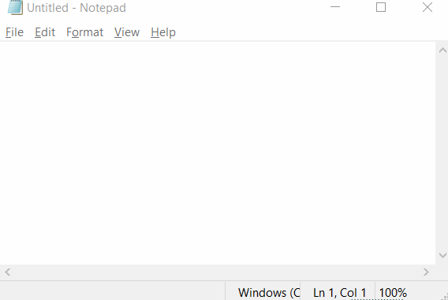
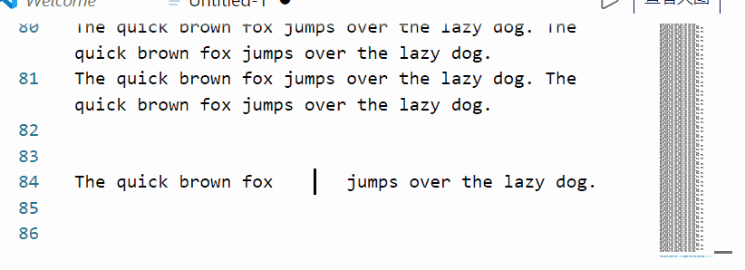
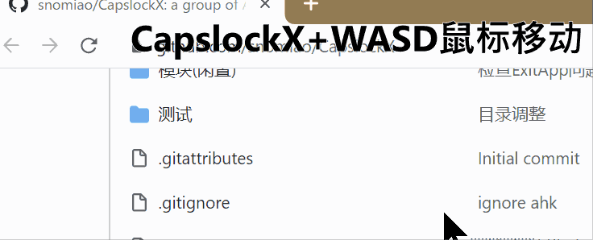
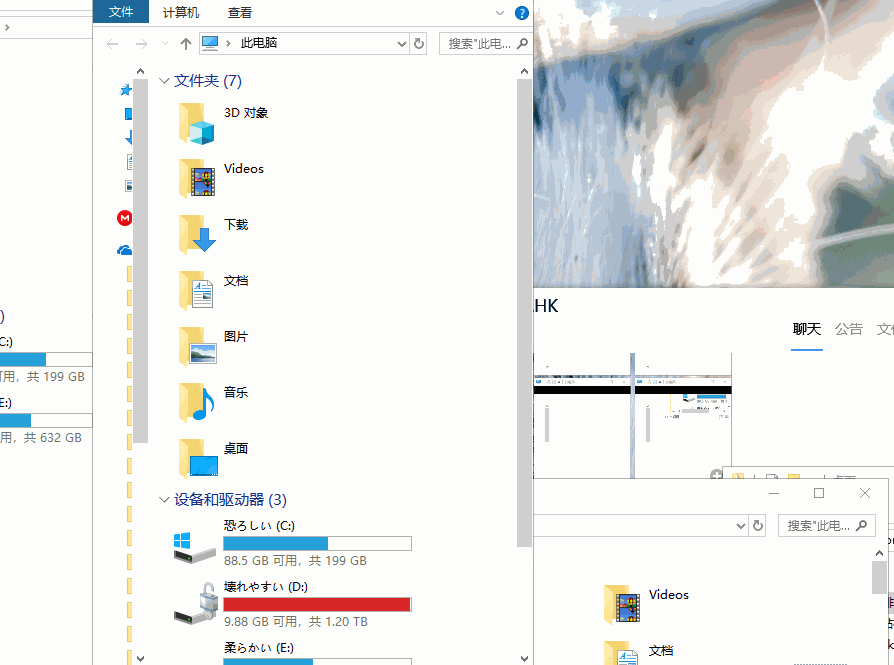
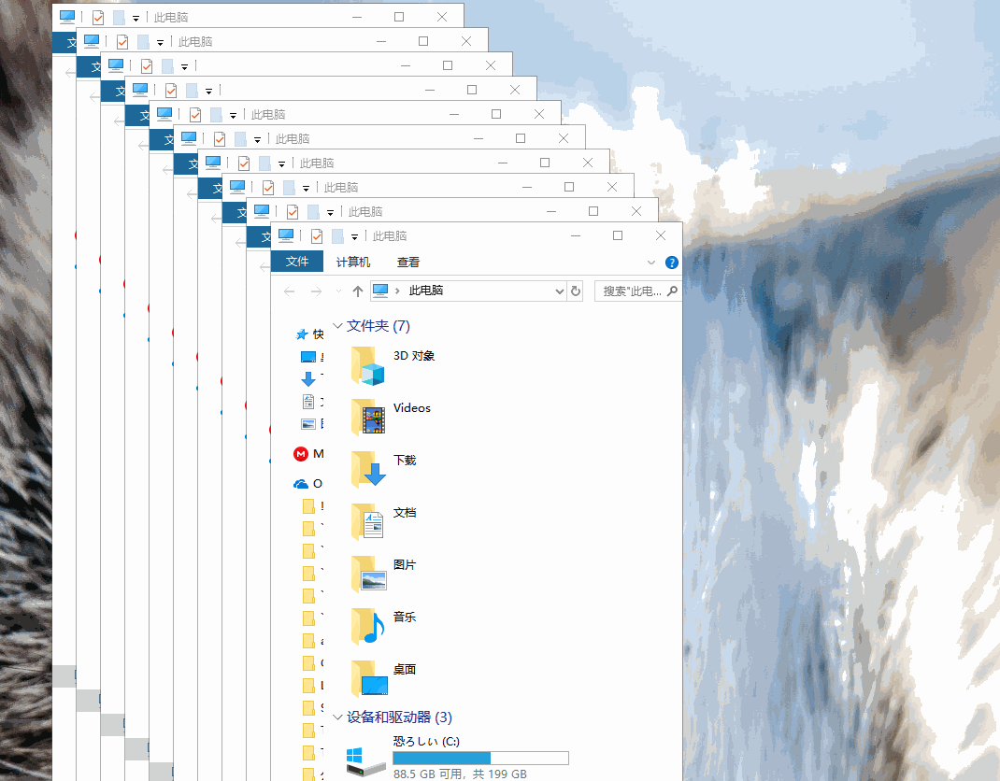

# CapsLockX 2.0 — Keyboard productivity + voice + LLM agent

> Hold `CapsLock` or `Space` + a key. Navigate without leaving home row, dictate by voice, let an LLM drive your computer.

CapsLockX is a cross-platform keyboard productivity layer, **rewritten in Rust** for 2.0. The original AutoHotkey script (1.x, Windows only) is preserved on the `legacy` branch; this page documents the current Rust implementation that runs on macOS, Linux, and (in progress) Windows.

What it does:

- **Vim-style navigation** anywhere (`HJKL` cursor, `YUIO` page, `G` enter, `T` delete, `N`/`P` tab)
- **Mouse simulation** with physics-based acceleration (`WASD` move, `QE` click, `RF` scroll)
- **Window management** & **virtual desktops** (`Z` cycle, `X` close, `C` tile, `1`–`9` desktops)
- **Voice dictation** (`Space+V`) — local SenseVoice / whisper.cpp, with optional LLM polish
- **Brainstorm chat** (`Space+B`) — streaming overlay to Gemini / OpenAI / Anthropic / Ollama / MLX
- **LLM agent** (`Space+M` or `clx agent`) — describe a task in natural language and it operates the UI for you

Languages:
**[English](./README.en.md)** · **[简体中文](./README.zh.md)** · **[日本語](./README.ja.md)** · **[Français](./README.fr.md)** · **[Español](./README.es.md)** · **[Русский](./README.ru.md)**

Repository 🏠: <https://github.com/snolab/CapsLockX>

---

## Voice features

`Space+V` toggles voice input; hold to talk push-to-talk style, tap to leave it on. The pipeline:

1. **STT** — SenseVoice (local) or whisper.cpp; Gemini cloud as fallback. Both mic and system-audio tracks are transcribed in parallel, so you can dictate over a meeting without losing either side.
2. **Polish chain** (configurable) — short utterances (≤15 chars or ≤5 s) return raw to avoid LLM-induced CER regressions; longer dictation flows through MLX (Qwen 2.5-3B local) or an LLM corrector for punctuation, capitalisation, and disfluency cleanup.
3. **Translation** (optional) — presets for learning, interpreter, chat, and conversation modes.
4. **TTS** — ElevenLabs → Gemini → OpenAI → msedge-tts → native system, with automatic fallback.

All settings live in the otoji preferences panel (`clx prefs`).

## LLM agent

The agent (`Space+M` or `clx agent --prompt "…"`) operates your computer via the CLX command language:

```
k a                  tap key 'a'
k c-c                Ctrl+C   (s=shift, c=ctrl, a=alt, w=cmd; macOS w=Cmd)
k "text"             type a string (with \n \t \" \\ escapes)
m 400 300            move mouse to (400, 300)
m 400 300 c          move + left-click
w 200ms              wait 200 ms
wf "Save" 3s         wait up to 3 s for "Save" to appear in the accessibility tree
scan ID x y w h dark>N { k key }   60 Hz pixel reflex (e.g. Chrome Dino jump)
scan_stop ID         stop a named reflex
S screen region x y w h   set the capture region
? screen             one-shot screenshot
```

CLI commands available without entering FN mode:

```bash
clx agent --tree            # dump the frontmost app's AX tree
clx agent --exec            # execute CLX commands from stdin
clx agent --prompt "open notes and write today's date"
clx agent "open notes"      # shorthand
clx dino                    # auto-play Chrome Dino with a 60 Hz pixel reflex
clx observe                 # screenshot + Gemini Vision description
clx ocr                     # Apple Vision OCR (full screen or region)
```

The agent system prompt is editable at [`skills/clx-agent/SKILL.md`](https://github.com/snolab/CapsLockX/blob/main/skills/clx-agent/SKILL.md) — no rebuild needed.

---

## Legacy 1.x reference (AutoHotkey)

The sections below describe the original AutoHotkey 1.x build. They still apply to users running CapsLockX 1.x on Windows; on the Rust 2.0 build, see [Installation](installation.md), the [hotkey map above](#hotkey-map), and the [core trigger behaviors spec](2026-05-15-core-behaviors.html) instead.

---

## Version Wall - Badges Wall 📛 Badges

<!-- culture badges  -->

[](https://github.com/Program-in-Chinese/overview),
[](https://996.icu)
[](https://github.com/snolab/CapsLockX/blob/master/LICENSE.md)


[](https://github.com/snolab/CapsLockX/stargazers)

<!-- build and publish status -->


[](https://github.com/snolab/CapsLockX/actions/workflows/gh-pages-release.yml)

[](https://www.jsdelivr.com/package/gh/snolab/capslockx)

[](https://www.npmjs.com/capslockx)
[](https://github.com/snolab/CapsLockX/actions/workflows/npm-publish.yml)


[](https://community.chocolatey.org/packages/CapsLockX/)
[](https://github.com/snolab/CapsLockX/actions/workflows/choco-push.yml)
[](https://community.chocolatey.org/packages/CapsLockX/)

<!-- [](https://github.com/snolab/CapsLockX/actions/workflows/package-test.yml) -->

---

## Beginner's Quick Start Tutorial 📖 Tutorial

### Simple Quick Start Tutorial (Completion of this section is considered the beginning of mastering CapsLockX)

CapsLockX has four core functions: **window management**, **mouse emulation**, **arrow key emulation**, and application-specific hotkeys. This beginner tutorial will teach you the first three core functions.

First, get CapsLockX: download this zip file: [Download JSDelivrCDN - Release Package.zip](https://cdn.jsdelivr.net/gh/snolab/CapsLockX@gh-pages/CapsLockX-latest.zip)

After unzipping, open `CapsLockX.exe` within the CapsLockX folder, get past the simple beginner tutorial, and then try out the following functions in the left and right-hand feature areas to understand the capabilities of CapsLockX.

Once CapsLockX is started, it will **not affect** the functionality of other keys on your keyboard. The following features are triggered only when you press `CapsLockX + combination keys`.

Left-hand feature area:

- Window management: `CapsLockX + 1234567890` switches to the `n`th virtual desktop, `CapsLockX + ZXCV` for window operations (window switching, window closing, window arranging, transparency top-most).
- Mouse emulation function: Press `CapsLockX + WASD` to move the mouse (as simple as moving a character while playing a game), press `CapsLockX + QE` for left and right mouse clicks, `CapsLockX + RF` for scrolling up and down.

Right-hand feature area:

- Arrow key emulation: Open any text editor (such as Notepad), press `HJKL` to move the cursor, `YOUI` to move the page

After familiarizing yourself with the basic features, consult the quick reference guide below for more advanced functionalities.

---

## Advanced Reference Manual 🦽 Manual

### Installation and Use 🛠 Installation

#### Portable Program Package (for beginners, stable version) 📦 Packaged Bins

The source code package is the software itself, no need to compile, just unzip and use the green portable software. Source code + program package, the first one is recommended (the fastest).

1. [Download JSDelivrCDN - Release Package.zip](https://cdn.jsdelivr.net/gh/snolab/CapsLockX@gh-pages/CapsLockX-latest.zip)
2. [Alternative Download CloudFlareCDN - Release Package.zip](https://capslockx.snomiao.com/CapsLockX-latest.zip)
3. [Alternative Download GitHub - Release Package.zip](https://github.com/snolab/CapsLockX/raw/gh-pages/CapsLockX-latest.zip)
4. [Alternative Download GitHub - Repository Program Package.zip](https://github.com/snolab/CapsLockX/archive/master.zip)
5. [Alternative Download BitBucket - Repository Program Package.zip](https://bitbucket.org/snomiao/capslockx/get/master.zip)
6. [Alternative Download for Mainland China Users - Gitee - Repository Program Package.zip (login required)](https://gitee.com/snomiao/CapslockX/repository/archive/master.zip)

You can use it after unzipping. Methods to start and set to auto-start: Double-click `CapsLockX.exe` to start the script. To add a startup item, enter shell:startup in the start menu - run, then create a shortcut for this program, and throw it in.

#### Command Line Installation (recommended for advanced users, can be updated automatically) 🖥️ Install by command

Choose any of the following, the 4th one is recommended for users in mainland China

1. `npx capslockx@latest`, -- Directly run with NPX, always run the latest version, recommended (requires installation of NodeJS)
2. `choco update capslockx && capslockx` -- Use [Chocolatey](https://community.chocolatey.org/packages/CapsLockX/) to install and use cup for automatic updates, recommended
3. `npm i -g capslockx && npx capslockx` -- npm global installation
4. `git clone https://gitee.com/snomiao/CapslockX && .\CapsLockX\CapsLockX.exe` -- Mainland China source code package (green software package) unzip and use, recommended for mainland China users
5. `git clone https://github.com/snolab/CapsLockX && .\CapsLockX\CapsLockX.exe` -- GitHub source code package (green software package) unzip and use
6. `winget capslockx` -- TODO #40
7. `scoop capslockx` -- TODO #41

## User Manual 📖 - Usage Manual

### Basic Operations

- Hold down `CapsLockX` to enter CapsLockX mode, at which point your keyboard will become a functional keyboard like the default mode of Vim (see key positions below).
- Press `CapsLockX+Space` at the same time to lock `CLX` mode, where `CLX` will be maintained until `CapsLockX` is pressed again next time. [Origin of Function](https://github.com/snolab/CapsLockX/issues/21)

### Module Description

CapsLockX by default loads some commonly used modules. The features and how to use them are listed below.
If you don't need certain modules, you can also directly delete the `.ahk` files in the `./Modules` directory, and then press `Ctrl + Alt + \` to reload.

You can also write your own `my-ahk.user.ahk` and put it in the `./User/` directory, and CapsLockX will automatically recognize and load them.

### Nightmares of Multitasking

#### Virtual Desktop Overview: Scenario Modes, Work Desks, Entertainment Desks, Project Categories...

Typically, a set of tasks a user is currently performing will include multiple windows. These windows combined can constitute a usage scenario, while multiple scenarios are likely to run at the same time, and some of them will run for a long time, without interference. This will involve a lot of window arrangement and virtual desktop switching operations, in these aspects, using CLX to manage your windows will bring a terrifying efficiency improvement.

Below are some examples of scenario combinations: Suppose you can study, work on several different jobs, chat with friends, play games, listen to BGM in the background, and have a paused movie ready to watch with family in the evening.

- Virtual desktop 1: Planning scenario: Schedule window + Multi-platform sync notes, e.g.: Google Calendar + Notion + Gmail.
- Virtual desktop 2: Learning scenario: Book reading window, note-taking window, e.g.: OneNote + Calibre, etc.
- Virtual desktop 3: Work scenario 1 (Front-end Development): Code editing + Documentation querying + Browser, e.g.: Chrome(dev) + VSCode + [stackoverflow](https://stackoverflow.com), etc.
- Virtual desktop 4: Work scenario 2 (Back-end Development): Code editing + Documentation querying + Backend terminal + Database browser, e.g.: DBeaver + VSCode(+bash) + [stackoverflow](https://stackoverflow.com), etc.
- Virtual desktop 5: Work scenario 3 (Script Development): Code editing + Documentation querying + Script target, e.g.: VSCode(+bash) + [stackoverflow](https://stackoverflow.com) etc.
- Virtual desktop 6: Work scenario 4 (3D Modeling and Rendering): 3D modeling software + Material searching, e.g.: Blender + Chrome.
- Virtual desktop 7: Work scenario 5 (3D Printing Slicing): Slicing software + Model searching window, e.g.: Cura + [thingiverse](https://thingiverse.com)
- Virtual desktop 7: Work scenario 6 (Video Processing): Editing + Material management, e.g.: PR + Everything.
- Virtual desktop 7: Work scenario 7 (Video Processing): Post-production + Documentation tutorial, e.g.: AE + Chrome.
- Virtual desktop 8: Writing scenario: Writing window, material referencing window, e.g.: Obsidian + Chrome (Google Scholar Index), etc.
- Virtual desktop 9: Communication scenario 1: Casual chats, e.g.: Telegram + Reddit + .
- Virtual desktop 9: Communication scenario 2: Work communication, e.g.: Slack + Skype + Gmail.
- Virtual desktop 9: Communication scenario 3: Presentation, e.g.: Google Meeting + (Vscode | Page application | Requirements document | Feedback document).
- Virtual desktop 0: Entertainment scenario 1: Playing games, e.g.: Age of Empires, Minecraft, Skyrim, Overcooked 2, etc.
- Virtual desktop 0: Entertainment scenario 3: Watching movies, listening to songs, e.g.: PotPlayer, Youtube Music, etc...
- ... More examples are welcome. Provide Issues or PRs for supplementation.

Snowstar does not recommend you handle too many tasks at the same time, but CapsLockX can save your thinking environment, greatly reducing the mental cost you incur during task switching, that is, saving you a lot of time rearranging windows and the resulting loss of attention.

(Note: If you like to handle many tasks at the same time, you might need not only a computer with not a small amount of memory but also a brain of significant capacity :D )

#### Enhancing the User Experience of Windows Window Switching - Win+Tab

When switching windows with Alt+Tab, if there are too many windows, a two-dimensional window pre-arrangement display will show up.
Generally speaking, Alt+Tab and Alt+Shift+Tab are purely left-handed keystrokes. If the user wants to select the window in the next line, they will instinctively press Alt+Tab many times.
However, the directional keys used for two-dimensional operations are often ignored because the right hand is usually on the mouse or on the J key.

Also, users will continue to hold down the Alt key after releasing the Tab key to browse the windows and select the target window to switch to.
In CLX, Alt+WASD will be used instead of the arrow keys to perform multiline window switching directly with the left hand, so there is no need to press Shift to go back to the left.
Moreover, if a user needs to clean up or close multiple windows, they simply press Alt+X to batch clean multiple target windows while remaining within the window browsing interface.

In CLX, these features greatly improve the usability of Alt+Tab.

#### TODO-Docs

<details>
<summary>Click to expand TODO-docs</summary>

#### Focus count: Active window, default active window, …

Each desktop has only one active focus window, and the virtual desktop can achieve automatic switching to the focus window of that virtual desktop when switching to it, achieving multiple task focuses (i.e., active windows).

#### Utilizing Multiple Screens - Multi-screening

#### Window Arrangement in the Era of 4K - Window arrange with 4k screen

Default window arrangement limitations in Windows 10:

1. Not applicable to multiple desktops.
2. Unnecessary window gaps are too large.

##### Window Management on Linux and Mac - Window Manager in Linux and mac

TODO: i3 Window Management

##### Window Management on Android and iOS - Window Manage in android

Two system-level solutions: Left-right top-bottom split screen, floating windows; Application level: floating components,

### Troubles with Editing Operations

#### The Distance Between the Typing Area and Editing Control Area

TODO Discussion on ThinkPad and Mac arrow keys, inspiration from VIM,

#### The Concept of Chording

TODO Various types of chording

TODO Calculation of information quantity increase with chording

### Troubles with the Graphical User Interface

TODO: Document: Introduction to mouse simulation function, movement in RPG games

### Human Perception of Speed

TODO: World perception of exponential growth, focus, auditory, visual, tactile, VS conventional linear operations

### Shortcut Deficiencies in Software

TODO: Application enhancement module introduction

### The Usability of Portable Keyboards

TODO: FN key, arrow keys, editing operations, 61-key layout vs 87-key layout,

</details>

<!-- The stuff below is automatically extracted from various modules. To make changes, please operate within the corresponding module.md files, as any changes made here will be overwritten. -->
<!-- MODULE_HELP_BEGIN -->
<!-- MODULE_FILE: @Help.ahk-->

…[### 帮助模块

如果你想学习如何开发 CapsLockX 的插件，请：

1. 打开 `Modules/@Help.ahk` ， 你可以了解到 CapsLockX 插件的基本格式
2. 将它复制一份，命名为你自己的插件名称
3. 将它本来的功能改成你自己需要的功能，插件的开发就完成啦！

#### 本模块功能见下

| 作用于 | 按键                  | 功能                             |
| ------ | --------------------- | -------------------------------- |
| 全局   | CapsLockX + /         | 临时显示热键提示                 |
| 全局   | CapsLockX + Alt + /   | 🔗 打开 CapsLockX 的完整文档页面 |
| 全局   | CapsLockX + Shift + / | 🕷 提交 bug、建议等              |

]

<!-- MODULE_FILE: App-AnkiEnhanced.ahk-->

…[### Anki 增强模块

Anki 操作增强

#### 常用功能/特性

1. 使用 WASD 或 HJKL 来快速连续地（并且可以撤销）切换记忆卡片
2. 在 Excel 制作一个单词列表，共 2 列， 全选复制，然后在 Anki 中按 Alt + i 来快速导入单词列表。
3. 简化 4 个选项为 3 个方向键，左易，下中，右难，上撤销。
4. 可配合手柄使用，使用 XPadder 配置手柄摇杆映射到方向键即可。效果请见 bilibili [中二雪星怎背词 - 手柄怎么可以不用来背单词！](https://www.bilibili.com/video/av8456838/)

#### 说明

| 模式                 | Anki 增强模块  | 说明                                                        |
| -------------------- | :------------: | ----------------------------------------------------------- |
| 在 Anki-学习界面     | `w 或 k 或 ↑`  | 按下=撤销，松开显示答案                                     |
| 在 Anki-学习界面     | `a 或 h 或 ←`  | 按下=顺利，松开显示答案                                     |
| 在 Anki-学习界面     | `s 或 j 或 ↓`  | 按下=一般，松开显示答案                                     |
| 在 Anki-学习界面     | `d 或 l 或 →`  | 按下=生疏，松开显示答案                                     |
| 在 Anki-学习界面     |      `q`       | 返回上个界面                                                |
| 在 Anki-学习界面     |      `c`       | 添加新卡片                                                  |
| 在 Anki-学习界面     | `1 或 NumPad1` | 困难（原键位）                                              |
| 在 Anki-学习界面     | `2 或 NumPad2` | 生疏（原键位）                                              |
| 在 Anki-学习界面     | `3 或 NumPad3` | 一般（原键位）                                              |
| 在 Anki-学习界面     | `4 或 NumPad4` | 顺利（原键位）                                              |
| 在 Anki-学习界面     | `5 或 NumPad5` | 撤销                                                        |
| 在 Anki-学习界面     | `6 或 NumPad6` | 暂停卡片                                                    |
| 在 Anki-学习界面     |   `Alt + i`    | 快速导入剪贴版的内容（按 Tab 分割） / 比如可以从 Excel 复制 |
| 在 Anki-添加卡片界面 |   `Alt + s`    | 按下 添加 按钮                                              |

]

<!-- MODULE_FILE: App-OneNote2019.ahk-->

…[### OneNote 2016 - 2019 增强

朴素地增强 OneNote 2016 - 2019 的键盘操作，便捷地使用键盘来：换笔，制作链接，整理页面，调整视图……

#### 雪星喵常用功能

1. 做日志的时候，先在笔记页面 `Alt + T` 给笔记标题添加日期标签（用于将来搜索），然后全局 `Win + Shift + N` 在 OneNote 搜索带有 今日标签 的所有笔记，用来方便地检索你今日的：恋爱日记、训练日志、每日书单、项目日报……总之在 OneNote 写日记就很方便了，一按就出来，不用找 XD
2. 选一个词按 `Alt + K` ，会把所有相关的页面链接列到这个词的下方，用来做索引目录，把你的 OneNote 织成一张网。
3. 新建一个笔记，改名叫 `我的剪贴板`，然后在复制文本、图片的时候，CLX 会帮你自动追加到这个笔记，用于方便地收集资料或摘抄文章。
4. Alt + 1234567 层级折叠，轻松地在不同抽象层次的思考上切换。

#### 按键分布设计（开发中）

| 按键描述                | 作用                    | 备注       |
| ----------------------- | ----------------------- | ---------- |
| `所有 OneNote 自带热键` | 原功能                  |            |
| `按一下 Alt 再按别的`   | 触发 OneNote 原菜单功能 |            |
| `Alt + 1234567`         | 大纲折叠展开到 1-7 层级 |            |
| `Alt + qwe asd r`       | 工具、换笔、视图        |            |
| `Alt + f`               | 查找标签                |            |
| `Alt + -=`              | 公式相关                |            |
| `Alt + m`               | 移动笔记、分区          |            |
| `Alt + hjkl`            | 各种链接功能            |            |
| `Alt + zxcv`            | 高级复制粘贴            | 细节开发中 |
| `Alt + /`               | 热键帮助、提示          | 开发中     |
| `F2 F3`                 | 重命名、查找笔记        |            |

#### 详细按键表 / CheatSheet

| 作用于                   | 格式热键                     | 功能                                                                      |
| ------------------------ | ---------------------------- | ------------------------------------------------------------------------- |
| 全局                     | `Win + Alt + N`              | 打开快速笔记第一页（弥补 OneNote 原本没有像 Notion 一样的首页概念的不足） |
| 全局                     | `Win + Shift + N`            | 打开 OneNote 并精确搜索今日标签                                           |
| OneNote2019              | `Alt + 1234567`              | 大纲：大纲折叠展开到那层（强烈推荐，超好用）                              |
| OneNote2019              | `F2`                         | 整理：重命名笔记                                                          |
| OneNote2019              | `Shift + F2`                 | 整理：重命名分区                                                          |
| OneNote2019              | `Alt + m`                    | 整理：移动笔记                                                            |
| OneNote2019              | `Alt + Shift + m`            | 整理：移动分区                                                            |
| OneNote2019              | `Ctrl + n`                   | 整理：新建笔记                                                            |
| OneNote2019              | `Ctrl + Alt + n`             | 整理：在当前笔记下方新建笔记                                              |
| OneNote2019              | `Alt + Delete`               | 整理：快速删除当前页面                                                    |
| OneNote2019              | `Ctrl + s`                   | 整理：立即同步此笔记本                                                    |
| OneNote2019              | `Ctrl + w`                   | 整理：关闭窗口                                                            |
| OneNote2019              | `Shift + Delete`             | 编辑：快速删除当前行                                                      |
| OneNote2019              | `Alt + -`                    | 编辑：自动 2 维化公式                                                     |
| OneNote2019              | `Alt + k`                    | 编辑：⭐🔗 展开当前关键词的相关页面链接（快速关键词一对多链接）           |
| OneNote2019              | `Alt + n`                    | 样式：切换页面为无色背景                                                  |
| OneNote2019              | `Alt + v`                    | 样式：改变文字背景色                                                      |
| OneNote2019              | `Alt + q`                    | 工具：拖动                                                                |
| OneNote2019              | `Alt + w`                    | 工具：套锁                                                                |
| OneNote2019              | `Alt + e`                    | 工具：橡皮                                                                |
| OneNote2019              | `Alt + s`                    | 工具：输入                                                                |
| OneNote2019              | `Alt + a`                    | 工具：换到第 2 支笔                                                       |
| OneNote2019              | `Alt + d`                    | 工具：打开换笔盘（然后可可方向键选笔 （目前全屏无效）                     |
| OneNote2019              | `Alt + d -> 1234567`         | 工具：打开换笔盘（然后选第 1 行第 x 支笔） （目前全屏无效）               |
| OneNote2019              | `Alt + d -> Shift + 1234567` | 工具：打开换笔盘（然后选第 2 行第 x 支笔） （目前全屏无效）               |
| OneNote2019              | `Alt + r`                    | 视图：缩放到原始大小                                                      |
| OneNote2019              | `Alt + y`                    | 视图：缩放到页面宽度                                                      |
| OneNote2019              | `^!+- 或 ^!+=`               | 视图：缩小页面 或 放大页面                                                |
| OneNote2019              | `Alt + f`                    | 视图：搜索标记                                                            |
| OneNote2019              | `Alt + t`                    | 编辑：给笔记增加日期标签，例如： (20220717)                               |
| OneNote2019              | `Ctrl + Shift + c`           | 编辑：复制（纯文本）                                                      |
| OneNote2019              | `Ctrl + Shift + v`           | 编辑：粘贴（纯文本）                                                      |
| OneNote2019 创建链接窗口 | `Alt + s`                    | 编辑：复制当前所有搜索结果页面的链接                                      |
| OneNote2019 创建链接窗口 | `Alt + Shift + s`            | 编辑：复制当前所有搜索结果页面的链接并粘贴                                |
| OneNote2019 剪贴板笔记   | `Ctrl + C`                   | 编辑：⭐ 追加复制的内容到名称中含有 "Clipboard" 或 "剪贴板" 的笔记        |

]

<!-- MODULE_FILE: App-XunFeiSwitching.ahk-->

…[### 讯飞输入法悬浮窗插件

#### 用法

| 作用于 |     按键      | 功能说明              |
| ------ | :-----------: | --------------------- |
| 全局   | Win + Alt + H | 启动/切换讯飞语音输入 |

#### 注

1. 若没有安装讯飞语音则会自动询问是否引导下载安装

#### 效果如下图

]

<!-- MODULE_FILE: CLX-Brainstorm.ahk-->

…[### CLX - Brainstorm 大脳风暴

任何時間，任何輸入框，按下 `CLX+b` 鍵，開始使用 AI 輔助輸入。

#### 按键分布（开发中）

| 按键描述        | 作用                                                 | 备注 |
| --------------- | ---------------------------------------------------- | ---- |
| CLX + b         | 自動複製当前选中内容，輸入指令，让 AI 辅助你的輸入   |      |
| CLX + Alt + b   | 配置激活碼（目前只有免費方案，将来可能加入功能増強） |      |
| CLX + Shift + b | 査看使用額度                                         |      |

#### Protips:

##### 随時整理会議記録

1. 任何輸入框内，使用 Win+H 來調出語音輸入，然後說出你想要的文字，不用在意語音輸入的準確度，只要說出大概的意思就可以了，
2. 然後全選按下 `CLX+b`，輸入 `列出要点和待辦事項`，就可以看到 AI 自動幫你整理出來的要點和待辦事項。

##### 随時翻訳任何語言到任何語言

1. 任何輸入框内，选中你想要翻譯的文字
2. 然後全選按下 `CLX+b`，`to chinese:` AI 自動幫你輸入成中文。
   ]

<!-- MODULE_FILE: CLX-Edit.ahk-->

…[### 编辑增强插件（ TG YUIO HJKL ） 🌟

这个世界上还有比 Vim 模式的 HJKL 移动光标更棒的东西吗？
这个必须有！
那就是带加速度的 HJKL 流畅编辑体验！想不想试试让你的光标来一次排水沟过弯的高端操作？装它！



| 作用域     | Edit 模块             | 说明                             |
| ---------- | --------------------- | -------------------------------- |
| 全局(基本) | `CapsLockX + h j k l` | 上下左右 方向键                  |
| 全局(基本) | `CapsLockX + y o`     | Home End                         |
| 全局(基本) | `CapsLockX + u i`     | PageUp PageDown                  |
| 全局(基本) | `CapsLockX + [ ]`     | Shift+Tab 和 Tab                 |
| 全局(基本) | `CapsLockX + g`       | 回车                             |
| 全局(进阶) | `CapsLockX + t`       | Delete                           |
| 全局(进阶) | `CapsLockX + hl`      | hl 一起按选择当前词              |
| 全局(进阶) | `CapsLockX + kj`      | kj 一起按选择当前行              |
| 全局(进阶) | `CapsLockX + h + t`   | 移位后删：大部分情况可代替退格键 |

]

<!-- MODULE_FILE: CLX-LaptopKeyboardFix.ahk-->

…[### Surface 笔记本扩充功能键

专治各种笔记本残破键盘

1. 没有右 Ctrl 键？合并 Menu 与 右 Ctrl 键，Menu 当 Ctrl 用 或者 Ctrl 当 Menu 用都可以
2. 没有 Pause 键？Win + Alt + P 也能打开系统设定信息。
3. 待补充

| 模式             | 按键                                  | 功能                               |
| ---------------- | :------------------------------------ | ---------------------------------- |
| 全局             | Win + Alt + P                         | 相当于 Win + Pause，专为笔记本定制 |
| 全局             | 右 Ctrl 按一下                        | 会按一下 Menu 弹出菜单             |
| 全局             | 按住右 Menu                           | 会按住 Ctrl，此时可以与其它键组合  |
| Win 键模拟启用后 | ] 按住同时，[ 按下                    | 相当于按 Win 键                    |
| Win 键模拟启用后 | RAlt+\| 相当于按 Alt+Tab 只不过在右手 |

]

<!-- MODULE_FILE: CLX-MediaKeys.ahk-->

…[### 媒体键模块

| 作用于 | 媒体键模块        | 说明                                        |
| ------ | ----------------- | ------------------------------------------- |
| 全局   | `CapsLockX + F1`  | 打开：我的电脑                              |
| 全局   | `CapsLockX + F2`  | 打开：计算器                                |
| 全局   | `CapsLockX + F3`  | 打开：浏览器主页                            |
| 全局   | `CapsLockX + F4`  | 打开：媒体库（默认是 Windows Media Player） |
| 全局   | `CapsLockX + F5`  | 播放：暂停/播放                             |
| 全局   | `CapsLockX + F6`  | 播放：上一首                                |
| 全局   | `CapsLockX + F7`  | 播放：下一首                                |
| 全局   | `CapsLockX + F8`  | 播放：停止                                  |
| 全局   | `CapsLockX + F9`  | 音量加                                      |
| 全局   | `CapsLockX + F10` | 音量减                                      |
| 全局   | `CapsLockX + F11` | 静音                                        |

]

<!-- MODULE_FILE: CLX-Mouse.ahk-->

…[### 模拟鼠标插件（ WASD QERF ）

> 一直以来，我总是以键盘控自居，应该是在从前做模型的时候伤到了手指关节开始，成为键盘重度用户的。各种键盘加速工具，主动去记住各种快捷键，力求少用鼠标，甚至去学习了 vim 和 emacs。但是，很多时候，鼠标是无可替代的，尤其是在图形界面大行其道时候。

—— 以上是来自 [SimClick 模拟点击](https://github.com/rywiki/simclick) 作者的一段话，这是一款以网格细分方式模拟鼠标的作品，可以与本项目互补

—— 由 [秦金伟](http://rsytes.coding-pages.com/) 推荐

#### 功能

- 本模块使用按键区：CapsLockX + QWER ASDF
- 非常舒适地使用 WASD QE RF 来模拟【完整的】鼠标功能，相信我，试过这种手感之后，你会喜欢上它的。
- 指针移动时会自动黏附各种按钮、超链接。滚轮的指数级增长的加速度滚动机制使你再也不惧怕超级长的文章和网页。
- 效果如图：
  

#### 使用方法如下

| 作用于 | 按键                                  | 说明                                     |
| ------ | ------------------------------------- | ---------------------------------------- |
| 全局   | `CapsLockX + w a s d`                 | 鼠标移动（上下左右）                     |
| 全局   | `CapsLockX + ad`                      | 将 HJKL 键切换到滚轮模式（上下左右滚动） |
| 全局   | `CapsLockX + r f`                     | 垂直滚轮（上下）                         |
| 全局   | `CapsLockX + Shift + r f`             | 水平滚轮（左右）                         |
| 全局   | `CapsLockX + Ctrl + Alt + r f`        | 垂直滚轮自动滚动（上 下）                |
| 全局   | `CapsLockX + Ctrl + Alt + Shift+ r f` | 水平滚轮自动滚动（左 右）                |
| 全局   | `CapsLockX + rf`                      | rf 同时按相当于鼠标中键                  |
| 全局   | `CapsLockX + e`                       | 鼠标左键                                 |
| 全局   | `CapsLockX + q`                       | 鼠标右键                                 |

#### 操作细节

快速连按 AD 步进
]

<!-- MODULE_FILE: CLX-NodeEval.ahk-->

…[### JavaScript 计算 (建议安装 NodeJS )

| 作用于 | 按键            | 效果                                   |
| ------ | --------------- | -------------------------------------- |
| 全局   | `CapsLockX + -` | 计算当前选区 JavaScript 表达式，并替换 |
| 全局   | `CapsLockX + =` | 计算当前选区 JavaScript 表达式，并替换 |

]

<!-- MODULE_FILE: CLX-WindowManager.ahk-->

…[### 窗口增强插件 (CLX + 1234567890 ZXCV)

#### 功能简述

用好 Win 10 自带的 10 个虚拟桌面豪华配置、多显示器自动排列窗口、半透明置顶、（注：任务栏和 AltTab 相关功能暂不兼容 Win11，窗口排列功能正常。）

1. 窗口切换：`CapsLockX + [Shift] + Z`
2. 窗口关闭：`CapsLockX + [Shift] + X`
3. 窗口排列：`CapsLockX + [Shift] + C`
4. 窗口置顶：`CapsLockX + [Shift] + V`
5. 左手窗口管理：在 `Alt + Tab` 的界面，用 `WASD` 切换窗口，`X` 关掉窗口。
6. 高效使用虚拟桌面：`CapsLockX + 0123456789` 切换、增减虚拟桌面，加上 `Shift` 键可以转移当前窗口
7. 虚拟机与远程桌面快速脱离：双击左边 `Shift + Ctrl + Alt`。

#### 效果图

- Alt + Tab 管理窗口增强
  
- CapsLockX + C 一键排列窗口（这 GIF 是旧版本录的看起来比较卡，新版本优化过 API 就不卡了）
  

#### 使用方法如下 ( Alt+Tab 与 CapsLockX )

| 作用域       | 窗口增强模块                          | 说明                                       |
| ------------ | ------------------------------------- | ------------------------------------------ |
| Alt+Tab 界面 | `Q E`                                 | 左右切换多桌面                             |
| Alt+Tab 界面 | `W A S D`                             | 上下左右切换窗口选择                       |
| Alt+Tab 界面 | `X C`                                 | 关闭选择的窗口（目前 X 和 C 没有区别）     |
| Win+Tab 视图 | `Alt + W A S D`                       | 切换窗口选择                               |
| 全局         | `Win + [Shift] + B`                   | 定位到托盘任务(windows 系統自帯熱鍵)       |
| 全局         | `Win + [Shift] + T`                   | 定位到任務栏任务(windows 系統自帯熱鍵)     |
| 全局         | `Win + Shift + hjkl`                  | 在窗口之间按方向切换焦点                   |
| 任务栏       | `Ctrl + W 或 Delete`                  | 在托盘图标或任务栏任务上，选择退出按钮     |
| 全局         | `CapsLockX + 1 2 ... 9 0`             | 切换到第 1 .. 12 个桌面                    |
| 全局         | `CapsLockX + Shift + 1 2 ... 9 0 - =` | 把当前窗口移到第 n 个桌面(如果有的话)      |
| 全局         | `CapsLockX + Alt + Backspace`         | 删除当前桌面（会把所有窗口移到上一个桌面） |
| 全局         | `CapsLockX + C`                       | 快速排列当前桌面的窗口                     |
| 全局         | `CapsLockX + Ctrl + C`                | 快速排列当前桌面的窗口（包括最小化的窗口） |
| 全局         | `CapsLockX + Shift + C`               | 快速堆叠当前桌面的窗口                     |
| 全局         | `CapsLockX + Shift + Ctrl + C`        | 快速堆叠当前桌面的窗口（包括最小化的窗口） |
| 全局         | `CapsLockX + Z`                       | 循环切到最近使用的窗口                     |
| 全局         | `CapsLockX + Shift + Z`               | 循环切到最不近使用的窗口                   |
| 全局         | `CapsLockX + X`                       | 关掉当前标签页 Ctrl+W                      |
| 全局         | `CapsLockX + Shift + X`               | 关掉当前窗口 Alt+F4                        |
| 全局         | `CapsLockX + V`                       | 让窗口透明                                 |
| 全局         | `CapsLockX + Shift + V`               | 让窗口保持透明（并置顶）                   |
| 任意窗口     | `双击左边 Shift+Ctrl+Alt`             | 后置当前窗口， \* 见下方注                 |

\*注： 双击左边 Shift+Ctrl+Alt 设计用于远程桌面与虚拟机，使其可与本机桌面窗口同时显示。
例如 mstsc.exe、TeamViewer、VirtualBox、HyperV、VMWare 等远程桌面或虚拟机程序，配合 CapsLockX + Shift + V 透明置顶功能，让你在 Windows 的界面上同时使用 Linux 界面或 MacOS 界面再也不是难题。

此处借用 [@yangbin9317 的评论](https://v2ex.com/t/772052#r_10458792)

> 以 CapsLock 为抓手,打通底层逻辑,拉齐 Windows 和 Linux WM,解决了 Windows 难用的痛点

(20220313) 对于两端都是 Windows 的情况，也可以考虑使用 [RemoteApp Tool - Kim Knight](http://www.kimknight.net/remoteapptool) 来代替远程桌面。
]

<!-- MODULE_FILE: QuickInput.ahk-->

…[### 快捷输入

| 模式 | 快捷输入 | 说明                                            |
| ---- | -------- | ----------------------------------------------- |
| 全局 | `#D#`    | 日期输入：`(20220217)`                          |
| 全局 | `#T#`    | 时间输入：`(20220217.220717)`                   |
| 全局 | `#DT#`   | 日期时间输入：`2022-02-17 22:07:33`             |
| 全局 | `#NPW#`  | 随机输入数字密码如： `7500331260229289`         |
| 全局 | `#PW#`   | 随机输入数字字母密码如： `yyCTCNYodECTLr2h`     |
| 全局 | `#WPW#`  | 随机输入数字字母密码如： `FtD5BB1m5H98eY7Y`     |
| 全局 | `#SPW#`  | 随机输入数字字母符号密码如： `/})y+xK]z~>XKQ+p` |

]

<!-- MODULE_FILE: TomatoLife.ahk-->

…[### 番茄时钟

25 分钟固定循环休息提醒。

使用 `CapsLockX + ,` 打开配置，然后修改 EnableScheduleTasks=1 即可启用本插件。

- 使用番茄报时（00 分和 30 分播放工作铃声，每小时的 25 分和 55 分播放休息铃声）（需要先开启定时任务）

  ```ini
  UseTomatoLife=1
  ```

- 使用番茄报时时，自动切换桌面（使用番茄报时时，自动切换桌面（休息桌面为 1，工作桌面为 2）

  ```ini
  UseTomatoLifeSwitchVirtualDesktop=1
  ```

注：如果只需要声音而不需要自动切换桌面的话，也可试试这款 Chrome 插件 [Tomato Life - Chrome 网上应用店](https://chrome.google.com/webstore/detail/25min-tomato-life/kkacpbmkhbljebmpcopjlgfgbgeokbhn)

注注: 本插件已经分离出一个独立项目，如果你喜欢番茄工作法的话可以参见雪星的 tomato-life 项目： [snomiao/tomato-life](https://github.com/snomiao/tomato-life)
]

<!-- MODULE_FILE: TurnOffScreenWhenLock.ahk-->

…[### 锁屏自动息屏

按 Win + L 锁屏时，立即关闭屏幕，适用于准备睡觉的时候自动把电脑屏幕关掉，不让它在睡觉的时候刺眼……
]

<!-- MODULE_HELP_END -->

## Past and Future 🛰

### Production Background (Autumn of 2017) 🍁 Background

> I often write code…
> At first, I was used to using the mouse with my right hand... later I found it a bit far to put the mouse on the right... so I switched to using the mouse with my left hand.
> After switching to the left hand, I realized I still had to take it off the keyboard... so I made a script that simulates the mouse with the WASD keys. (Then I could keep playing with the computer with my right hand under my chin)
> Later I wrote more and more scripts and put some of the common ones together to load...

### Development RoadMap 🛰️ RoadMap

The core philosophy of CapsLockX is to simplify system operation logic, improve operation efficiency, and not conflict with existing habitual key positions.

1. [x] Press CapsLockX + - key to display corresponding help (the current display style is quite rough)
2. [ ] i18n (eh this really should exist)
3. [ ] Auto-update (although git pull is also fine)
4. [ ] Tutorial for first-time users (this is a bit simple now...)
5. [ ] Plugin manager (although the file system could handle it too)
6. [ ] Auto-sync of configuration (though throwing it in OneDrive is usually enough)
7. [ ] A user-friendly options configuration UI (though changing ini isn't that hard)
8. [ ] Execute external code (Python, Nodejs, external AHK, Bash, …) (although running a script isn't much trouble)

If you have any ideas or suggestions, please propose them here:
[Issues · snomiao/CapslockX](https://github.com/snolab/CapsLockX/issues)

### Key Combination Meaning Design ⌨ Chore Design

Win + series are generally used for operating system functions, desktop window application process management, input method, output device (display, multiple screens) management.

Alt + series typically denote invocation of application internal functions, their meanings should be equivalent to pressing the same function button, or jumping to a specific function interface.

Ctrl + series as above, but used more frequently and it's very likely that there is no button with the same function.

Ctrl + Alt + same as above, but generally for global hotkeys.

The Shift key is used to slightly change the meaning of the above functions (such as reverse operations like Shift+Alt+Tab, or extended function range like Shift+Arrow keys to adjust the selection, etc.)

### CapsLockX vs. Similar Projects Function Comparison ⚔ Feat Compare Matrix

Updated (20200627) The information may become outdated over time

| Feature\Project                 | [CapsLockX](https://github.com/snolab/CapsLockX) | [Vonng/CapsLock](https://github.com/Vonng/CapsLock) | [coralsw/CapsEz](https://github.com/coralsw/CapsEz) | [CapsLock+](https://capslox.com/capslock-plus/) |
| :------------------------------ | :----------------------------------------------- | :-------------------------------------------------- | :-------------------------------------------------- | :---------------------------------------------- |
| Mouse Simulation                | ✅ Smooth and complete                           | ✅ No scroll wheel                                  | 🈚 None                                             | 🈚 None                                         |
| Expression Calculation          | ✅ Nodejs or JScript                             | 🈚 None                                             | 🈚 None                                             | ✅ TabScript (Snippet + Javascript)             |
| Window Management               | ✅ Strong                                        | ✅ Available                                        | ✅ Available                                        | ✅ Strong                                       |
| Virtual Desktop Management      | ✅ Available                                     | 🈚 None                                             | 🈚 None                                             | 🈚 None                                         |
| Editing Enhancement             | ✅ Available (parabolic model)                   | ✅ Available                                        | ✅ Available                                        | ✅ Very comprehensive                           |
| Portable (No Install)           | ✅ Yes                                           | ✅ Yes                                              | ✅ Yes                                              | ✅ Yes                                          |
| Enhanced Media Keys             | Not all                                          | ✅ All                                              | 🈚 None                                             | 🈚 None                                         |
| Enhanced Clipboard              | Weak                                             | 🈚 None                                             | 🈚 None                                             | ✅ Available                                    |
| Quick Application Launch        | ✅ Plugins                                       | ✅ Available                                        | ✅ Available                                        | ✅ Available                                    |
| Application Feature Enhancement | ✅ Rich                                          | 🈚 None                                             | ✅ Available                                        | 🈚 None                                         |
| Bash Control                    | 🈚 None                                          | ✅ Available                                        | 🈚 None                                             | 🈚 None                                         |
| Quick Start Voice Input         | ✅ iFLYTEK                                       | 🈚 None                                             | 🈚 None                                             | 🈚 None                                         |
| Quick Input of Time and Date    | ✅ Available                                     |                                                     | ✅ Available                                        |                                                 |
| Bind Window to Hotkey           | 🈚 None                                          | 🈚 None                                             | 🈚 None                                             | ✅ Available                                    |
| Quick Screen Rotation           | ✅ Available                                     | 🈚 None                                             | 🈚 None                                             | 🈚 None                                         |
| Secondary Development           | ✅ Documentation friendly                        | ✅ Possible                                         | ✅ Possible                                         | ✅ Possible                                     |
| Memory Usage                    | ✅ About 2~3M                                    |                                                     |                                                     |                                                 |
| Modularization                  | ✅                                               | 🈚 None                                             | 🈚 None                                             | 🈚 None                                         |
| System                          | Win                                              | Mac (main), Win (secondary)                         | Win                                                 | Win, [Mac](https://capslox.com/)                |
| Supported Languages             | English / Chinese / Any Language (by ChatGPT)    | Chinese / English                                   | Chinese                                             | Chinese / English                               |

#### CapsLockX Address 🔗 Project Urls

The following repositories are updated synchronously:

- GitHub: [https://github.com/snolab/CapsLockX](https://github.com/snolab/CapsLockX)
- Gitee: [https://gitee.com/snomiao/CapslockX](https://gitee.com/snomiao/CapslockX)
- Bitbucket: [https://bitbucket.org/snomiao/capslockx](https://bitbucket.org/snomiao/capslockx)
- Gitlab: [https://gitlab.com/snomiao/CapsLockX/](https://gitlab.com/snomiao/CapsLockX/)

Document Address 📄

- Automatic Translation Document Netlify CDN: [https://capslockx.netlify.com](https://capslockx.netlify.com)
- Automatic Translation Document CloudFlare CDN: [https://capslockx.snomiao.com](https://capslockx.snomiao.com)

Star Chart ⭐️

- [](https://starchart.cc/snolab/CapsLockX)

#### Similar Project Addresses 🔗 Similar Projects

- [Star Historys](https://star-history.t9t.io/#snolab/CapsLockX&wo52616111/capslock-plus&coralsw/CapsEz&Vonng/CapsLock)
- Source: [Vonng/CapsLock: Make CapsLock Great Again!](https://github.com/Vonng/CapsLock)
  Design: [Capslock/design.md at master · Vonng/Capslock](https://github.com/Vonng/Capslock/blob/master/design.md)
- [coralsw/CapsEz: KeyMouse Tools](https://github.com/coralsw/CapsEz)
- [CapsLock+](https://capslox.com/CapsLock-plus/)
- [Capslox](https://capslox.com/cn/)
- CapsLock++ [matrix1001/CapsLock-plus-plus: ⌨Amazing, extendable, readable autohotkey scripts framework utilized by CapsLock.](https://github.com/matrix1001/CapsLock-plus-plus)
- [Power Keys | Liberate Computer Usage Efficiency](https://powerkeys.github.io/)

## Questions and Answers ❓ Questions

Related Communities:

- [CapsLockX's issues (can be used as a forum)](https://github.com/snolab/CapsLockX/issues) ✉️
- CapsLockX User Telegram Group: [t.me/CLX_users](https://t.me/CLX_users)📱
- CapsLockX User QQ Group 🐧: [100949388](https://jq.qq.com/?_wv=1027&k=56lsK8ko)
- QZ/VimD/TC/AHK QQ Group 🐧: 271105729
- AHK Advanced QQ Group 🐧: 717947647
- The Little Red Dot mechanical keyboard group 🐧: 199606725

For questions related to CapsLockX, you can directly join the group [@雪星](tencent://message?uin=997596439) or ask privately.

### Privacy and Security 🔒 Privacy

Considering that any software that can obtain administrative rights is quite dangerous to a user's operating system, CapsLockX must and is currently adopting an open-source approach. This allows the community to freely and arbitrarily inspect any part of the CapsLockX code that may be involved, to ensure that the security of all users' operating systems is not compromised by this software.

## Support ⭐️ Supports

How to help CapsLockX survive? If CapsLockX has been helpful to you:

1. ⭐️ Please star CapsLockX on Github <a class="github-button" href="https://github.com/snolab/CapsLockX" data-color-scheme="no-preference: light; light: light; dark: dark;" data-icon="octicon-star" data-size="large" data-show-count="true" aria-label="Star snolab/CapsLockX on GitHub">Star</a>
2. 🔗 Please share it with your friends.
3. 🌐 Welcome to help translate this documentation into different languages.
4. 🐞 Welcome to submit bugs and suggestions for improvement [issues](https://github.com/snolab/CapsLockX/issues)
5. Code PR submissions are welcome, even just to correct a typo ～
6. Welcome to create works about this software, such as recording tutorial videos to post on Youtube or Bilibili, Xue Xing will like your video.
7. 💰 Welcome to donate to the development of CapsLockX, each donation will be recorded in the list below:
   - Love Send Electric ⚡️：[https://afdian.net/@snomiao](https://afdian.net/@snomiao)
   - PAYPAL: [https://paypal.me/snomiao](https://paypal.me/snomiao)
   - Alipay donation account： [snomiao@gmail.com （click to view QR code）](./支付宝捐助.png)
   - ETH： [0xdc2eece11a9e09c8db921989e54b30375446e49e](https://etherscan.io/address/0xdc2eece11a9e09c8db921989e54b30375446e49e)

- [Development Roadmap](#发展路线-roadmap)

### Donation Records (as of 20210821) 📄 Donate Records

| Donation Date | Name                             | Channel         | Amount      | Comment                                                        |
| ------------- | -------------------------------- | --------------- | ----------- | -------------------------------------------------------------- |
| 2021-06-19    | \*\*Yu                           | Alipay QR       | +50.00 CNY  | A little support, in favor of independent developers           |
| 2023-05-12    | Karawen                          | WeChat Transfer | +200.00 CNY | 🫡 (Salute)                                                    |
| 2023-06-09    | [@andriasw](github.com/andriasw) | Alipay Transfer | +66.66 CNY  | for CapsLockX-mac, 66.66 is good (https://github.com/andriasw) |
| 2023-12-19    | Huidan                           | QQ Red Packet   | +45.00 CNY  | Buy the developer a coffee                                     |

### Acknowledgements 🙏🏻 Thanks

- Thank you for the financial support from the above donors.
- Thanks to [Qin Jinwei](http://rsytes.coding-pages.com/) for the citation recommendation article and development suggestions: [2020-02-23 When Keyboard Simulates Mouse - Jianshu](https://www.jianshu.com/p/f757f56a7de6)
- Thanks to @He Xuren for helping with the dissemination: [CapsLockX – Operate the computer like a hacker! 【Xue Xing】 – AutoAHK](https://www.autoahk.com/archives/34996)
- Thank you to those who asked questions in the issues and in the group and helped to improve CapsLockX.

### Related Topics - Related Topics

- [秦金伟](http://rsytes.coding-pages.com/)
  - [2020-02-23 当键盘模拟鼠标 - qwertc](https://mp.weixin.qq.com/s?__biz=MzIzNzczOTkzMw==&mid=2247483745&idx=1&sn=16f16c1fa02e1ef386a83f3023fb109d&chksm=e8c54b93dfb2c285e49fa8045d2380b20810768e3be043f364be146a598faf5f363bbb2623e7&scene=21#wechat_redirect)
  - [2020-10-26 键盘模拟鼠标 2 - qwertc](https://mp.weixin.qq.com/s?__biz=MzIzNzczOTkzMw==&mid=2247484272&idx=1&sn=0ed1ff91bee008fc5c01dc0fe20e53ba&chksm=e8c54982dfb2c09493c88a0f7847ffb0b508598e0756ddd7e8ad94d1f31f65490388d6cff7a4&scene=21#wechat_redirect)
  - [2021-03-11 capslockX-治愈鼠标手 - qwertc](https://mp.weixin.qq.com/s?__biz=MzIzNzczOTkzMw==&mid=2247484478&idx=1&sn=1518d7ec4dc08c1a72c08fcaff98550e&chksm=e8c54eccdfb2c7daed0ad9b8c03395e4211e029199374f4bc0dbdc9a8403c2dae86b740c95c5&scene=21#wechat_redirect)
  - 2021 年 11 月，键盘模拟鼠标 3
  - [2022-08-21 t0820 复制后匹配-siyuan-clx-截图 - qwertc](https://mp.weixin.qq.com/s?__biz=MzIzNzczOTkzMw==&mid=2247485441&idx=1&sn=848d5e6f3fb7c1e7b14100615ca7d0db&chksm=e8c542f3dfb2cbe5770fe19bb8b5c81935e52a4a686154e69104bc403ab6ce960d1b6ae429a9&scene=21#wechat_redirect)
  - [2024-01-06 t0106 OpenAI 加持的 CapslockX - qwertc](https://mp.weixin.qq.com/s?__biz=MzIzNzczOTkzMw==&mid=2247485707&idx=1&sn=d40eea9f0b5bb81e3387ec592def4ed0&chksm=e8c543f9dfb2caef90939e2fafcb324fd757949c79399c55adfbab0940e70efd753fb6bf3837&token=1464360155&lang=zh_CN#rd)
- V2EX:
  - [有没有办法将 Chrome OS 中的快捷键实现到 Windows 10 中 - V2EX](https://www.v2ex.com/t/778967)
  - [推荐一下我的键位映射工具 MyKeymap - V2EX](https://v2ex.com/t/844432)
  - [有多少人会把键盘上的 CapsLock 和 Backspace 对调？ - V2EX](https://www.v2ex.com/t/855901)
  - [分享一个用 CapsLock+H/J/K/L 模拟方向键的小工具 - V2EX](https://www.v2ex.com/t/318182)
  - [推荐一个适合程序员的效率工具 AltPlus，左边大拇指按下 Alt 键,就可以像使用 vim 一样编程了. - V2EX](https://www.v2ex.com/t/800721)
  - [CapsLockX - 像黑客一样操作电脑 - V2EX](https://v2ex.com/t/772052#reply1)
- Zhihu:
  - [如何将电脑桌面划分为独立的两半？ - 知乎](https://www.zhihu.com/questionz/23443944/answer/1670521971)
  - [有哪位残友用的是单手键盘？ - 知乎](https://www.zhihu.com/question/50621709/answer/1681247637)
  - [怎么样才能只用键盘不用鼠标，包括任何指针触控设备，并优雅地使用电脑？ - 知乎](https://www.zhihu.com/question/21281518/answer/1770669886)
  - [如何将电脑桌面划分为独立的两半？ - 知乎](https://www.zhihu.com/question/23443944/answer/1670521971)
  - [我是职场达人，AutoHotKey 让我成为职场超人 - 知乎](https://zhuanlan.zhihu.com/p/60372361)
  - [为什么知乎上这么多人推荐 HHKB，却不反复强调说该键盘不适合大多数程序员？ - 知乎](https://www.zhihu.com/question/33690121/answer/3495460336)
- AutoAHK:
  - [AutoHotKey 中文网专栏 - 知乎](https://www.zhihu.com/column/autoahk)
  - [我是职场达人，AutoHotKey 让我成为职场超人 – AutoAHK](https://www.autoahk.com/archives/14636)
  - [脱胎于 CapslockX 的雪星鼠标-键盘模拟鼠标 – AutoAHK](https://www.autoahk.com/archives/44126)
  - [QZ——Arrary – AutoAHK](https://www.autoahk.com/archives/4133)
  - [CapsLockX - 像黑客一样操作电脑！ - AutoHotkey Community](https://www.autohotkey.com/boards/viewtopic.php?f=28&t=88593)
- [(10) What are some good career alternatives for a computer programmer with RSI? - Quora](https://www.quora.com/Repetitive-Strain-Injury-RSI/What-are-some-good-career-alternatives-for-a-computer-programmer-with-RSI)

## Footer Catalog - Table of Contents

- [CapsLockX - 💻 Get Hacker's Keyboard. Operate your computer like a **hacker**](#capslockx----get-hackers-keyboard-operate-your-computer-like-a-hacker)
  - [Version Wall - Badge Wall 📛 Badges](#version-wall---badge-wall--badges)
  - [Beginner's Quick Start Tutorial 📖 Tutorial](#beginners-quick-start-tutorial--tutorial)
    - [Simple Introduction Tutorial (Once you read this section, you're considered to have started using CapsLockX)](#simple-introduction-tutorial-once-you-read-this-section-youre-considered-to-have-started-using-capslockx-)
  - [Advanced Reference Manual 🦽 Manual](#advanced-reference-manual--manual)
    - [Installation and Usage 🛠 Installation](#installation-and-usage--installation)
      - [Green Portable Package (Suitable for beginners, stable version) 📦 Packaged Bins](#green-portable-package-suitable-for-beginners-stable-version--packaged-bins)
      - [Command Line Installation (Recommended for advanced users, supports auto-update)🖥️ Install by command](#command-line-installation-recommended-for-advanced-users-supports-auto-update️-install-by-command)
  - [Usage Manual 📖 - Usage Manual](#usage-manual----usage-manual)
    - [Basic Operations](#basic-operations)
    - [Module Descriptions](#module-descriptions)
    - [Nightmares of Multitasking](#nightmares-of-multitasking)
      - [Virtual Desktop Overview: Scenarios Mode, Work Desktop, Entertainment Desktop, Project Categorization...](#virtual-desktop-overview-scenarios-mode-work-desktop-entertainment-desktop-project-categorization)
      - [Improvement of User Experience in Windows Window Switching - Win+tab](#improvement-of-user-experience-in-windows-window-switching---wintab)
      - [TODO-Docs](#todo-docs)
      - [Focus Amount: Active Window, Default Active Window,...](#focus-amount-active-window-default-active-window)
      - [Utilization of Multiple Screens - Multi-screening](#utilization-of-multiple-screens---multi-screening)
      - [Window Arrangement in the 4K Era - Window arrange with 4k screen](#window-arrangement-in-the-4k-era---window-arrange-with-4k-screen)
        - [Window Management in Linux and Mac - Window Manager in Linux and Mac](#window-management-in-linux-and-mac---window-manager-in-linux-and-mac)
        - [Window Management in Android and iOS - Window Management in Android](#window-management-in-android-and-ios---window-management-in-android)
    - [Troubles with Edit Operations](#troubles-with-edit-operations)
      - [Estrangement between Typing Area and Editing Control Area](#estrangement-between-typing-area-and-editing-control-area)
      - [The Concept of Chording](#the-concept-of-chording)
    - [Troubles with Graphic User Interface](#troubles-with-graphic-user-interface)
    - [Human Perception of Speed](#human-perception-of-speed)
    - [Hotkey Flaws of Software](#hotkey-flaws-of-software)
    - [Usability of Portable Keyboards](#usability-of-portable-keyboards)
    - [Help Module](#help-module)
  - [Functions of this module as follows](#functions-of-this-module-as-follows)
    - [Anki Enhancement Module](#anki-enhancement-module)
  - [Common Features/Characteristics](#common-featurescharacteristics)
  - [Explanations](#explanations)
    - [Figma Enhanced](#figma-enhanced)
  - [Common Features/Characteristics](#common-featurescharacteristics-1)
  - [Explanations](#explanations-1)
    - [OneNote 2016 - 2019 Enhancement](#onenote-2016---2019-enhancement)
  - [Common Features Used by XuexingMiao](#common-features-used-by-xuexingmiao)
  - [Key Distribution Design (Under Development)](#key-distribution-design-under-development)
  - [Detailed Key Table / CheatSheet](#detailed-key-table--cheatsheet)
    - [Editing Enhancement Plugin (TG YUIO HJKL) 🌟](#editing-enhancement-plugin-tg-yuio-hjkl--)
    - [Expanded Function Keys for Surface Laptops](#expanded-function-keys-for-surface-laptops)
    - [Media Key Module](#media-key-module)
    - [Mouse Simulation Plugin (WASD QERF)](#mouse-simulation-plugin-wasd-qerf-)
  - [Features](#features)
  - [How to Use as follows](#how-to-use-as-follows)
  - [Operational Details](#operational-details)
    - [JavaScript Calculation (Installation of NodeJS Recommended)](#javascript-calculation-installation-of-nodejs-recommended-)
    - [Window Enhancement Plugin (CLX + 1234567890 ZXCV)](#window-enhancement-plugin-clx--1234567890-zxcv)
  - [Brief Description of the Features](#brief-description-of-the-features)
  - [Effect Pictures](#effect-pictures)
  - [How to Use as follows (Alt+Tab and CapsLockX)](#how-to-use-as-follows-alttab-and-capslockx-)
    - [Quick Input](#quick-input)
    - [Pomodoro Timer](#pomodoro-timer)
    - [Auto Screen Off when Locking Screen](#auto-screen-off-when-locking-screen)
  - [Past and Future 🛰](#past-and-future-)
    - [Creation Background (Autumn 2017) 🍁 Background](#creation-background-autumn-2017--background)
    - [Development Path 🛰️ RoadMap](#development-path-️-roadmap)
    - [Combination Key Meaning Design ⌨ Chore Design](#combination-key-meaning-design--chore-design)
    - [Feature Comparison of CapsLockX and Similar Projects ⚔ Feat Compare Matrix](#feature-comparison-of-capslockx-and-similar-projects--feat-compare-matrix)
      - [CapsLockX Project Urls 🔗 Project Urls](#capslockx-project-urls--project-urls)
      - [Urls of Similar Projects 🔗 Similar Projects](#urls-of-similar-projects--similar-projects)
  - [FAQs Related ❓ Questions](#faqs-related--questions)
    - [Privacy and Security 🔒 Privacy](#privacy-and-security--privacy)
  - [Support ⭐️ Supports](#support-️-supports)
    - [Donation Records (Up to 20210821) 📄 Donate Records](#donation-records-up-to-20210821--donate-records)
    - [Acknowledgements 🙏🏻 Thanks](#acknowledgements--thanks)
    - [Related Topics](#related-topics)
  - [Footer Catalog - Table of Contents](#footer-catalog---table-of-contents)

---

<!-- Place this tag in your head or just before your close body tag. -->
<script async defer src="https://buttons.github.io/buttons.js"></script>
