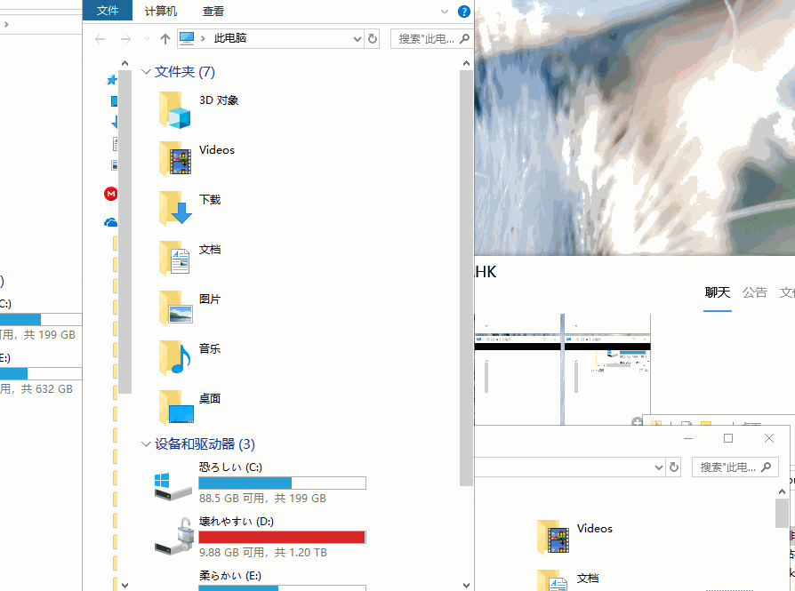

# CapsLockX - Windows 效率套件

像**黑客**一样操作电脑！CapsLockX 让你可以轻轻松松像电影里的**黑客**一样，双手不离开键盘，**高效率**地操作电脑。这里有超多一摸就懂超好上手的功能：编辑增强、虚拟桌面与窗口管理、鼠标模拟、应用内热键增强、JS数学表达式计算、等超多功能等你来定义。

## 入门教程第一

源码打包就是软件本体，无需编译

1. 下载源码 zip 点击 [Github仓库](https://github.com/snomiao/CapslockX/archive/master.zip) 或 [Gitee仓库（墙内）](https://gitee.com/snomiao/CapslockX/repository/archive/master.zip) 然后解压后使用。

2. 双击 `CapsLockX.exe` 即可启动脚本，如需添加启动项，请在开始菜单 - 运行输入 shell:startup 然后给本程序创建快捷方式，扔进去就可以了。

3. 启动脚本后, 你可以尝试：按下 `Alt`, 按住 `Tab`, 然后按 `WASD` 切换选中窗口, 再按 `C` 关闭窗口，

> 某些功能需要使用管理员身份运行（如鼠标模拟）
> 在 CapsLockX-Settings.ahk 中
> 手动修改 global T_AskRunAsAdmin := 1 即可
> 如不需要，可以改为 0

## 目录第二

- [CapsLockX - Windows 效率套件](#capslockx---windows-效率套件)
  - [入门教程第一](#入门教程第一)
  - [目录第二](#目录第二)
  - [使用手册第三](#使用手册第三)
    - [帮助模块](#帮助模块)
      - [本模块功能见下](#本模块功能见下)
    - [模拟鼠标插件](#模拟鼠标插件)
      - [功能](#功能)
      - [使用方法如下](#使用方法如下)
    - [编辑增强插件](#编辑增强插件)
    - [窗口增强插件](#窗口增强插件)
      - [功能简述：](#功能简述)
      - [效果图](#效果图)
      - [使用方法如下](#使用方法如下-1)
    - [Surface 笔记本扩充功能键](#surface-笔记本扩充功能键)
    - [秒打时间戳模块](#秒打时间戳模块)
    - [Anki 增强](#anki-增强)
    - [Edge增强模块](#edge增强模块)
    - [mstsc远程桌面增强模块](#mstsc远程桌面增强模块)
    - [TIM添加常驻功能模块](#tim添加常驻功能模块)
    - [讯飞输入法悬浮窗插件](#讯飞输入法悬浮窗插件)
      - [用法](#用法)
      - [效果如下图](#效果如下图)
    - [OneNote 剪贴板收集插件](#onenote-剪贴板收集插件)
    - [媒体键模块](#媒体键模块)
    - [搜索键模块](#搜索键模块)
    - [雪星转屏模块](#雪星转屏模块)
  - [过去与未来第四](#过去与未来第四)
    - [制作背景 ( 2017年秋)](#制作背景--2017年秋)
    - [发展路线](#发展路线)
    - [本项目与类似项目的功能对比 / (20200627)](#本项目与类似项目的功能对比--20200627)
      - [本项目地址（以下几个仓库同步）：](#本项目地址以下几个仓库同步)
      - [相似项目地址：](#相似项目地址)
      - [其它效率软件推荐](#其它效率软件推荐)
  - [答疑相关第五](#答疑相关第五)
  - [支持本项目第六](#支持本项目第六)
    - [鸣谢列表](#鸣谢列表)

## 使用手册第三

<!-- * 按 `CapsLock` 切换 CapsLockX 模式 -->
- 按住 `CapsLock` 进入 CapsLockX 模式，此时你的键盘会成为像 Vim 默认模式那样的功能键盘，（键位见下

下面列出的每个模块都可以单独禁用，请见 `CapsLockX-Settings.ahk` 文件，
对于不需要的模块，你也可以直接删除 `./Modules` 目录下对应的文件，然后按 `Ctrl + Alt + F12` 重新加载即可。

<!-- 下面这堆东西是自动从各个模块里抽取的，如需改动请到对应模块.md 里操作, 在这里修改会被覆盖 -->
<!-- 开始：抽取模块帮助 -->
<!-- 模块文件名：00-Help.ahk-->
### 帮助模块

如果你想学习如何开发 CapsLockX 的插件，请：
1. 打开这个文件中： `Modules/01-Help.ahk`， 你可以了解到 CapsLockX 插件的基本格式
2. 将它复制一份，命名为你自己的插件名称
3. 将它本来的功能改成你自己需要的功能，插件的开发就完成啦！

#### 本模块功能见下

| 作用于 | 按键 | 功能
| - | - | -
| 全局 | CapsLockX + /          | 临时显示热键提示
| 全局 | CapsLockX（长按）      | 临时显示热键提示
| 全局 | CapsLockX + Alt + /    | 🔗 打开 CapsLockX 的 README.md 页面
| 全局 | CapsLockX + Shift + /  | 🕷 提交bug、建议等

<!-- 模块文件名：01.1-插件-模拟鼠标.ahk-->
### 模拟鼠标插件

#### 功能

* 非常舒适地使用 WASD QE RF 来模拟【完整的】鼠标功能，相信我，试过这种手感之后，你会喜欢上它的。
* 指针移动时会自动黏附各种按钮、超链接。滚轮的指数级增长的加速度滚动机制使你再也不惧怕超级长的文章和网页。
* 效果如图：
  

#### 使用方法如下

| 作用于 | 按键 | 说明
| - | - | -
| 全局 | CapsLockX + w a s d | 鼠标抛物移动（上下左右）
| 全局 | CapsLockX + r f     | 垂直抛物滚轮（上下）
| 全局 | CapsLockX + R F     | 水平抛物滚轮
| 全局 | CapsLockX + rf      | r f 同时按相当于鼠标中键
| 全局 | CapsLockX + e       | 鼠标左键
| 全局 | CapsLockX + q       | 鼠标右键

<!-- 模块文件名：01.2-插件-编辑增强.ahk-->
### 编辑增强插件

这个世界上还有比 Vim 模式的 HJKL 移动光标更棒的东西吗？
这个必须有！
那就是带加速度的 HJKL 流畅编辑体验！想不想试试让你的光标来一次排水沟过弯的高端操作？装它！

| 作用域 | Edit模块   | 说明 （欢迎push）|
| - | :-: | - |
| 全局 | CapsLockX + z         | 回车（单纯是为了把回车放到左手……以便右手可以一直撑着下巴玩电脑） |
| 全局 | CapsLockX + k j h l   | 上下左右 方向键 |
| 全局 | CapsLockX + n m       | Home End |
| 全局 | CapsLockX + n + m     | n m 一起按选择当前行 |
| 全局 | CapsLockX + b         | BackSpace |
| 全局 | CapsLockX + Shift + b | Delete |

<!-- 模块文件名：03.1-插件-窗口增强.ahk-->
### 窗口增强插件

#### 功能简述：

1. CapsLockX + O 快速排列窗口
2. 在 Alt + Tab 的时候，用 `WASD` 切换窗口，C 关掉窗口
3. `CapsLockX + 0123456789 - =` 切换、增减虚拟桌面，加上 Alt 键可以转移当前窗口，高效使用虚拟桌面

#### 效果图

* Alt + Tab 管理窗口增强
  
* 一键排列窗口（这 GIF 是旧版本录的看起来比较卡，新版本优化过 API 就不卡了）
  

#### 使用方法如下

| 作用域 | 窗口增强模块   | 说明
| - | - | -
| 全局 | CapsLockX + O | 快速排列当前桌面的窗口
| 全局 | CapsLockX + Shift + O | 快速排列当前桌面的窗口（不包括最大化的窗口）
| 全局 | CapsLockX + Alt + O | 快速堆叠当前桌面的窗口
| 全局 | CapsLockX + Alt + Shift + O | 快速堆叠当前桌面的窗口（不包括最大化的窗口）
| 全局 | CapsLockX + [ ] | 切换到上一个/下一个桌面
| 全局 | CapsLockX + = | 新建桌面
| 全局 | CapsLockX + - | 删除当前桌面（会把所有窗口移到上一个桌面）
| 全局 | CapsLockX + Alt + [ ] | 把当前窗口移到上一个/下一个桌面
| 全局 | CapsLockX + Alt + = | 新建桌面，并把当前窗口移过去
| 全局 | CapsLockX + 1 2 ... 9 | 切换到第 n 个桌面
| 全局 | CapsLockX + Alt + 1 2 ... 9 | 把当前窗口移到第 n 个桌面(如果有的话)
| Alt+Tab 界面下 | W A S D | 上下左右切换窗口选择
| Alt+Tab 界面下 | X C     | 关闭选择的窗口（目前 X 和 C 没有区别）
| Alt+Tab 界面下 | Q E     | 左右切换多桌面
| Win+Tab 视图下 | W A S D | 切换窗口选择
| Win+Tab 视图下 | X | 关掉选择的窗口
| Win+Tab 视图下 | Q E | 左右切换桌面概览
| Win+Tab 视图下 | Z | 合并当前桌面与上一个桌面
| Win+Tab 视图下 | 0 | 新建桌面
| Win+Tab 视图下 | 1 2 ... 9 | 把窗口移到除了自己的第X个桌面（或新建桌面）
| Win+Tab 视图下 | V | 新建桌面，并把当前窗口扔到新建桌面
| Win+Tab 视图下 | C | 新建桌面，并把当前窗口扔到新建桌面，并激活窗口
| Win+Tab 视图下 | [ ] | 切换到上一个/下一个桌面

<!-- 模块文件名：SurfaceKeyboardFix.ahk-->
### Surface 笔记本扩充功能键

专治各种笔记本残破键盘
1. 没有右 Ctrl 键？合并 Menu与 右Ctrl键，Menu当Ctrl用 或者 Ctrl当Menu用都可以
2. 没有 Pause 键？Win + Alt + P 也能打开系统设定信息。
3. 待补充

| 模式 | 按键 | 功能 |
| - | :-: | - |
| 全局 | Win + Alt + P | 相当于 Win + Pause，专为笔记本定制 |
| 全局 | 右Ctrl按一下 | 会按一下 Menu 弹出菜单 |
| 全局 | 按住右Menu | 会按住 Ctrl，此时可以与其它键组合 |

<!-- 模块文件名：功能-秒打时间戳.ahk-->

### 秒打时间戳模块

| 模式 | 秒打时间戳   | 说明 |
| - | :-: | - |
| 全局 | [d 或 (d | 插入日期, 类似 (20190115) 这样的时间戳 |
| 全局 | [t 或 (t | 插入时间, 类似 (20190115.164744) 这样的时间戳 |
| 全局 | [s 或 (s | 插入时间, 类似 (1647) 这样的时间戳 |
| 全局 | [v | 插入版本号, 类似 v2019.01.15 这样的版本号 |

<!-- 模块文件名：应用-Anki增强.ahk-->
### Anki 增强

| 模式 | Anki增强模块   | 说明 |
| - | :-: | - |
| 在Anki-学习界面 | w 或 k 或 ↑ | 按下=撤销，松开显示答案 |
| 在Anki-学习界面 | a 或 h 或 ← | 按下=顺利，松开显示答案 |
| 在Anki-学习界面 | s 或 j 或 ↓ | 按下=困难，松开显示答案 |
| 在Anki-学习界面 | d 或 l 或 → | 按下=生疏，松开显示答案 |
| 在Anki-学习界面 | q | 返回上个界面 |
| 在Anki-学习界面 | c | 添加新卡片 |
| 在Anki-学习界面 | 1 或 NumPad1 | 困难（原键位不动） |
| 在Anki-学习界面 | 2 或 NumPad2 | 生疏（原键位不动） |
| 在Anki-学习界面 | 3 或 NumPad3 | 一般（原键位不动） |
| 在Anki-学习界面 | 4 或 NumPad4 | 顺利（原键位不动） |
| 在Anki-学习界面 | 5 或 NumPad5 | 撤销 |
| 在Anki-学习界面 | 6 或 NumPad6 | 暂停卡片 |
| 在Anki-学习界面 | Alt + i | 快速导入剪贴版的内容（按 Tab 分割） / 比如可以从Excel复制 |
| 在Anki-添加卡片界面 | Alt + s | 按下 "添加" 按钮 |

>
> 此插件可配合手柄使用，使用 XPadder 配置手柄摇杆映射到方向键即可。
> 
> 效果请见 bilibili [中二雪星怎背词 - 手柄怎么可以不用来背单词！](https://www.bilibili.com/video/av8456838/)
>

<!-- 模块文件名：应用-Edge增强.ahk-->

### Edge增强模块

模块测试中

| 模式 | 按键  | 说明 |
| - | :-: | - |
| 在Edge内 | Alt + w | 拿出笔（全屏模式暂时不支持）|
| 在Edge内 | Alt + q | 换左边的笔/橡皮（全屏模式暂时不支持） |
| 在Edge内 | Alt + e | 换右边的笔/橡皮（全屏模式暂时不支持） |
| 在Edge内 | Alt + , | 上一章/节 |
| 在Edge内 | Alt + . | 下一章/节 |
| 在Edge内 | Alt + / | 显示目录 |
| 在Edge内 | Alt + ; | 切换自适应页面大小模式 |
| 在Edge内 | Alt + ' | 切换双页布局模式 |

<!-- 模块文件名：应用-mstsc远程桌面增强.ahk-->

### mstsc远程桌面增强模块

| 模式 | 按键| 功能说明 |
| - | :-: | - |
| 在远程桌面窗口中 | 无需按键自动触发 | 自动置底：如果当前操作的远程桌面窗口是最大化的窗口，则自动置底，这样可以跟当前电脑桌面上的窗口共同操作 |
| 在远程桌面窗口中 | RAlt + RCtrl | 切换焦点：右边的 Alt+Ctrl 一起按可以切换焦点在不在远程桌面窗口 |
| 在远程桌面窗口中 | LAlt + RAlt | 最小化当前远程桌面窗口：回到系统操作界面 |

<!-- 模块文件名：应用-TIM添加常驻功能.ahk-->

### TIM添加常驻功能模块

|模式|按键|功能|
| - | :-: | - |
| 在Tim窗口内 |Alt + f| 焦点定位到左上角搜索框|
| 在Tim窗口内 |Ctrl + PgUp| 切换上一个窗口|
| 在Tim窗口内 |Ctrl + PgDn| 切换下一个窗口|

<!-- 模块文件名：应用-讯飞输入法语音悬浮窗.ahk-->
### 讯飞输入法悬浮窗插件

#### 用法

| 作用于 | 按键| 功能说明 |
| - | :-: | - |
| 全局 | Win + H | 启动/切换讯飞语音输入 |

**注：**
1. 原 `Win + H` 的功能是 Windows 自带听写，安装本插件后，可通过 `Win + Shift + H` 使用原 Windows 的听写
2. 若没有安装讯飞语音则会自动询问是否引导下载安装

#### 效果如下图

<!-- 模块文件名：插件-OneNote剪贴板收集器.ahk-->
### OneNote 剪贴板收集插件

使用方法：

1. OneNote 2016 打开一个窗口，标题写成这样 "剪贴板收集"。
2. 然后再用 Ctrl + C 复制东西的时候就会自动记到 OneNote 里
3. 如图
   

<!-- 模块文件名：插件-媒体键.ahk-->

### 媒体键模块

| 作用于 | 媒体键模块   | 说明 |
|-|-|-|
| 全局 | CapslockX + F1     | 打开：我的电脑 |
| 全局 | CapslockX + F2     | 打开：计算器 |
| 全局 | CapslockX + F3     | 打开：浏览器主页 |
| 全局 | CapslockX + F4     | 打开：媒体库（默认是 Windows Media Player） |
| 全局 | CapslockX + F5     | 播放：暂停/播放 |
| 全局 | CapslockX + F6     | 播放：上一首 |
| 全局 | CapslockX + F7     | 播放：下一首 |
| 全局 | CapslockX + F8     | 播放：停止 |
| 全局 | CapslockX + F9     | 音量加 |
| 全局 | CapslockX + F10    | 音量减 |
| 全局 | CapslockX + F11    | 静音 |
| 全局 | CapslockX + F12    |  |
| 全局 | CapslockX + Pause  |  |

<!-- 模块文件名：插件-搜索键.ahk-->

### 搜索键模块

| 模式 | 搜索键模块   | 说明 （这个模块基本还是半成品。。欢迎push） |
| - | :-: | - |
| CapsLockX | g    | 用 google 搜索当前选择或鼠标所指的词 |

<!-- 模块文件名：插件-雪星转屏.ahk-->
### 雪星转屏模块

功能：同步旋转你所有的屏幕，自动对齐屏幕边界，不会错位

使用方式如下

| 模式 | 按键 | 功能 |
| - | :-: | - |
| 全局 | CapsLockX + Alt + 方向键 上 下 左 右 | 同时旋转所有屏幕到你指定的方向 |
<!-- 结束：抽取模块帮助 -->

## 过去与未来第四

### 制作背景 ( 2017年秋)

> 本人比较经常写代码…
> 起初我是右鼠……后来觉得鼠标放右边有点远……改成了左鼠
> 左鼠之后发现手还是要离开键盘……于是做了个 WASD 模拟鼠标的东西。（然后就能一直用右手托着下巴玩电脑了）
> 后来写的脚本越来越多，就把其中一些常用的放到一起加载……

### 发展路线

本项目的核心理念是：简化系统操作逻辑，提升操作效率，且尽量不与原有习惯键位冲突。

1. [x] 长按 CapsLockX 键显示对应帮助
2. [ ] 初次使用上手教程
3. [ ] 自动更新
4. [ ] 插件管理器
5. [ ] 自动配置同步功能
6. [ ] 易用的选项配置的 UI 界面
7. [ ] 执行外部代码（Python、Nodejs、Bash、……）

如果你有任何想法或建议，请在这里提出：
[Issues · snomiao/CapslockX]( https://github.com/snomiao/CapsLockX/issues )

### 本项目与类似项目的功能对比 / (20200627)

| 功能\项目 | [CapsLockX](https://github.com/snomiao/CapsLockX) | [Vonng/CapsLock]( https://github.com/Vonng/CapsLock ) | [coralsw/CapsEz]( https://github.com/coralsw/CapsEz ) | [CapsLock+]( https://capslox.com/capslock-plus/ ) |
| :- | :- | :- | :- | :- |
| 鼠标模拟 | ✅流畅完整 | ✅无滚轮 | 🈚无 | 🈚无 |
| 表达式计算 | ✅ Nodejs 或 JScript | 🈚无 | 🈚无 | ✅ TabScript (Snippet + Javascript) |
| 窗口管理 | ✅强 | ✅有 | ✅有 | ✅强 |
| 虚拟桌面管理 | ✅有 | 🈚无 | 🈚无 |  🈚无 |
| 编辑增强 | ✅有（抛物模型） | ✅有 | ✅有 | ✅有（很全） |
| 绿色免安装 | ✅是 | ✅是 | ✅是 | ✅是 |
| 增强媒体键 | 不全 | ✅全 | 🈚无 | 🈚无 |
| 强化的剪贴板 | 弱 | 🈚无 | 🈚无 | ✅有 |
| 快速启动应用 |  ✅插件 | ✅有 | ✅有 | ✅有  |
| Bash 控制 | 🈚无 | ✅有 | 🈚无 | 🈚无  |
| 快速启动语音输入 | ✅讯飞 | 🈚无 | 🈚无 | 🈚无 |
| 应用功能增强 | ✅丰富 | 🈚无 | ✅有  | 🈚无 |
| 快速输入时间日期 | ✅有 | | ✅有 | |
| 窗口绑定到热键 | 🈚无 | 🈚无 | 🈚无 | ✅有 |
| 快速旋转屏幕 | ✅有 | 🈚无 | 🈚无 | 🈚无 |
| 二次开发 | ✅文档友好 | ✅可 | ✅可 | ✅可 |
| 内存占用 | ✅约 2~3M |  |  | |
| 模块化 | ✅ | 🈚无 | 🈚无 | 🈚无 |
| 系统 | Win | Mac（主），Win（次） | Win | Win, [Mac](https://capslox.com/) |
| 支持语言 | 中文 | 中文 / English | 中文 | 中文 / English |

#### 本项目地址（以下几个仓库同步）：

- GitHub: https://github.com/snomiao/CapsLockX
- Gitee: https://gitee.com/snomiao/CapslockX
- Bitbucket: https://bitbucket.org/snomiao/capslockx/

#### 相似项目地址：

- 源码：[Vonng/CapsLock: Make CapsLock Great Again!]( https://github.com/Vonng/CapsLock )
  设计：[rrCapslock/design.md at master · Vonng/Capslock]( https://github.com/Vonng/Capslock/blob/master/design.md )
- [coralsw/CapsEz: KeyMouse Tools]( https://github.com/coralsw/CapsEz )
- [CapsLock+]( https://capslox.com/CapsLock-plus/ )
- [Capslox]( https://capslox.com/cn/ )
- CapsLock++ [matrix1001/CapsLock-plus-plus: ⌨Amazing, extendable, readable autohotkey scripts framework utilized by CapsLock.]( https://github.com/matrix1001/CapsLock-plus-plus )

#### 其它效率软件推荐

- [Quicker](https://getquicker.net/) 也是一个提高电脑操作效率的软件，与本项目可以互补。<!-- （雪星的推荐码： 55396-2857） -->
- [Listary Pro - 能极大幅度提高你 Windows 文件浏览与搜索速度效率的「超级神器」 - 异次元软件下载]( https://www.iplaysoft.com/listary.html )
- [Everything]( https://www.voidtools.com/zh-cn/ )

## 答疑相关第五

本项目使用 [GNU通用公共许可证 v3.0 - GNU工程 - 自由软件基金会]( https://www.gnu.org/licenses/gpl-3.0.html )。

本项目地址
- GitHub: [https://github.com/snomiao/CapsLockX](https://github.com/snomiao/CapsLockX)

友链：
- 秦金伟的引用推荐文章： [2020-02-23 当键盘模拟鼠标 - 简书]( https://www.jianshu.com/p/f757f56a7de6 )

QQ群：
- CapsLockX 用户群：[100949388]( https://jq.qq.com/?_wv=1027&k=56lsK8ko )
- QZ/VimD/TC/AHK群：271105729

本项目相关答疑直接进群 @雪星 提问即可。

## 支持本项目第六

如何帮助本项目生存下去？ 如果本项目有帮助到你：
1. 欢迎在 Github 上点星
2. 欢迎把我转发分享给你身边的朋友们。
3. 欢迎提交bug、提出完善建议 [issues]( https://github.com/snomiao/CapsLockX/issues )
4. 欢迎提交代码PR
5. 欢迎在此捐助本项目的开发：
   - 爱发电：https://afdian.net/@snomiao
   - PAYPAL: https://paypal.me/snomiao
   - 支付宝捐助账号： [snomiao@gmail.com （点击查看二维码）](./支付宝捐助.png)

你的支持会实际地，帮助到本项目的未来开发工作，开发计划见此：[发展路线](#发展路线)

### 鸣谢列表

感谢 [秦金伟]( http://rsytes.coding-pages.com/ ) 的引用推荐。