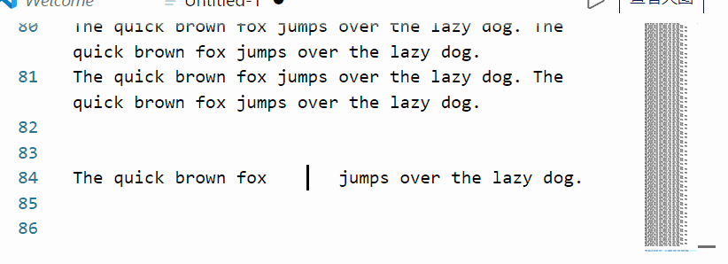

# CapsLockX - 💻 Get Hacker's Keyboard. Operate your computer like a **hacker**

CapsLockX is a modular hotkey script engine based on AutoHotkey. It allows you to operate your computer efficiently like a hacker in a movie without ever taking your hands off the keyboard. It comes packed with functions that are intuitive and easy to use: enhanced editing, virtual desktop and window management, mouse simulation, in-app hotkey enhancement, JS mathematical expression calculation, and many more multifunctional features are there for you to personally customize.

Docs in Languages:
**[English Docs (ChatGPT Translated)](https://capslockx.snomiao.com/)**
**[简体中文 説明](./README.zh-hans.md)**
**[English Docs (ChatGPT Translated)](./README.zh-hans.md)**

**[See Any Language Docs (Google Translated)](https://capslockx.snomiao.com/)**

---

CapsLockX is a modular hotkey script engine based on AutoHotkey. It makes it so you can effortlessly operate your computer with high efficiency like a hacker from the movies, without taking your hands off the keyboard. There are a lot of easy-to-learn and very user-friendly functions available: editing enhancement, virtual desktop and window management, mouse simulation, application-specific hotkey enhancement, JS mathematical expression calculation, and many other features await your personal customization. Main repository address 🏠: [https://github.com/snolab/CapsLockX](https://github.com/snolab/CapsLockX)

---

## Version Wall - Badges Wall 📛 Badges

<!-- culture badges  -->

[](https://github.com/Program-in-Chinese/overview),
[](https://996.icu)
[](https://github.com/snolab/CapsLockX/blob/master/LICENSE.md)


[](https://github.com/snolab/CapsLockX/stargazers)

<!-- build and publish status -->


[](https://github.com/snolab/CapsLockX/actions/workflows/gh-pages-release.yml)

[](https://www.jsdelivr.com/package/gh/snolab/capslockx)

[](https://www.npmjs.com/capslockx)
[](https://github.com/snolab/CapsLockX/actions/workflows/npm-publish.yml)


[](https://community.chocolatey.org/packages/CapsLockX/)
[](https://github.com/snolab/CapsLockX/actions/workflows/choco-push.yml)
[](https://community.chocolatey.org/packages/CapsLockX/)

<!-- [](https://github.com/snolab/CapsLockX/actions/workflows/package-test.yml) -->

---

## Beginner's Quick Start Tutorial 📖 Tutorial

### Simple Quick Start Tutorial (Completion of this section is considered the beginning of mastering CapsLockX)

CapsLockX has four core functions: **window management**, **mouse emulation**, **arrow key emulation**, and application-specific hotkeys. This beginner tutorial will teach you the first three core functions.

First, get CapsLockX: download this zip file: [Download JSDelivrCDN - Release Package.zip](https://cdn.jsdelivr.net/gh/snolab/CapsLockX@gh-pages/CapsLockX-latest.zip)

After unzipping, open `CapsLockX.exe` within the CapsLockX folder, get past the simple beginner tutorial, and then try out the following functions in the left and right-hand feature areas to understand the capabilities of CapsLockX.

Once CapsLockX is started, it will **not affect** the functionality of other keys on your keyboard. The following features are triggered only when you press `CapsLockX + combination keys`.

Left-hand feature area:

- Window management: `CapsLockX + 1234567890` switches to the `n`th virtual desktop, `CapsLockX + ZXCV` for window operations (window switching, window closing, window arranging, transparency top-most).
- Mouse emulation function: Press `CapsLockX + WASD` to move the mouse (as simple as moving a character while playing a game), press `CapsLockX + QE` for left and right mouse clicks, `CapsLockX + RF` for scrolling up and down.

Right-hand feature area:

- Arrow key emulation: Open any text editor (such as Notepad), press `HJKL` to move the cursor, `YOUI` to move the page

After familiarizing yourself with the basic features, consult the quick reference guide below for more advanced functionalities.

---

## Advanced Reference Manual 🦽 Manual

### Installation and Use 🛠 Installation

#### Portable Program Package (for beginners, stable version) 📦 Packaged Bins

The source code package is the software itself, no need to compile, just unzip and use the green portable software. Source code + program package, the first one is recommended (the fastest).

1. [Download JSDelivrCDN - Release Package.zip](https://cdn.jsdelivr.net/gh/snolab/CapsLockX@gh-pages/CapsLockX-latest.zip)
2. [Alternative Download CloudFlareCDN - Release Package.zip](https://capslockx.snomiao.com/CapsLockX-latest.zip)
3. [Alternative Download GitHub - Release Package.zip](https://github.com/snolab/CapsLockX/raw/gh-pages/CapsLockX-latest.zip)
4. [Alternative Download GitHub - Repository Program Package.zip](https://github.com/snolab/CapsLockX/archive/master.zip)
5. [Alternative Download BitBucket - Repository Program Package.zip](https://bitbucket.org/snomiao/capslockx/get/master.zip)
6. [Alternative Download for Mainland China Users - Gitee - Repository Program Package.zip (login required)](https://gitee.com/snomiao/CapslockX/repository/archive/master.zip)

You can use it after unzipping. Methods to start and set to auto-start: Double-click `CapsLockX.exe` to start the script. To add a startup item, enter shell:startup in the start menu - run, then create a shortcut for this program, and throw it in.

#### Command Line Installation (recommended for advanced users, can be updated automatically) 🖥️ Install by command

Choose any of the following, the 4th one is recommended for users in mainland China

1. `npx capslockx@latest`, -- Directly run with NPX, always run the latest version, recommended (requires installation of NodeJS)
2. `choco update capslockx && capslockx` -- Use [Chocolatey](https://community.chocolatey.org/packages/CapsLockX/) to install and use cup for automatic updates, recommended
3. `npm i -g capslockx && npx capslockx` -- npm global installation
4. `git clone https://gitee.com/snomiao/CapslockX && .\CapsLockX\CapsLockX.exe` -- Mainland China source code package (green software package) unzip and use, recommended for mainland China users
5. `git clone https://github.com/snolab/CapsLockX && .\CapsLockX\CapsLockX.exe` -- GitHub source code package (green software package) unzip and use
6. `winget capslockx` -- TODO #40
7. `scoop capslockx` -- TODO #41

## User Manual 📖 - Usage Manual

### Basic Operations

- Hold down `CapsLockX` to enter CapsLockX mode, at which point your keyboard will become a functional keyboard like the default mode of Vim (see key positions below).
- Press `CapsLockX+Space` at the same time to lock `CLX` mode, where `CLX` will be maintained until `CapsLockX` is pressed again next time. [Origin of Function](https://github.com/snolab/CapsLockX/issues/21)

### Module Description

CapsLockX by default loads some commonly used modules. The features and how to use them are listed below.
If you don't need certain modules, you can also directly delete the `.ahk` files in the `./Modules` directory, and then press `Ctrl + Alt + \` to reload.

You can also write your own `my-ahk.user.ahk` and put it in the `./User/` directory, and CapsLockX will automatically recognize and load them.

### Nightmares of Multitasking

#### Virtual Desktop Overview: Scenario Modes, Work Desks, Entertainment Desks, Project Categories...

Typically, a set of tasks a user is currently performing will include multiple windows. These windows combined can constitute a usage scenario, while multiple scenarios are likely to run at the same time, and some of them will run for a long time, without interference. This will involve a lot of window arrangement and virtual desktop switching operations, in these aspects, using CLX to manage your windows will bring a terrifying efficiency improvement.

Below are some examples of scenario combinations: Suppose you can study, work on several different jobs, chat with friends, play games, listen to BGM in the background, and have a paused movie ready to watch with family in the evening.

- Virtual desktop 1: Planning scenario: Schedule window + Multi-platform sync notes, e.g.: Google Calendar + Notion + Gmail.
- Virtual desktop 2: Learning scenario: Book reading window, note-taking window, e.g.: OneNote + Calibre, etc.
- Virtual desktop 3: Work scenario 1 (Front-end Development): Code editing + Documentation querying + Browser, e.g.: Chrome(dev) + VSCode + [stackoverflow](https://stackoverflow.com), etc.
- Virtual desktop 4: Work scenario 2 (Back-end Development): Code editing + Documentation querying + Backend terminal + Database browser, e.g.: DBeaver + VSCode(+bash) + [stackoverflow](https://stackoverflow.com), etc.
- Virtual desktop 5: Work scenario 3 (Script Development): Code editing + Documentation querying + Script target, e.g.: VSCode(+bash) + [stackoverflow](https://stackoverflow.com) etc.
- Virtual desktop 6: Work scenario 4 (3D Modeling and Rendering): 3D modeling software + Material searching, e.g.: Blender + Chrome.
- Virtual desktop 7: Work scenario 5 (3D Printing Slicing): Slicing software + Model searching window, e.g.: Cura + [thingiverse](https://thingiverse.com)
- Virtual desktop 7: Work scenario 6 (Video Processing): Editing + Material management, e.g.: PR + Everything.
- Virtual desktop 7: Work scenario 7 (Video Processing): Post-production + Documentation tutorial, e.g.: AE + Chrome.
- Virtual desktop 8: Writing scenario: Writing window, material referencing window, e.g.: Obsidian + Chrome (Google Scholar Index), etc.
- Virtual desktop 9: Communication scenario 1: Casual chats, e.g.: Telegram + Reddit + .
- Virtual desktop 9: Communication scenario 2: Work communication, e.g.: Slack + Skype + Gmail.
- Virtual desktop 9: Communication scenario 3: Presentation, e.g.: Google Meeting + (Vscode | Page application | Requirements document | Feedback document).
- Virtual desktop 0: Entertainment scenario 1: Playing games, e.g.: Age of Empires, Minecraft, Skyrim, Overcooked 2, etc.
- Virtual desktop 0: Entertainment scenario 3: Watching movies, listening to songs, e.g.: PotPlayer, Youtube Music, etc...
- ... More examples are welcome. Provide Issues or PRs for supplementation.

Snowstar does not recommend you handle too many tasks at the same time, but CapsLockX can save your thinking environment, greatly reducing the mental cost you incur during task switching, that is, saving you a lot of time rearranging windows and the resulting loss of attention.

(Note: If you like to handle many tasks at the same time, you might need not only a computer with not a small amount of memory but also a brain of significant capacity :D )

#### Enhancing the User Experience of Windows Window Switching - Win+Tab

When switching windows with Alt+Tab, if there are too many windows, a two-dimensional window pre-arrangement display will show up.
Generally speaking, Alt+Tab and Alt+Shift+Tab are purely left-handed keystrokes. If the user wants to select the window in the next line, they will instinctively press Alt+Tab many times.
However, the directional keys used for two-dimensional operations are often ignored because the right hand is usually on the mouse or on the J key.

Also, users will continue to hold down the Alt key after releasing the Tab key to browse the windows and select the target window to switch to.
In CLX, Alt+WASD will be used instead of the arrow keys to perform multiline window switching directly with the left hand, so there is no need to press Shift to go back to the left.
Moreover, if a user needs to clean up or close multiple windows, they simply press Alt+X to batch clean multiple target windows while remaining within the window browsing interface.

In CLX, these features greatly improve the usability of Alt+Tab.

#### TODO-Docs

<details>
<summary>Click to expand TODO-docs</summary>

#### Focus count: Active window, default active window, …

Each desktop has only one active focus window, and the virtual desktop can achieve automatic switching to the focus window of that virtual desktop when switching to it, achieving multiple task focuses (i.e., active windows).

#### Utilizing Multiple Screens - Multi-screening

#### Window Arrangement in the Era of 4K - Window arrange with 4k screen

Default window arrangement limitations in Windows 10:

1. Not applicable to multiple desktops.
2. Unnecessary window gaps are too large.

##### Window Management on Linux and Mac - Window Manager in Linux and mac

TODO: i3 Window Management

##### Window Management on Android and iOS - Window Manage in android

Two system-level solutions: Left-right top-bottom split screen, floating windows; Application level: floating components,

### Troubles with Editing Operations

#### The Distance Between the Typing Area and Editing Control Area

TODO Discussion on ThinkPad and Mac arrow keys, inspiration from VIM,

#### The Concept of Chording

TODO Various types of chording

TODO Calculation of information quantity increase with chording

### Troubles with the Graphical User Interface

TODO: Document: Introduction to mouse simulation function, movement in RPG games

### Human Perception of Speed

TODO: World perception of exponential growth, focus, auditory, visual, tactile, VS conventional linear operations

### Shortcut Deficiencies in Software

TODO: Application enhancement module introduction

### The Usability of Portable Keyboards

TODO: FN key, arrow keys, editing operations, 61-key layout vs 87-key layout,

</details>

<!-- The stuff below is automatically extracted from various modules. To make changes, please operate within the corresponding module.md files, as any changes made here will be overwritten. -->
<!-- BEGIN: Extracted module help -->
<!-- Module filename: @Help.ahk-->

### Help Module

If you want to learn how to develop plugins for CapsLockX, please:

1. Open `Modules/@Help.ahk`, where you can learn the basic format of CapsLockX plugins.
2. Copy it and name it with your own plugin name.
3. Change its original functionality to what you need, and the plugin development is done!

## Functionality of this module is described below

| Applied to | Key                   | Function                                          |
| ---------- | --------------------- | ------------------------------------------------- |
| Global     | CapsLockX + /         | Temporarily display hotkey hints                  |
| Global     | CapsLockX + Alt + /   | 🔗 Open the full documentation page for CapsLockX |
| Global     | CapsLockX + Shift + / | 🕷 Submit bugs, suggestions, etc.                  |

<!-- Module filename: App-AnkiEnhanced.ahk-->

### Anki Enhancement Module

Enhanced operations for Anki

## Common Features/Characteristics

1. Use WASD or HJKL to quickly and continuously (and reversibly) switch between flashcards.
2. Create a word list in Excel with 2 columns, select all, copy, and then press Alt + i in Anki to quickly import the list of words.
3. Simplify the 4 options to 3 directional keys, left for easy, down for medium, right for hard, up to undo.
4. Can be used in conjunction with a gamepad, use XPadder to configure the gamepad joystick to map to the directional keys. For effect, see bilibili [Zhōngèr xuě xīng zěn bèi cí - How can a gamepad not be used for memorizing words!](https://www.bilibili.com/video/av8456838/)

## Instructions

| Mode                       | Anki Enhancement Module | Description                                                                               |
| -------------------------- | :---------------------: | ----------------------------------------------------------------------------------------- |
| In Anki-Study Interface    |      `w or k or ↑`      | Press to undo, release to show answer                                                     |
| In Anki-Study Interface    |      `a or h or ←`      | Press for easy, release to show answer                                                    |
| In Anki-Study Interface    |      `s or j or ↓`      | Press for good, release to show answer                                                    |
| In Anki-Study Interface    |      `d or l or →`      | Press for hard, release to show answer                                                    |
| In Anki-Study Interface    |           `q`           | Go back to the previous interface                                                         |
| In Anki-Study Interface    |           `c`           | Add a new card                                                                            |
| In Anki-Study Interface    |     `1 or NumPad1`      | Hard (original key position)                                                              |
| In Anki-Study Interface    |     `2 or NumPad2`      | Again (original key position)                                                             |
| In Anki-Study Interface    |     `3 or NumPad3`      | Good (original key position)                                                              |
| In Anki-Study Interface    |     `4 or NumPad4`      | Easy (original key position)                                                              |
| In Anki-Study Interface    |     `5 or NumPad5`      | Undo                                                                                      |
| In Anki-Study Interface    |     `6 or NumPad6`      | Suspend card                                                                              |
| In Anki-Study Interface    |        `Alt + i`        | Quickly import contents from the clipboard (separated by Tab) / e.g., can copy from Excel |
| In Anki-Add Card Interface |        `Alt + s`        | Press the Add button                                                                      |

<!-- Module filename: App-OneNote2019.ahk-->

### OneNote 2016 - 2019 Enhancements

Simply enhance the keyboard operations in OneNote 2016 - 2019, conveniently use the keyboard to: change pens, create links, organize pages, adjust views...

## Common Features of Snowstar Meow

1. When making diary entries, first add a date tag to the note title on the note page with `Alt + T` (for future searches), then use the global shortcut `Win + Shift + N` to search for all notes with the tag 'Today' in OneNote. It makes it easy to retrieve your daily records: love diary, training logs, daily reading lists, project reports... In short, writing a diary in OneNote is very convenient, they just pop up with a keystroke, no need to search XD
2. Select a word and press `Alt + K`, and it will list all the related page links underneath that word, to create an index directory, weaving your OneNote into a web.
3. Create a new note, rename it to `My Clipboard`, and when you copy text or pictures, CLX will automatically append them to this note for you, making it easy to collect materials or excerpt articles.
4. Alt + 1234567 for hierarchical folding, easily switch between different levels of abstract thinking.

## Keyboard Layout Design (Under Development)

| Key Description              | Function                                  | Remarks                |
| ---------------------------- | ----------------------------------------- | ---------------------- |
| `All OneNote Hotkeys`        | Original functions                        |                        |
| `Press Alt then another key` | Trigger OneNote's original menu functions |                        |
| `Alt + 1234567`              | Outline collapse/expand to levels 1-7     |                        |
| `Alt + qwe asd r`            | Tools, change pen, view                   |                        |
| `Alt + f`                    | Find tags                                 |                        |
| `Alt + -=`                   | Formula related                           |                        |
| `Alt + m`                    | Move notes, sections                      |                        |
| `Alt + hjkl`                 | Various linking functions                 |                        |
| `Alt + zxcv`                 | Advanced copy-paste                       | Details in development |
| `Alt + /`                    | Hotkey help, hints                        | Under development      |
| `F2 F3`                      | Rename, search notes                      |                        |

## Detailed Key Bindings / CheatSheet

| Applies To                     | Hotkey                       | Function                                                                                               |
| ------------------------------ | ---------------------------- | ------------------------------------------------------------------------------------------------------ |
| Global                         | `Win + Alt + N`              | Open the first page of Quick Notes (compensates for OneNote's lack of a home page concept like Notion) |
| Global                         | `Win + Shift + N`            | Open OneNote and search precisely for today's tag                                                      |
| OneNote2019                    | `Alt + 1234567`              | Outline: Expand or collapse the outline to that level (highly recommended, very useful)                |
| OneNote2019                    | `F2`                         | Organize: Rename note                                                                                  |
| OneNote2019                    | `Shift + F2`                 | Organize: Rename section                                                                               |
| OneNote2019                    | `Alt + m`                    | Organize: Move note                                                                                    |
| OneNote2019                    | `Alt + Shift + m`            | Organize: Move section                                                                                 |
| OneNote2019                    | `Ctrl + n`                   | Organize: Create new note                                                                              |
| OneNote2019                    | `Ctrl + Alt + n`             | Organize: Create new note below current one                                                            |
| OneNote2019                    | `Alt + Delete`               | Organize: Quickly delete current page                                                                  |
| OneNote2019                    | `Ctrl + s`                   | Organize: Immediately synchronize this notebook                                                        |
| OneNote2019                    | `Ctrl + w`                   | Organize: Close window                                                                                 |
| OneNote2019                    | `Shift + Delete`             | Edit: Quickly delete current line                                                                      |
| OneNote2019                    | `Alt + -`                    | Edit: Auto-convert equations to 2D                                                                     |
| OneNote2019                    | `Alt + k`                    | Edit: ⭐🔗 Expand links to pages related to the current keyword (fast keyword one-to-many linking)     |
| OneNote2019                    | `Alt + n`                    | Style: Switch page to colorless background                                                             |
| OneNote2019                    | `Alt + v`                    | Style: Change text background color                                                                    |
| OneNote2019                    | `Alt + q`                    | Tool: Dragging                                                                                         |
| OneNote2019                    | `Alt + w`                    | Tool: Latch                                                                                            |
| OneNote2019                    | `Alt + e`                    | Tool: Eraser                                                                                           |
| OneNote2019                    | `Alt + s`                    | Tool: Input                                                                                            |
| OneNote2019                    | `Alt + a`                    | Tool: Switch to second pen                                                                             |
| OneNote2019                    | `Alt + d`                    | Tool: Open pen tray (select pen with arrow keys (currently ineffective fullscreen))                    |
| OneNote2019                    | `Alt + d -> 1234567`         | Tool: Open pen tray (then select the 1st row x pen) (currently ineffective fullscreen)                 |
| OneNote2019                    | `Alt + d -> Shift + 1234567` | Tool: Open pen tray (then select the 2nd row x pen) (currently ineffective fullscreen)                 |
| OneNote2019                    | `Alt + r`                    | View: Zoom to original size                                                                            |
| OneNote2019                    | `Alt + y`                    | View: Zoom to page width                                                                               |
| OneNote2019                    | `^!+- or ^!+=`               | View: Zoom out or zoom in page                                                                         |
| OneNote2019                    | `Alt + f`                    | View: Search for tags                                                                                  |
| OneNote2019                    | `Alt + t`                    | Edit: Add the date tag to the note, e.g., (20220717)                                                   |
| OneNote2019                    | `Ctrl + Shift + c`           | Edit: Copy (plain text)                                                                                |
| OneNote2019                    | `Ctrl + Shift + v`           | Edit: Paste (plain text)                                                                               |
| OneNote2019 Create Link Window | `Alt + s`                    | Edit: Copy links to all search result pages                                                            |
| OneNote2019 Create Link Window | `Alt + Shift + s`            | Edit: Copy and paste links to all search result pages                                                  |
| OneNote2019 Clipboard Note     | `Ctrl + C`                   | Edit: ⭐ Append copied content to the note with "Clipboard" or "剪贴板" in its name                    |

<!-- Module Filename: App-XunFeiSwitching.ahk-->

### Xunfei Input Method Floating Window Plugin

#### Usage

| Applies To |   Key   | Function Description               |
| ---------- | :-----: | ---------------------------------- |
| Global     | Win + H | Start/Switch to Xunfei Voice Input |

#### Notes

1. The original `Win + H` function is Windows' built-in dictation. After installing this plugin, you can use the original Windows dictation with `Win + Shift + H`.
2. If Xunfei voice is not installed, it will automatically ask whether to guide the download and installation.

#### Effect is shown in the following image


<!-- Module Filename: CLX-Brainstorm.ahk-->

### CLX - Brainstorm

At any time, in any input field, press the `CLX+b` key to start using AI-assisted typing.

#### Key Layout (Under Development)

| Key Description | Function                                                                                           | Note |
| --------------- | -------------------------------------------------------------------------------------------------- | ---- |
| CLX + b         | Automatically copy the current selection, enter a command, and let AI assist your typing           |      |
| CLX + Alt + b   | Configure activation code (currently only a free plan, more features might be added in the future) |      |
| CLX + Shift + b | Check usage quota                                                                                  |      |

#### Protips:

##### Organize meeting minutes anytime

1. In any input box, use Win+H to call out voice input, then speak the text you want, no need for precision, just convey the general idea.
2. Then select all and press `CLX+b`, enter `List key points and to-do items`, and you can see the key points and to-do items automatically organized by AI.

##### Translate any language to any language at any time

1. In any input box, select the text you want to translate.
2. Then select all and press `CLX+b`, enter `to chinese:`, and AI will automatically input it in Chinese.

<!-- Module Filename: CLX-Edit.ahk-->

### Editing Enhancement Plugin (TG YUIO HJKL) 🌟

Is there anything better in the world than Vim mode's HJKL cursor movement? There must be!
That's the accelerated HJKL smooth editing experience! Want to try letting your cursor perform a high-end maneuver like speeding around a drain? Install it!



| Scope            | Edit Module           | Description                                                      |
| ---------------- | --------------------- | ---------------------------------------------------------------- |
| Global(Basic)    | `CapsLockX + h j k l` | Arrow keys: up, down, left, right                                |
| Global(Basic)    | `CapsLockX + y o`     | Home End                                                         |
| Global(Basic)    | `CapsLockX + u i`     | PageUp PageDown                                                  |
| Global(Basic)    | `CapsLockX + [ ]`     | Shift+Tab and Tab                                                |
| Global(Basic)    | `CapsLockX + g`       | Enter                                                            |
| Global(Advanced) | `CapsLockX + t`       | Delete                                                           |
| Global(Advanced) | `CapsLockX + hl`      | Press hl together to select the current word                     |
| Global(Advanced) | `CapsLockX + kj`      | Press kj together to select the current line                     |
| Global(Advanced) | `CapsLockX + h + t`   | Move and delete: In most cases, it can replace the backspace key |

<!-- Module Filename: CLX-LaptopKeyboardFix.ahk-->

### Surface Laptop Function Key Expansion

Cures all kinds of broken laptop keyboards

1. No right Ctrl key? Combine Menu with right Ctrl, Menu can be used as Ctrl or Ctrl as Menu.
2. No Pause key? Win + Alt + P can also open system settings info.
3. To be supplemented

| Mode                       | Key                                                         | Function                                                       |
| -------------------------- | :---------------------------------------------------------- | -------------------------------------------------------------- |
| Global                     | Win + Alt + P                                               | Equivalent to Win + Pause, designed for notebooks              |
| Global                     | Press right Ctrl briefly                                    | Presses Menu to pop up the menu                                |
| Global                     | Hold right Menu                                             | Holding will press Ctrl, which can be combined with other keys |
| Win key simulation enabled | Hold ] while pressing [                                     | Equivalent to pressing the Win key                             |
| Win key simulation enabled | RAlt+\| is equivalent to pressing Alt+Tab on the right hand |

<!-- Module Filename: CLX-MediaKeys.ahk-->

### Media Keys Module

| Applies To | Media Keys Module | Description                                           |
| ---------- | ----------------- | ----------------------------------------------------- |
| Global     | `CapsLockX + F1`  | Open: My Computer                                     |
| Global     | `CapsLockX + F2`  | Open: Calculator                                      |
| Global     | `CapsLockX + F3`  | Open: Browser homepage                                |
| Global     | `CapsLockX + F4`  | Open: Media library (default is Windows Media Player) |
| Global     | `CapsLockX + F5`  | Playback: Pause/Play                                  |
| Global     | `CapsLockX + F6`  | Playback: Previous track                              |
| Global     | `CapsLockX + F7`  | Playback: Next track                                  |
| Global     | `CapsLockX + F8`  | Playback: Stop                                        |
| Global     | `CapsLockX + F9`  | Volume up                                             |
| Global     | `CapsLockX + F10` | Volume down                                           |
| Global     | `CapsLockX + F11` | Mute                                                  |

<!-- Module Filename: CLX-Mouse.ahk-->

### Simulated Mouse Plugin (WASD QERF)

> I have always prided myself on being a keyboard enthusiast, probably starting when I injured my finger joints while working on models, becoming a heavy keyboard user. Various keyboard acceleration tools, actively remembering various shortcuts, trying to use the mouse less, even learning vim and emacs. But many times, the mouse is irreplaceable, especially when graphical interfaces are prevalent.

—— The above is a quote from the author of [SimClick](https://github.com/rywiki/simclick), a project for simulating mouse actions through grid partitioning, which can complement this project.

—— Recommended by [Qin Jinwei](http://rsytes.coding-pages.com/)

## Features

- This module uses the key area: CapsLockX + QWER ASDF
- Very comfortably use WASD QE RF to simulate [full] mouse functionality, believe me, after trying this feel, you'll love it.
- The pointer automatically sticks to various buttons, hyperlinks when moved. The wheel's exponentially accelerating scrolling mechanism means you'll no longer fear super long articles and web pages.
- The effect is shown in the image:
  

## Instructions for Use

| Applies to | Key Combination                       | Description                                                   |
| ---------- | ------------------------------------- | ------------------------------------------------------------- |
| Global     | `CapsLockX + w a s d`                 | Mouse movement (up, down, left, right)                        |
| Global     | `CapsLockX + ad`                      | Toggle HJKL keys to wheel mode (scroll up, down, left, right) |
| Global     | `CapsLockX + r f`                     | Vertical scroll wheel (up, down)                              |
| Global     | `CapsLockX + Shift + r f`             | Horizontal scroll wheel (left, right)                         |
| Global     | `CapsLockX + Ctrl + Alt + r f`        | Auto vertical scroll (up, down)                               |
| Global     | `CapsLockX + Ctrl + Alt + Shift+ r f` | Auto horizontal scroll (left, right)                          |
| Global     | `CapsLockX + rf`                      | Pressing rf together is equivalent to the middle mouse button |
| Global     | `CapsLockX + e`                       | Left mouse button                                             |
| Global     | `CapsLockX + q`                       | Right mouse button                                            |

## Operation Details

Quick tap AD for stepping

<!-- Module filename: CLX-NodeEval.ahk-->

### JavaScript Evaluation (NodeJS installation recommended)

| Applies to | Hotkey          | Effect                                                                            |
| ---------- | --------------- | --------------------------------------------------------------------------------- |
| Global     | `CapsLockX + -` | Calculate and replace the current selection with the JavaScript expression result |
| Global     | `CapsLockX + =` | Calculate and replace the current selection with the JavaScript expression result |

<!-- Module filename: CLX-WindowManager.ahk-->

### Window Enhancement Plugin (CLX + 1234567890 ZXCV)

## Feature Overview

Make the most of Win 10's luxurious configuration with 10 built-in virtual desktops, automatic window arrangement for multi-monitors, translucent always-on-top (Note: Taskbar and AltTab related features are temporarily incompatible with Win11, but window arrangement functions normally.)

1. Window Switching: `CapsLockX + [Shift] + Z`
2. Window Closing: `CapsLockX + [Shift] + X`
3. Window Arrangement: `CapsLockX + [Shift] + C`
4. Always On Top: `CapsLockX + [Shift] + V`
5. Left-Handed Window Management: In the `Alt + Tab` interface, use `WASD` to switch windows, and `X` to close a window.
6. Efficient Use of Virtual Desktops: `CapsLockX + 0123456789` to switch, add or remove virtual desktops; use the `Shift` key to transfer the current window.
7. Quick Release from Virtual Machines and Remote Desktops: Double click the left `Shift + Ctrl + Alt`.

## Effect Picture

- Enhanced Alt+Tab Window Management
  
- CapsLockX + C to arrange windows with one click (This GIF was recorded on an older version which looks a bit laggy, but the new version has optimized the API so it's not laggy anymore)
  

## Usage Instructions ( Alt+Tab and CapsLockX )

| Scope        | Window Enhancement Module             | Description                                                              |
| ------------ | ------------------------------------- | ------------------------------------------------------------------------ |
| Alt+Tab UI   | `Q E`                                 | Switch between virtual desktops left and right                           |
| Alt+Tab UI   | `W A S D`                             | Switch window selection up, down, left, and right                        |
| Alt+Tab UI   | `X C`                                 | Close the selected window (currently no difference between X and C)      |
| Win+Tab View | `Alt + W A S D`                       | Switch window selection                                                  |
| Global       | `Win + [Shift] + B`                   | Navigate to system tray tasks (Windows native hotkey)                    |
| Global       | `Win + [Shift] + T`                   | Navigate to taskbar tasks (Windows native hotkey)                        |
| Global       | `Win + Shift + hjkl`                  | Switch focus between windows in direction                                |
| Taskbar      | `Ctrl + W or Delete`                  | Choose the exit button on the tray icon or taskbar task                  |
| Global       | `CapsLockX + 1 2 ... 9 0`             | Switch to desktop 1 .. 12                                                |
| Global       | `CapsLockX + Shift + 1 2 ... 9 0 - =` | Move the current window to the nth desktop (if available)                |
| Global       | `CapsLockX + Alt + Backspace`         | Delete current desktop (all windows moved to previous desktop)           |
| Global       | `CapsLockX + C`                       | Quickly arrange windows on current desktop                               |
| Global       | `CapsLockX + Ctrl + C`                | Quickly arrange windows on current desktop (including minimized windows) |
| Global       | `CapsLockX + Shift + C`               | Quickly stack windows on current desktop                                 |
| Global       | `CapsLockX + Shift + Ctrl + C`        | Quickly stack windows on current desktop (including minimized windows)   |
| Global       | `CapsLockX + Z`                       | Cycle to most recently used window                                       |
| Global       | `CapsLockX + Shift + Z`               | Cycle to least recently used window                                      |
| Global       | `CapsLockX + X`                       | Close current tab Ctrl+W                                                 |
| Global       | `CapsLockX + Shift + X`               | Close current window Alt+F4                                              |
| Global       | `CapsLockX + V`                       | Make window transparent                                                  |
| Global       | `CapsLockX + Shift + V`               | Keep window transparent (and topmost)                                    |
| Any window   | `Double-click Left Shift+Ctrl+Alt`    | Send current window to back, \* see note below                           |

\*Note: Double-clicking Left Shift+Ctrl+Alt is designed for remote desktops and virtual machines, allowing simultaneous display with the host desktop windows.
For example, with programs like mstsc.exe, TeamViewer, VirtualBox, HyperV, VMWare, and other remote desktop or virtual machine software, combined with the CapsLockX + Shift + V transparency and topmost feature, using interfaces like Linux or MacOS on Windows is no longer a challenge.

This reference uses [@yangbin9317's comment](https://v2ex.com/t/772052#r_10458792)

> Using CapsLock as the interface, it bridges the underlying logic, aligns Windows with Linux WM, and solves the pain points of Windows.

(20220313) For scenarios where both ends are Windows, you can also consider using [RemoteApp Tool - Kim Knight](http://www.kimknight.net/remoteapptool) as a substitute for remote desktop.

<!-- Module Filename: QuickInput.ahk-->

### Quick Input

| Mode   | Quick Input | Description                                                                    |
| ------ | ----------- | ------------------------------------------------------------------------------ |
| Global | `#D#`       | Date input: `(20220217)`                                                       |
| Global | `#T#`       | Time input: `(20220217.220717)`                                                |
| Global | `#DT#`      | Date and time input: `2022-02-17 22:07:33`                                     |
| Global | `#NPW#`     | Randomly input a numeric password like: `7500331260229289`                     |
| Global | `#PW#`      | Randomly input a numeric and letter password like: `yyCTCNYodECTLr2h`          |
| Global | `#WPW#`     | Randomly input a numeric and letter password like: `FtD5BB1m5H98eY7Y`          |
| Global | `#SPW#`     | Randomly input a numeric, letter, and symbol password like: `/})y+xK]z~>XKQ+p` |

<!-- Module Filename: TomatoLife.ahk-->

### Pomodoro Timer

25 minutes fixed cycle for rest reminders.

Use `CapsLockX + ,` to open the configuration, then change EnableScheduleTasks=1 to enable this plugin.

- Use Pomodoro chime (play a working bell sound at 00 and 30 minutes, and a rest bell sound at 25 and 55 minutes of every hour) (schedule tasks must first be enabled)

```ini
  UseTomatoLife=1
```

- When using Pomodoro chime, automatically switch desktops (rest desktop is 1, work desktop is 2)

```ini
  UseTomatoLifeSwitchVirtualDesktop=1
```

Note: If you only need the sound and do not need to automatically switch desktops, you can also try this Chrome plugin [Tomato Life - Chrome Web Store](https://chrome.google.com/webstore/detail/25min-tomato-life/kkacpbmkhbljebmpcopjlgfgbgeokbhn)

Note: This plugin has been separated into an independent project, if you like the Pomodoro technique you can refer to the snow star's tomato-life project: [snomiao/tomato-life](https://github.com/snomiao/tomato-life)

<!-- Module Filename: TurnOffScreenWhenLock.ahk-->

### Auto Turn Off Screen When Locking

When pressing Win + L to lock the screen, immediately turn off the screen. This is suitable for automatically turning off the computer screen when preparing to sleep, so that it does not dazzle during the night...

<!-- End: Extract module help -->

## Past and Future 🛰

### Production Background (Autumn of 2017) 🍁 Background

> I often write code…
> At first, I was used to using the mouse with my right hand... later I found it a bit far to put the mouse on the right... so I switched to using the mouse with my left hand.
> After switching to the left hand, I realized I still had to take it off the keyboard... so I made a script that simulates the mouse with the WASD keys. (Then I could keep playing with the computer with my right hand under my chin)
> Later I wrote more and more scripts and put some of the common ones together to load...

### Development RoadMap 🛰️ RoadMap

The core philosophy of CapsLockX is to simplify system operation logic, improve operation efficiency, and not conflict with existing habitual key positions.

1. [x] Press CapsLockX + - key to display corresponding help (the current display style is quite rough)
2. [ ] i18n (eh this really should exist)
3. [ ] Auto-update (although git pull is also fine)
4. [ ] Tutorial for first-time users (this is a bit simple now...)
5. [ ] Plugin manager (although the file system could handle it too)
6. [ ] Auto-sync of configuration (though throwing it in OneDrive is usually enough)
7. [ ] A user-friendly options configuration UI (though changing ini isn't that hard)
8. [ ] Execute external code (Python, Nodejs, external AHK, Bash, …) (although running a script isn't much trouble)

If you have any ideas or suggestions, please propose them here:
[Issues · snomiao/CapslockX](https://github.com/snolab/CapsLockX/issues)

### Key Combination Meaning Design ⌨ Chore Design

Win + series are generally used for operating system functions, desktop window application process management, input method, output device (display, multiple screens) management.

Alt + series typically denote invocation of application internal functions, their meanings should be equivalent to pressing the same function button, or jumping to a specific function interface.

Ctrl + series as above, but used more frequently and it's very likely that there is no button with the same function.

Ctrl + Alt + same as above, but generally for global hotkeys.

The Shift key is used to slightly change the meaning of the above functions (such as reverse operations like Shift+Alt+Tab, or extended function range like Shift+Arrow keys to adjust the selection, etc.)

### CapsLockX vs. Similar Projects Function Comparison ⚔ Feat Compare Matrix

Updated (20200627) The information may become outdated over time

| Feature\Project                 | [CapsLockX](https://github.com/snolab/CapsLockX) | [Vonng/CapsLock](https://github.com/Vonng/CapsLock) | [coralsw/CapsEz](https://github.com/coralsw/CapsEz) | [CapsLock+](https://capslox.com/capslock-plus/) |
| :------------------------------ | :----------------------------------------------- | :-------------------------------------------------- | :-------------------------------------------------- | :---------------------------------------------- |
| Mouse Simulation                | ✅ Smooth and complete                           | ✅ No scroll wheel                                  | 🈚 None                                             | 🈚 None                                         |
| Expression Calculation          | ✅ Nodejs or JScript                             | 🈚 None                                             | 🈚 None                                             | ✅ TabScript (Snippet + Javascript)             |
| Window Management               | ✅ Strong                                        | ✅ Available                                        | ✅ Available                                        | ✅ Strong                                       |
| Virtual Desktop Management      | ✅ Available                                     | 🈚 None                                             | 🈚 None                                             | 🈚 None                                         |
| Editing Enhancement             | ✅ Available (parabolic model)                   | ✅ Available                                        | ✅ Available                                        | ✅ Very comprehensive                           |
| Portable (No Install)           | ✅ Yes                                           | ✅ Yes                                              | ✅ Yes                                              | ✅ Yes                                          |
| Enhanced Media Keys             | Not all                                          | ✅ All                                              | 🈚 None                                             | 🈚 None                                         |
| Enhanced Clipboard              | Weak                                             | 🈚 None                                             | 🈚 None                                             | ✅ Available                                    |
| Quick Application Launch        | ✅ Plugins                                       | ✅ Available                                        | ✅ Available                                        | ✅ Available                                    |
| Application Feature Enhancement | ✅ Rich                                          | 🈚 None                                             | ✅ Available                                        | 🈚 None                                         |
| Bash Control                    | 🈚 None                                          | ✅ Available                                        | 🈚 None                                             | 🈚 None                                         |
| Quick Start Voice Input         | ✅ iFLYTEK                                       | 🈚 None                                             | 🈚 None                                             | 🈚 None                                         |
| Quick Input of Time and Date    | ✅ Available                                     |                                                     | ✅ Available                                        |                                                 |
| Bind Window to Hotkey           | 🈚 None                                          | 🈚 None                                             | 🈚 None                                             | ✅ Available                                    |
| Quick Screen Rotation           | ✅ Available                                     | 🈚 None                                             | 🈚 None                                             | 🈚 None                                         |
| Secondary Development           | ✅ Documentation friendly                        | ✅ Possible                                         | ✅ Possible                                         | ✅ Possible                                     |
| Memory Usage                    | ✅ About 2~3M                                    |                                                     |                                                     |                                                 |
| Modularization                  | ✅                                               | 🈚 None                                             | 🈚 None                                             | 🈚 None                                         |
| System                          | Win                                              | Mac (main), Win (secondary)                         | Win                                                 | Win, [Mac](https://capslox.com/)                |
| Supported Languages             | Chinese                                          | Chinese - English                                   | Chinese                                             | Chinese - English                               |

#### CapsLockX Address 🔗 Project Urls

The following repositories are updated synchronously:

- GitHub: [https://github.com/snolab/CapsLockX](https://github.com/snolab/CapsLockX)
- Gitee: [https://gitee.com/snomiao/CapslockX](https://gitee.com/snomiao/CapslockX)
- Bitbucket: [https://bitbucket.org/snomiao/capslockx](https://bitbucket.org/snomiao/capslockx)
- Gitlab: [https://gitlab.com/snomiao/CapsLockX/](https://gitlab.com/snomiao/CapsLockX/)

Document Address 📄

- Automatic Translation Document Netlify CDN: [https://capslockx.netlify.com](https://capslockx.netlify.com)
- Automatic Translation Document CloudFlare CDN: [https://capslockx.snomiao.com](https://capslockx.snomiao.com)

Star Chart ⭐️

- [](https://starchart.cc/snolab/CapsLockX)

#### Similar Project Addresses 🔗 Similar Projects

- [Star Historys](https://star-history.t9t.io/#snolab/CapsLockX&wo52616111/capslock-plus&coralsw/CapsEz&Vonng/CapsLock)
- Source: [Vonng/CapsLock: Make CapsLock Great Again!](https://github.com/Vonng/CapsLock)
  Design: [Capslock/design.md at master · Vonng/Capslock](https://github.com/Vonng/Capslock/blob/master/design.md)
- [coralsw/CapsEz: KeyMouse Tools](https://github.com/coralsw/CapsEz)
- [CapsLock+](https://capslox.com/CapsLock-plus/)
- [Capslox](https://capslox.com/cn/)
- CapsLock++ [matrix1001/CapsLock-plus-plus: ⌨Amazing, extendable, readable autohotkey scripts framework utilized by CapsLock.](https://github.com/matrix1001/CapsLock-plus-plus)
- [Power Keys | Liberate Computer Usage Efficiency](https://powerkeys.github.io/)

## Questions and Answers ❓ Questions

Related Communities:

- [CapsLockX's issues (can be used as a forum)](https://github.com/snolab/CapsLockX/issues) ✉️
- CapsLockX User Telegram Group: [t.me/CLX_users](https://t.me/CLX_users)📱
- CapsLockX User QQ Group 🐧: [100949388](https://jq.qq.com/?_wv=1027&k=56lsK8ko)
- QZ/VimD/TC/AHK QQ Group 🐧: 271105729
- AHK Advanced QQ Group 🐧: 717947647

For questions related to CapsLockX, you can directly join the group [@雪星](tencent://message?uin=997596439) or ask privately.

### Privacy and Security 🔒 Privacy

Considering that any software that can obtain administrative rights is quite dangerous to a user's operating system, CapsLockX must and is currently adopting an open-source approach. This allows the community to freely and arbitrarily inspect any part of the CapsLockX code that may be involved, to ensure that the security of all users' operating systems is not compromised by this software.

## Support ⭐️ Supports

How to help CapsLockX survive? If CapsLockX has been helpful to you:

1. ⭐️ Please star CapsLockX on Github <a class="github-button" href="https://github.com/snolab/CapsLockX" data-color-scheme="no-preference: light; light: light; dark: dark;" data-icon="octicon-star" data-size="large" data-show-count="true" aria-label="Star snolab/CapsLockX on GitHub">Star</a>
2. 🔗 Please share it with your friends.
3. 🌐 Welcome to help translate this documentation into different languages.
4. 🐞 Welcome to submit bugs and suggestions for improvement [issues](https://github.com/snolab/CapsLockX/issues)
5. Code PR submissions are welcome, even just to correct a typo ～
6. Welcome to create works about this software, such as recording tutorial videos to post on Youtube or Bilibili, Xue Xing will like your video.
7. 💰 Welcome to donate to the development of CapsLockX, each donation will be recorded in the list below:
   - Love Send Electric ⚡️：[https://afdian.net/@snomiao](https://afdian.net/@snomiao)
   - PAYPAL: [https://paypal.me/snomiao](https://paypal.me/snomiao)
   - Alipay donation account： [snomiao@gmail.com （click to view QR code）](./支付宝捐助.png)
   - ETH： [0xdc2eece11a9e09c8db921989e54b30375446e49e](https://etherscan.io/address/0xdc2eece11a9e09c8db921989e54b30375446e49e)

- [Development Roadmap](#发展路线-roadmap)

### Donation Records (as of 20210821) 📄 Donate Records

| Donation Date | Name                             | Channel         | Amount      | Comment                                                        |
| ------------- | -------------------------------- | --------------- | ----------- | -------------------------------------------------------------- |
| 2021-06-19    | \*\*Yu                           | Alipay QR       | +50.00 CNY  | A little support, in favor of independent developers           |
| 2023-05-12    | Karawen                          | WeChat Transfer | +200.00 CNY | 🫡 (Salute)                                                     |
| 2023-06-09    | [@andriasw](github.com/andriasw) | Alipay Transfer | +66.66 CNY  | for CapsLockX-mac, 66.66 is good (https://github.com/andriasw) |
| 2023-12-19    | Huidan                           | QQ Red Packet   | +45.00 CNY  | Buy the developer a coffee                                     |

### Acknowledgements 🙏🏻 Thanks

- Thank you for the financial support from the above donors.
- Thanks to [Qin Jinwei](http://rsytes.coding-pages.com/) for the citation recommendation article and development suggestions: [2020-02-23 When Keyboard Simulates Mouse - Jianshu](https://www.jianshu.com/p/f757f56a7de6)
- Thanks to @He Xuren for helping with the dissemination: [CapsLockX – Operate the computer like a hacker! 【Xue Xing】 – AutoAHK](https://www.autoahk.com/archives/34996)
- Thank you to those who asked questions in the issues and in the group and helped to improve CapsLockX.

### Related Topics - Related Topics

- [Qin Jinwei](http://rsytes.coding-pages.com/)
  - [2020-02-23 When Keyboard Simulates Mouse - qwertc](https://mp.weixin.qq.com/s?__biz=MzIzNzczOTkzMw==&mid=2247483745&idx=1&sn=16f16c1fa02e1ef386a83f3023fb109d&chksm=e8c54b93dfb2c285e49fa8045d2380b20810768e3be043f364be146a598faf5f363bbb2623e7&scene=21#wechat_redirect)
  - [2020-10-26 Keyboard Simulates Mouse 2 - qwertc](https://mp.weixin.qq.com/s?__biz=MzIzNzczOTkzMw==&mid=2247484272&idx=1&sn=0ed1ff91bee008fc5c01dc0fe20e53ba&chksm=e8c54982dfb2c09493c88a0f7847ffb0b508598e0756ddd7e8ad94d1f31f65490388d6cff7a4&scene=21#wechat_redirect)
  - [2021-03-11 capslockX-Cure Mouse Hand - qwertc](https://mp.weixin.qq.com/s?__biz=MzIzNzczOTkzMw==&mid=2247484478&idx=1&sn=1518d7ec4dc08c1a72c08fcaff98550e&chksm=e8c54eccdfb2c7daed0ad9b8c03395e4211e029199374f4bc0dbdc9a8403c2dae86b740c95c5&scene=21#wechat_redirect)
  - November 2021, Keyboard Simulates Mouse 3
  - [2022-08-21 t0820 After Copy Match-siyuan-clx-Screenshot - qwertc](https://mp.weixin.qq.com/s?__biz=MzIzNzczOTkzMw==&mid=2247485441&idx=1&sn=848d5e6f3fb7c1e7b14100615ca7d0db&chksm=e8c542f3dfb2cbe5770fe19bb8b5c81935e52a4a686154e69104bc403ab6ce960d1b6ae429a9&scene=21#wechat_redirect)
  - [2024-01-06 t0106 OpenAI-empowered CapslockX - qwertc](https://mp.weixin.qq.com/s?__biz=MzIzNzczOTkzMw==&mid=2247485707&idx=1&sn=d40eea9f0b5bb81e3387ec592def4ed0&chksm=e8c543f9dfb2caef90939e2fafcb324fd757949c79399c55adfbab0940e70efd753fb6bf3837&token=1464360155&lang=zh_CN#rd)
- [Is there any way to implement the shortcuts in Chrome OS into Windows 10 - V2EX](https://www.v2ex.com/t/778967)
- [Recommend My Key Mapping Tool MyKeymap - V2EX](https://v2ex.com/t/844432)
- [How Many People Would Swap CapsLock and Backspace on their Keyboard? - V2EX](https://www.v2ex.com/t/855901)
- [Share a Small Tool that Uses CapsLock+H/J/K/L to Simulate Arrow Keys - V2EX](https://www.v2ex.com/t/318182)
- [Recommended Efficiency Tool for Programmers AltPlus, Pressing Alt with Left Thumb You Can Code Like Using vim - V2EX](https://www.v2ex.com/t/800721)
- [CapsLockX - Operate the Computer Like a Hacker - V2EX](https://v2ex.com/t/772052#reply1)
- [CapsLockX - Operate the Computer Like a Hacker! - AutoHotkey Community](https://www.autohotkey.com/boards/viewtopic.php?f=28&t=88593)
- [(10) What are some good career alternatives for a computer programmer with RSI? - Quora](https://www.quora.com/Repetitive-Strain-Injury-RSI/What-are-some-good-career-alternatives-for-a-computer-programmer-with-RSI)
- [How to Divide the Computer Desktop into Two Separate Halves? - Zhihu](https://www.zhihu.com/questionz/23443944/answer/1670521971)
- [Is there any person with disabilities here who uses a one-handed keyboard? - Zhihu](https://www.zhihu.com/question/50621709/answer/1681247637)
- [(5 messages - 50 comments) How to use a computer elegantly without using a mouse or any other pointer touch device using only a keyboard? - Zhihu](https://www.zhihu.com/question/21281518/answer/1770669886)
- [(5 messages - 50 comments) How to Divide the Computer Desktop into Two Separate Halves? - Zhihu](https://www.zhihu.com/question/23443944/answer/1670521971)
- [I am a Workplace Expert, AutoHotKey Made Me a Workplace Superhuman - Zhihu](https://zhuanlan.zhihu.com/p/60372361)
- [AutoHotKey Chinese Site Column - Zhihu](https://www.zhihu.com/column/autoahk)
- [How to Prevent and Treat "Mouse Hand" for Computer Users - Shaanxi Daily](http://www.sxjkjy.com/uploadfiles/files/2017062110481454.pdf)

## Footer Catalog - Table of Contents

- [CapsLockX - 💻 Get Hacker's Keyboard. Operate your computer like a **hacker**](#capslockx----get-hackers-keyboard-operate-your-computer-like-a-hacker)
  - [Version Wall - Badge Wall 📛 Badges](#version-wall---badge-wall--badges)
  - [Beginner's Quick Start Tutorial 📖 Tutorial](#beginners-quick-start-tutorial--tutorial)
    - [Simple Introduction Tutorial (Once you read this section, you're considered to have started using CapsLockX)](#simple-introduction-tutorial-once-you-read-this-section-youre-considered-to-have-started-using-capslockx-)
  - [Advanced Reference Manual 🦽 Manual](#advanced-reference-manual--manual)
    - [Installation and Usage 🛠 Installation](#installation-and-usage--installation)
      - [Green Portable Package (Suitable for beginners, stable version) 📦 Packaged Bins](#green-portable-package-suitable-for-beginners-stable-version--packaged-bins)
      - [Command Line Installation (Recommended for advanced users, supports auto-update)🖥️ Install by command](#command-line-installation-recommended-for-advanced-users-supports-auto-update️-install-by-command)
  - [Usage Manual 📖 - Usage Manual](#usage-manual----usage-manual)
    - [Basic Operations](#basic-operations)
    - [Module Descriptions](#module-descriptions)
    - [Nightmares of Multitasking](#nightmares-of-multitasking)
      - [Virtual Desktop Overview: Scenarios Mode, Work Desktop, Entertainment Desktop, Project Categorization...](#virtual-desktop-overview-scenarios-mode-work-desktop-entertainment-desktop-project-categorization)
      - [Improvement of User Experience in Windows Window Switching - Win+tab](#improvement-of-user-experience-in-windows-window-switching---wintab)
      - [TODO-Docs](#todo-docs)
      - [Focus Amount: Active Window, Default Active Window,...](#focus-amount-active-window-default-active-window)
      - [Utilization of Multiple Screens - Multi-screening](#utilization-of-multiple-screens---multi-screening)
      - [Window Arrangement in the 4K Era - Window arrange with 4k screen](#window-arrangement-in-the-4k-era---window-arrange-with-4k-screen)
        - [Window Management in Linux and Mac - Window Manager in Linux and Mac](#window-management-in-linux-and-mac---window-manager-in-linux-and-mac)
        - [Window Management in Android and iOS - Window Management in Android](#window-management-in-android-and-ios---window-management-in-android)
    - [Troubles with Edit Operations](#troubles-with-edit-operations)
      - [Estrangement between Typing Area and Editing Control Area](#estrangement-between-typing-area-and-editing-control-area)
      - [The Concept of Chording](#the-concept-of-chording)
    - [Troubles with Graphic User Interface](#troubles-with-graphic-user-interface)
    - [Human Perception of Speed](#human-perception-of-speed)
    - [Hotkey Flaws of Software](#hotkey-flaws-of-software)
    - [Usability of Portable Keyboards](#usability-of-portable-keyboards)
    - [Help Module](#help-module)
  - [Functions of this module as follows](#functions-of-this-module-as-follows)
    - [Anki Enhancement Module](#anki-enhancement-module)
  - [Common Features/Characteristics](#common-featurescharacteristics)
  - [Explanations](#explanations)
    - [Figma Enhanced](#figma-enhanced)
  - [Common Features/Characteristics](#common-featurescharacteristics-1)
  - [Explanations](#explanations-1)
    - [OneNote 2016 - 2019 Enhancement](#onenote-2016---2019-enhancement)
  - [Common Features Used by XuexingMiao](#common-features-used-by-xuexingmiao)
  - [Key Distribution Design (Under Development)](#key-distribution-design-under-development)
  - [Detailed Key Table / CheatSheet](#detailed-key-table--cheatsheet)
    - [Editing Enhancement Plugin (TG YUIO HJKL) 🌟](#editing-enhancement-plugin-tg-yuio-hjkl--)
    - [Expanded Function Keys for Surface Laptops](#expanded-function-keys-for-surface-laptops)
    - [Media Key Module](#media-key-module)
    - [Mouse Simulation Plugin (WASD QERF)](#mouse-simulation-plugin-wasd-qerf-)
  - [Features](#features)
  - [How to Use as follows](#how-to-use-as-follows)
  - [Operational Details](#operational-details)
    - [JavaScript Calculation (Installation of NodeJS Recommended)](#javascript-calculation-installation-of-nodejs-recommended-)
    - [Window Enhancement Plugin (CLX + 1234567890 ZXCV)](#window-enhancement-plugin-clx--1234567890-zxcv)
  - [Brief Description of the Features](#brief-description-of-the-features)
  - [Effect Pictures](#effect-pictures)
  - [How to Use as follows (Alt+Tab and CapsLockX)](#how-to-use-as-follows-alttab-and-capslockx-)
    - [Quick Input](#quick-input)
    - [Pomodoro Timer](#pomodoro-timer)
    - [Auto Screen Off when Locking Screen](#auto-screen-off-when-locking-screen)
  - [Past and Future 🛰](#past-and-future-)
    - [Creation Background (Autumn 2017) 🍁 Background](#creation-background-autumn-2017--background)
    - [Development Path 🛰️ RoadMap](#development-path-️-roadmap)
    - [Combination Key Meaning Design ⌨ Chore Design](#combination-key-meaning-design--chore-design)
    - [Feature Comparison of CapsLockX and Similar Projects ⚔ Feat Compare Matrix](#feature-comparison-of-capslockx-and-similar-projects--feat-compare-matrix)
      - [CapsLockX Project Urls 🔗 Project Urls](#capslockx-project-urls--project-urls)
      - [Urls of Similar Projects 🔗 Similar Projects](#urls-of-similar-projects--similar-projects)
  - [FAQs Related ❓ Questions](#faqs-related--questions)
    - [Privacy and Security 🔒 Privacy](#privacy-and-security--privacy)
  - [Support ⭐️ Supports](#support-️-supports)
    - [Donation Records (Up to 20210821) 📄 Donate Records](#donation-records-up-to-20210821--donate-records)
    - [Acknowledgements 🙏🏻 Thanks](#acknowledgements--thanks)
    - [Related Topics](#related-topics)
  - [Footer Catalog - Table of Contents](#footer-catalog---table-of-contents)

---

<!-- Place this tag in your head or just before your close body tag. -->
<script async defer src="https://buttons.github.io/buttons.js"></script>
