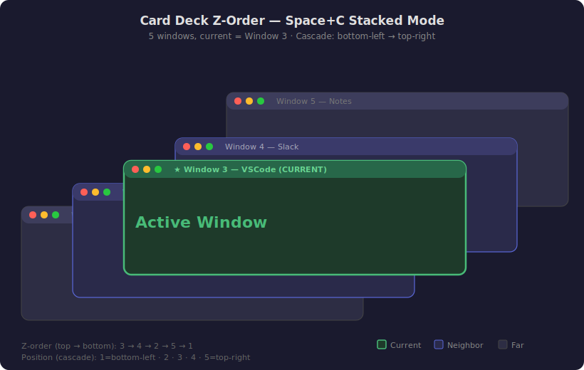

# Window Cycle (Space+Z) — Cross-Monitor + Cross-Space Design

## Current behavior (broken)
- Only cycles windows on **current display**
- Wraps at boundary (never leaves current screen)
- 11 Chrome windows = stuck cycling Chrome forever

## AHK behavior (Windows)
```
Monitor 1 windows → Monitor 2 windows → next Virtual Desktop (all monitors switch)
```
Windows virtual desktops are shared across all monitors — switching desktop
changes ALL screens simultaneously.

## macOS difference
Each display has **independent Spaces** (default since 10.9 Mavericks).
Switching Space only changes one monitor, not all.

## New macOS behavior
```
Monitor 1, current Space windows
  → exhaust → Ctrl+Right (next Space on Monitor 1)
    → Monitor 1, next Space windows
      → exhaust all Spaces on Monitor 1
        → jump to Monitor 2, current Space
          → Monitor 2 Space windows
            → exhaust → next Space on Monitor 2
              → ... wrap back to Monitor 1 Space 1
```

### Boundary transitions:
1. **Last window on current Space of current monitor** → Ctrl+Right to switch
   to next Space on same monitor, then cycle first window there
2. **Last Space on current monitor** → move focus to next monitor (keep its
   current Space), cycle first window there
3. **Last Space on last monitor** → wrap to first monitor, first Space

## Card Deck Z-Order (Space+C Stacked Mode)

When arranging windows in stacked/cascade mode, the z-order follows a
**card deck fan-out** pattern centered on the current window:

```
Windows:  [1] [2] [3] [4] [5]
Current:           ^3

Z-order (top to bottom): 3 → 4 → 2 → 5 → 1

Position: cascade from bottom-left (window 1) to top-right (window 5).
Each window is offset +dx right and -dy up from the previous one.
(AXPosition uses Quartz coords: y=0 at top, y increases downward.)

Z-order: current window topmost, neighbors behind, farthest at back.

Visual result (5 windows, current = window 3):



The cascade goes bottom-left → top-right. The current window is
like the center card in a fanned hand. Windows before it (lower index)
peek from the bottom-left, windows after (higher index) peek from
the top-right. Further from current = deeper in z-stack.
```

Algorithm: sort by distance from current index (descending). Farthest
windows are raised first (bottom of stack), current window raised last
(top of stack). This creates a beautiful card deck effect where you can
see the edges of all nearby windows fanning out from the active one.

Implemented on both macOS (AXRaise) and Windows (SetWindowPos).

### Implementation:
- Remove `windows.retain(|w| w.display_id == current_display)` filter
- Cycle all on-screen windows across all monitors (`kCGWindowListOptionOnScreenOnly`)
- At list boundary: inject `Ctrl+Right` keystroke (switches Space on focused monitor)
- Wait 300ms for Space animation
- Re-enumerate windows on new Space
- If no new windows (already on last Space): move mouse to next monitor and repeat

### Space switching:
- Use `CGEventPost` to inject `Ctrl+Right` / `Ctrl+Left` keystrokes
- This is the same approach as yabai and other tiling WMs
- No private SkyLight API needed
- Works with "Displays have separate Spaces" ON (default)

### Monitor focus:
- To make Space switch happen on a specific monitor, move the mouse cursor
  to that monitor first (`CGWarpMouseCursorPosition`)
- Then inject Ctrl+Right — macOS switches the Space of the monitor under the cursor
